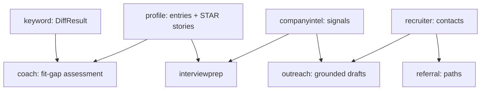
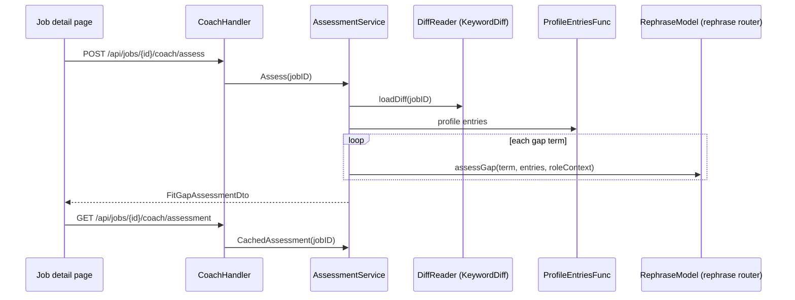
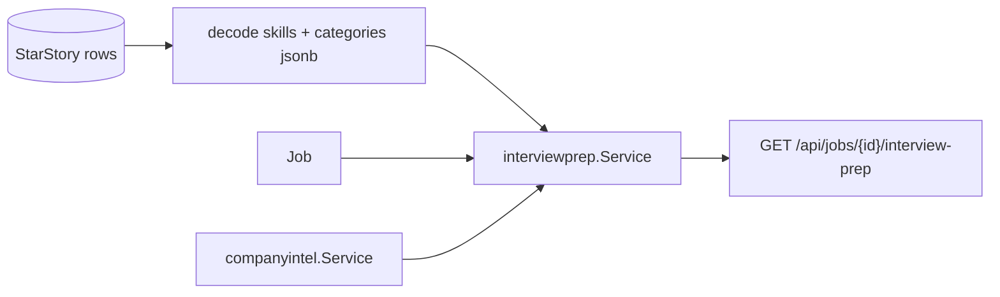
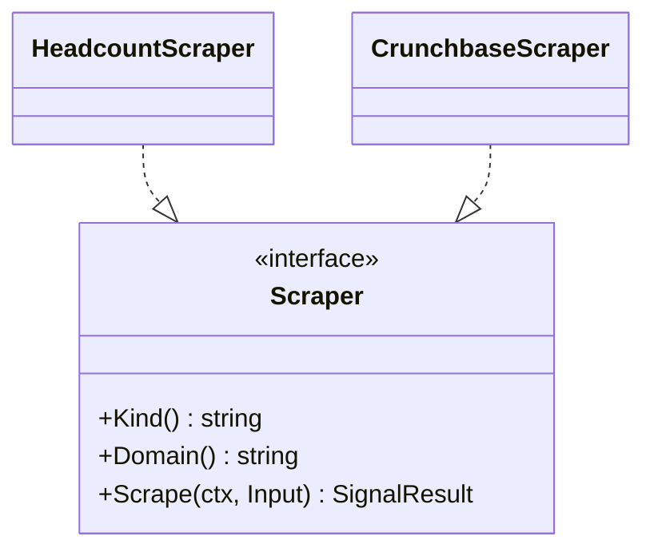
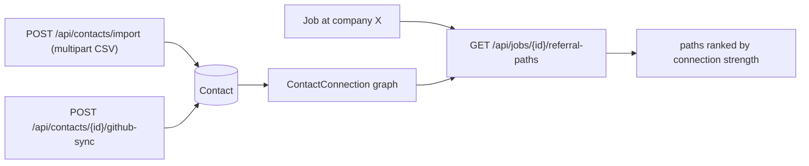
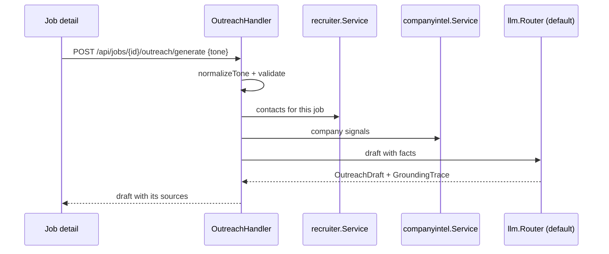

# Assistants

Six packages sit on the synchronous request path rather than on a queue. They share a
pattern: read stored analysis, add an LLM call where judgement is needed, return a DTO.



## Coach

`coach.Service` assesses the gap between a job's keyword diff and your profile entries;
`AssessmentService` adds caching and DTO mapping (`coach/apiservice.go:56-105`).

```go
type FitGapAssessment struct { /* gaps, evidence */ }
type GapItem struct { ... }
type EvidenceItem struct { ... }
type ProfileEntry struct { SourceLabel, Bullet string }
```

A design note worth copying (`apiservice.go:38-42`):

```go
// It is a func rather than an interface bound to a concrete profile type so
// this package never needs to import internal/profile.
type ProfileEntriesFunc func(ctx context.Context) ([]ProfileEntry, error)
```

A function-typed dependency is the smallest possible port. `compose_features.go` supplies
the closure that adapts `profile.Service` to it.



Two endpoints, deliberately: `assess` spends model calls, `assessment` returns the cached
result for free.

## Interview prep

`interviewprep.Service` combines profile STAR stories with company intel
(`compose_features.go`, `composeInterviewPrep`). STAR stories come from `StarStory`
(`00022_star_story.sql`) with `skills` and `categories` as jsonb arrays, decoded at the
composition boundary.



A profile with no STAR stories yields prep without them — `composeInterviewPrep` returns
`nil, nil` when there is no default profile rather than erroring.

## Company intel

`companyintel` maintains `Company` and `CompanySignal` rows, with pluggable scrapers, each
declaring `Kind()` and `Domain()`:

| Scraper | Kind | Domain |
| --- | --- | --- |
| `HeadcountScraper` | `headcount` | `company-site` — resolves the about page |
| `CrunchbaseScraper` | `funding` | `crunchbase.com` |



`CompanySignal` is unique on `(companyId, kind)`, so a refresh replaces a signal rather
than appending. `parseHeadcount` takes the previous value, so a refresh can reason about
change rather than only about the current number.

| Endpoint | Effect |
| --- | --- |
| `GET /api/companies/{jobId}/intel` | cached signals |
| `POST /api/companies/{jobId}/intel/refresh` | re-scrape |

## Recruiter resolution

`internal/recruiter` resolves hiring contacts for a job. Sources: the posting text and the
company page always; LinkedIn only when `LINKEDIN_SCRAPE_ENABLED=true`.

:::warning LinkedIn is off by default
`.env.example` states the reason: *"LinkedIn's public company page is a ToS gray area — off
by default. The posting-text and company-page contact sources always run regardless."*
:::

Results land in `JobContact` (`00010_job_contact.sql`), exposed at
`GET /api/jobs/{id}/contacts` with a `POST .../refresh`.

## Referral paths

`internal/referral` owns the contact graph: `Contact` plus `ContactConnection` with a
`relationshipType` and a `strength` in `[0,1]`, and a `CHECK` forbidding self-edges
(`00015_contact_graph.sql`).



## Outreach

`internal/outreach` drafts messages with an explicit grounding model:

```go
type Tone string
type Fact struct { ... }
type GroundingTrace struct { ... }
type OutreachDraft struct { ... }
```

`AllTones()`, `isValidTone` and `normalizeTone` (`outreach/types.go:26-64`) make the tone
vocabulary a closed set, surfaced at `GET /api/jobs/{id}/outreach/tones` so the UI cannot
offer an unsupported option.

`Fact` and `GroundingTrace` are the notable part: a draft carries the facts it was built
from and where they came from — recruiter data, company intel, the posting. An outreach
message that claims something is traceable to its source rather than being an unattributed
model assertion.



## Common shape

| Package | Router | Storage | Cached read |
| --- | --- | --- | --- |
| `coach` | `rephrase` (via `keyword.ProviderRephraseModel`) | `KeywordDiff` | yes |
| `interviewprep` | — (composes stored data) | `StarStory`, intel | n/a |
| `companyintel` | — (scrapers) | `Company`, `CompanySignal` | yes, refresh is explicit |
| `recruiter` | — | `JobContact` | yes, refresh is explicit |
| `referral` | — | `Contact`, `ContactConnection` | n/a |
| `outreach` | `default` | — | no |

Note how few of these call a model. Most of the assistant surface is composition of data
the pipeline already produced — which is why these endpoints are synchronous.
