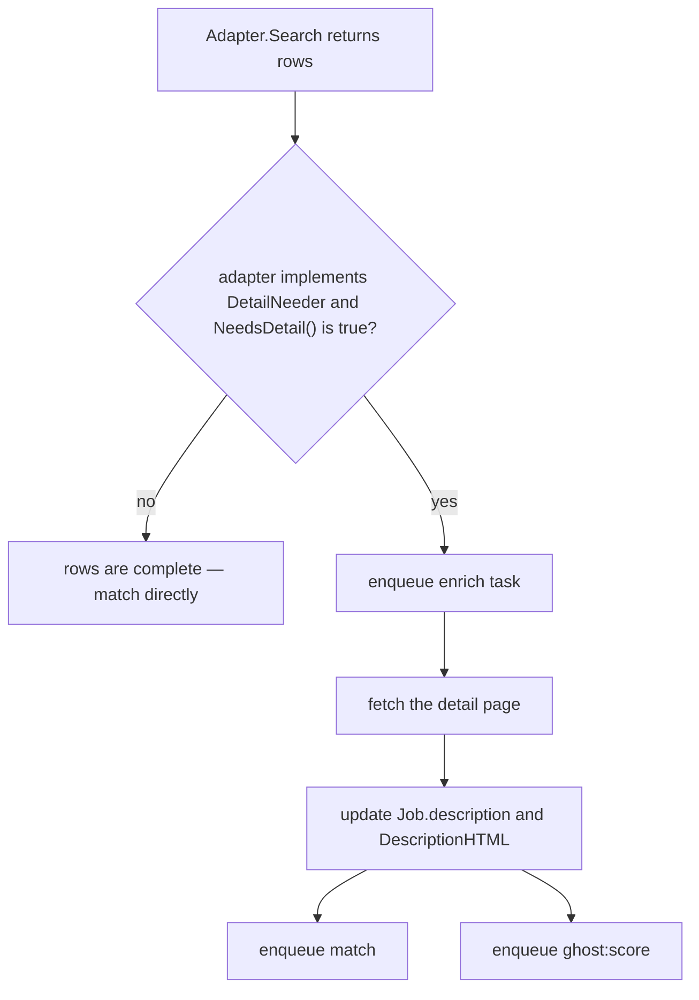
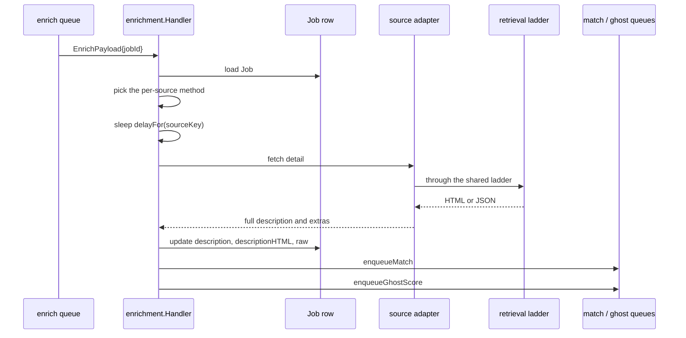
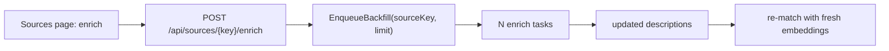

# Enrichment

Many sources return list rows — title, company, URL, and a teaser. Those rows are not worth
matching or ghost-scoring. Enrichment fetches the full posting and updates the `Job`.

## When a job needs enrichment



`NeedsDetail` is an optional interface, not a flag, so adapters returning complete rows
need no change (`ports/source.go:44-46` in the job-scraper library).

## The handler

`enrichment.NewHandler` takes the nine adapters that have detail pages — djinni, dou,
workua, indeed, remoteok, glassdoor, jobleads, wellfound, jobgether (`compose.go:460-467`)
— plus the asynq
client, a default delay and a per-source delay map
(`internal/enrichment/handler.go:40`):

| Adapter | Method |
| --- | --- |
| `djinni` | `enrichDjinni` (`handler.go:144`) |
| `dou` | `enrichDOU` (`:175`) |
| `workua` | `enrichWorkUa` (`:216`) |
| `indeed` | `enrichIndeed` (`:249`) |
| `remoteok` | `enrichRemoteOK` (`:280`) |
| `jobleads` | `enrichJobLeads` (`:315`) |
| `glassdoor` | `enrichGlassdoor` (`:350`) |
| `wellfound` | `enrichWellfound` (`:385`) |
| `jobgether` | `enrichJobgether` (`:421`) |

Dispatch is by `sourceKey`. A source with no detail handler is simply not enqueued.

:::note Why explicit per-source methods rather than one generic path
Detail pages differ structurally — some need a second request for the description, some
carry salary only on the detail view, one needs a session. The shared parts (fetching,
pacing, identity) live in `retrieval`; what remains genuinely differs per source.
:::

## Delays

```go
// cmd/server/compose.go
enrichDelay := time.Duration(cfg.DjinniDetailDelayMs) * time.Millisecond
enrichDelays := map[string]time.Duration{
    "workua": time.Duration(cfg.WorkUaDetailDelayMs) * time.Millisecond,
}
```

`delayFor(sourceKey)` (`handler.go:50-58`) returns the per-source override or the default.
This is on top of the transport-level pacing from
[rate limiting](/ingestion/rate-limiting) — the enrich loop's access pattern is many
sequential detail pages against one host, which benefits from an explicit gap.

## Flow



The re-fan-out matters: matching runs **after** enrichment for these sources, so the fit
score is computed against the real posting rather than a teaser. And because the embedding
is content-addressed by hash, the changed description automatically invalidates the
prefilter cache ([matching](/ai/matching)).

## Queue characteristics

| Property | Value |
| --- | --- |
| Queue | `enrich` |
| Concurrency | `ENRICH_CONCURRENCY` (default 1), fixed — no LLM component |
| Deadline | `AI_TASK_TIMEOUT_ENRICH` (default `10m`) |
| LLM task key | none |

Enrichment appears in the "AI" section because it feeds the AI pipeline, but it makes no
model calls of its own — it is pure retrieval and parsing.

## Backfill

`EnqueueBackfill(ctx, sourceKey, limit)` (`handler.go:505`) enqueues enrichment for
existing jobs from one source, bounded by `limit`. It is exposed as
`POST /api/sources/{key}/enrich` and is the tool for "this adapter's detail parser was
broken last week; re-fetch those postings".



## Failure behaviour

| Failure | Result |
| --- | --- |
| Detail page 404 (posting removed) | permanent — no retry burned |
| Host challenges | the ladder escalates; the task may still succeed |
| Transient 5xx | asynq retries with backoff |
| Parse failure | logged; the job keeps its list-row description |

A job that fails enrichment is still matchable — just on weaker text.
