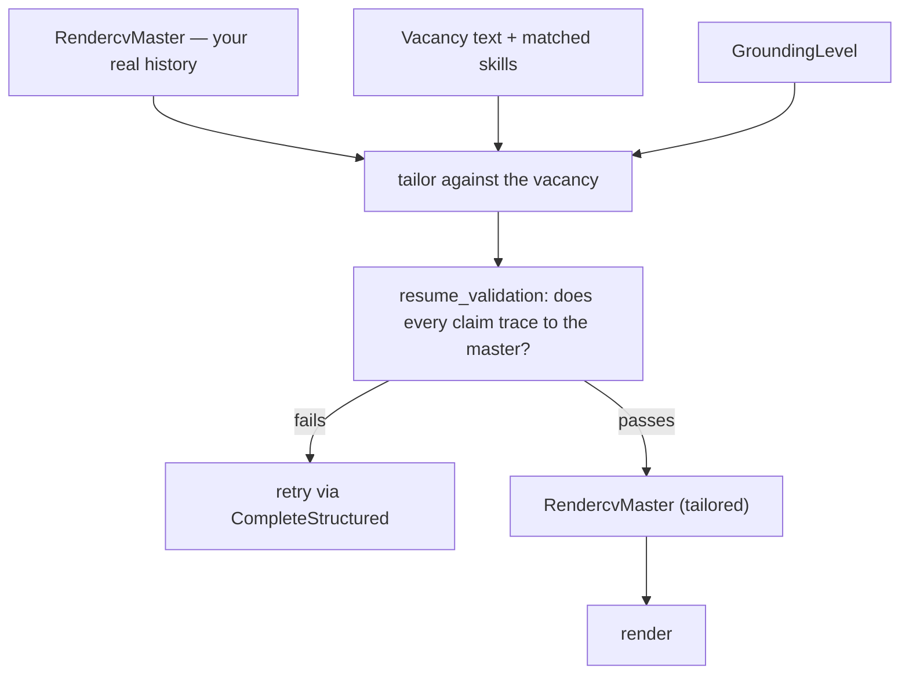
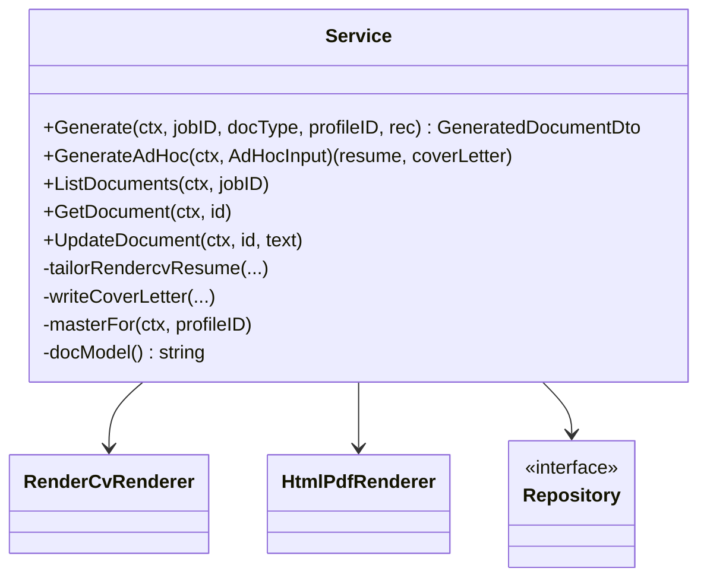
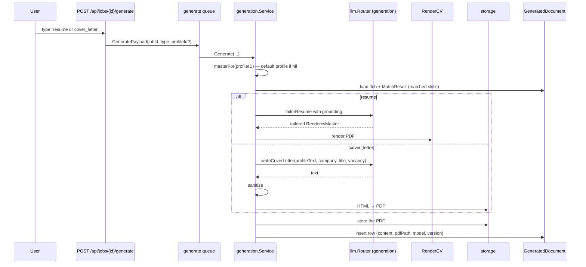
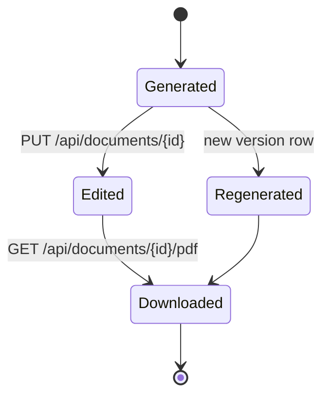

# Document generation

`internal/generation` produces two document types — `resume` and `cover_letter` — grounded
in your master profile, tailored to a specific vacancy, and rendered to PDF.

## Grounding is the core constraint

Generation is not free-form writing. `RESUME_GROUNDING_LEVEL` (default `moderate`) governs
how far the model may depart from the master profile, and the package carries dedicated
code for it: `grounding.go`, `rendercv_grounding.go`, `resume_validation.go`.



The rule this enforces: a tailored resume reorders, reweights and rephrases what is true.
It does not invent employers, dates or skills.

Two decisions are deliberately kept away from the model rather than checked afterwards:

- **Skill order.** The selection payload has no skills field. Groups carry over from the
  master untouched and `domain.RankSkills` orders them from the vacancy analysis — a
  permutation, so nothing can be dropped, reworded or invented on the way. A group's
  authored `skills_level` (`all` / `medium` / `relevant`) then bounds what a tailored
  resume renders: `domain.TrimSkillGroups` keeps the top half of a `medium` group (in that
  ranked order) or only the vacancy-matched entries of a `relevant` group, dropping a
  `relevant` group that matches nothing. The workspace export path never trims — the
  selection is the shape (FR-018).
- **Numbers.** Every metric a highlight asserts must appear in the master bullets it draws
  from, checked at every grounding level. Word-overlap alone cannot see this: it discards
  short tokens, so `40%` was invisible to it.
- **Which bullets appear.** Highlights are `{sourceIndex, rephrased}` references into the
  numbered bullet list the prompt showed for that entry, not free text. A rewording is
  checked against the one bullet it names and falls back to the original when it drifts;
  under strict grounding it is ignored outright.
- **Condensing for the page target.** `domain.TrimHighlights` drops bullets from the end of
  each entry — the selection stage already ranked them — instead of a model call that would
  reword everything it kept. Expanding is still a model call.

## Service shape

```go
func NewService(q Repository, profiles ProfileStore, htmlRenderer *HtmlPdfRenderer,
                rendercv *RenderCvRenderer, llmc llm.Provider,
                genModel, defaultLevel string) *Service
```

| Collaborator | Role |
| --- | --- |
| `q` | `Repository` port over `GeneratedDocument` |
| `profiles` | `ProfileStore` — the master document |
| `htmlRenderer` | HTML → PDF path (cover letters) |
| `rendercv` | RenderCV path (resumes), binary from `RENDERCV_BIN` |
| `llmc` | the `generation` router |
| `genModel` | `LLM_MODEL_GENERATION`; `docModel()` falls back to the provider default |
| `defaultLevel` | `RESUME_GROUNDING_LEVEL` |



## The job-scoped path



`Generate` accepts an `*activity.Recorder` so its steps appear on the Status page, exactly
like matching.

## Two renderers

| Renderer | Used for | Mechanism |
| --- | --- | --- |
| `RenderCvRenderer` | resumes | shells out to `RENDERCV_BIN` with a generated RendercvMaster config |
| `HtmlPdfRenderer` | cover letters | HTML template → PDF |

Templates live in `internal/generation/templates`; `rendercv_config.go` and
`resume_mapping.go` convert between the master profile, RendercvMaster, and
`dto.JsonResume`.

:::note `sanitize` before rendering
`sanitize` (`service.go:63-70`) cleans model output before it reaches a renderer.
Untrusted text going into a template or a shelled-out binary is exactly where you want a
scrubbing step.
:::

## Versioning

`GeneratedDocument` is unique on `(jobId, type, version)`. Each generation writes a new
version; nothing overwrites. `UpdateDocument(ctx, id, text)` lets you hand-edit a
generated document — the edit is stored against the same row, so the copy you actually
sent stays retrievable.



## Ad-hoc documents

`GenerateAdHoc(ctx, AdHocInput)` (`service.go:89`) produces a resume **and** a cover letter
from pasted vacancy text, with no `Job` row involved — migration
`00006_adhoc_documents.sql` added the storage for it.

| Endpoint | Purpose |
| --- | --- |
| `POST /api/documents/tailor` | generate from pasted vacancy text |
| `GET /api/documents/ad-hoc` | list ad-hoc documents |
| `GET /api/documents/{id}` | fetch content |
| `PUT /api/documents/{id}` | save an edit |
| `GET /api/documents/{id}/pdf` | download the PDF |

This is the "I found this job elsewhere" path, and it is why `Documents` is a separate
handler from `Jobs`.

## The workspace path (042)

`POST /v1/generations` starts a second, newer pipeline alongside the job-scoped path above:
the **resume generation workspace**, `internal/generation/application/workspace.go` and
`workspace_rerun.go`. It persists a `generation_runs` / `generation_sections` /
`generation_items` row set (migration `00042`) that the user reviews and edits directly,
rather than a single tailored document the model hands back whole.

The workspace makes the same "the model never rewords a real bullet" rule true by a
different, stronger mechanism than the job-scoped path's `{sourceIndex, rephrased}` check:

- **Ranking by index, not rewording.** The selection stage's response
  (`domain.RankedSelection`) carries `[]int` only — no `rephrased`, `summary`, `suggestions`
  or `drop` field of any kind. A profile-sourced item's displayed and exported text is
  therefore byte-identical to the master's, by construction rather than by a post-hoc
  grounding check. `K = min(2N, A)` candidates are ranked per entry; the top `min(N, A)`
  are pre-selected; the rest are shown, unselected, below them. A ranking that omits or
  duplicates an index is rejected, retried once, and — if still invalid — falls back to
  master order for that entry (`fallback_used`), never to failing the run.
- **A separate suggestion channel.** AI-authored content (a bullet the model thinks belongs
  but isn't in the profile, an extra skill) comes from its own LLM call
  (`domain.SuggestionSet`, `rankcv_llm.go`'s `suggestContent`), routed through the same
  `generation-select` task key. Every suggestion is created `origin='ai'`, `selected=false`
  — off by default — and badged distinctly from a profile-sourced item so the two are never
  visually confused. A suggestion that merely restates a master bullet is suppressed
  deterministically (`domain.SuppressDuplicateSuggestions`) before it is ever persisted.
- **Render-once export.** `POST /v1/generations/{runId}/export` assembles a `RendercvMaster`
  from exactly the selected items in their displayed order (`domain.Assemble`, no model
  call), renders it once, and — if it still overflows the page target after one
  layout-only `CompactDesign` retry — reports the overflow with named, worst-ranked-first
  drop candidates instead of silently trimming or re-rendering with different content.
  `expandContent` and `TrimHighlights` never run on this path.
- **Rerun in place.** `POST /v1/generations/{runId}/rerun` replaces a named section's (or
  the whole run's) items in place, on the same run id. A profile item is matched to its
  replacement by `source_index`, an AI item by normalised `source_text`; a match keeps its
  `selected`/`position`/`edited_text`, so re-ranking one section does not silently discard
  the user's decisions on the others.

`POST /documents/tailor` and the rest of this page's job-scoped path are unaffected — they
keep today's `{sourceIndex, rephrased}` semantics for as long as that endpoint exists.

## Automatic generation

When `aifeature` has `resume` or `cover_letter` enabled and a `MatchResult` scores at or
above the feature's threshold, the match handler enqueues generation automatically
(`internal/matching/handler.go:51`). Both features default to **disabled** with a
threshold of 90 — automatic spending on a hosted provider is opt-in.

## Queue characteristics

| Property | Value |
| --- | --- |
| Queue | `generate` |
| LLM task key | `generation` |
| Concurrency | `AI_CONCURRENCY_LOCAL` (1) or `AI_CONCURRENCY_CLOUD` (3), by resolved provider class |
| Deadline | `AI_TASK_TIMEOUT_GENERATE` (default `15m`) — the longest of the six |

The deadline is long because a resume tailor plus a PDF render plus a cover letter is the
heaviest unit of work in the system.

## Testing

`rendercv_test.go`, `resume_mapping_test.go`, `grounding_test.go` and `pdf_renderer_test.go`
run offline against `testdata`. `rendercv_live_test.go` and `pdf_renderer_live_test.go`
exercise the real binary and are opt-in.
