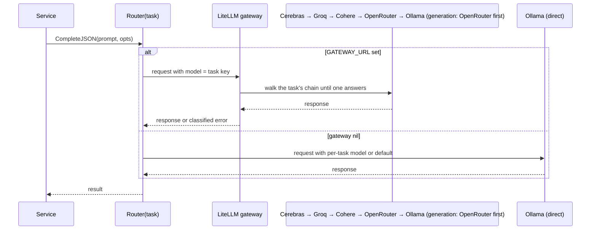
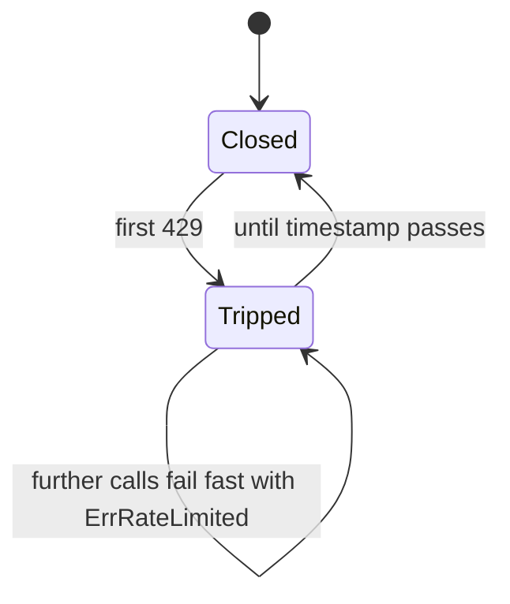
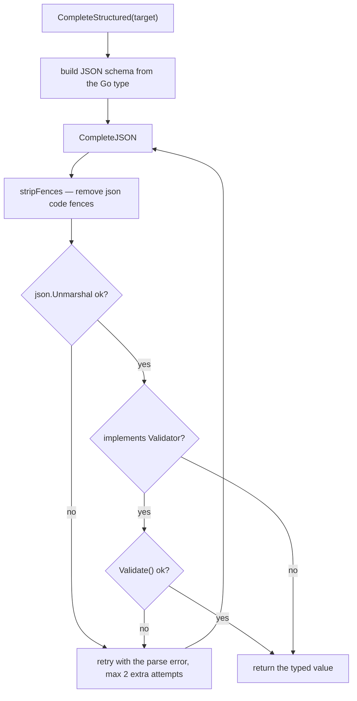

# LLM abstraction

Package layout (`apps/api/internal/platform/llm/`):

| Path | Holds |
| --- | --- |
| `domain/port.go` | the `Provider` interface and `CompleteOptions` |
| `application/router.go` | the task-bound `Router` |
| `infrastructure/ollama/` | the local/cloud Ollama adapter — the only one that embeds |
| `infrastructure/gateway/` | the OpenAI-compatible LiteLLM gateway adapter |
| `infrastructure/shared/errors.go` | the error taxonomy and the rate-limit breaker |

## The interface

```go
// internal/platform/llm/domain/port.go
type Provider interface {
    ModelName() string
    Complete(ctx context.Context, prompt string, opts *CompleteOptions) (string, error)
    CompleteJSON(ctx context.Context, prompt string, opts *CompleteOptions) (string, error)
    Embed(ctx context.Context, text string) ([]float32, error)
}
```

`CompleteJSON` is the low-level "ask for JSON, no retry" call. The retry loop — strip
fences, parse, validate, retry with the error — lives in `CompleteStructured`.

```go
type CompleteOptions struct {
    System      string
    Temperature *float64
    MaxTokens   *int
    Model       string   // per-call override; empty uses the provider default
}
```

Pointers for `Temperature` and `MaxTokens` are deliberate: unset must be distinguishable
from an explicit zero (`types.go:19-27`).

## Implementations


| Provider | Chat | Embeddings | Notes |
| --- | --- | --- | --- |
| Ollama | yes | **yes** | local or Ollama Cloud via `OLLAMA_KEY`; `OLLAMA_KEEP_ALIVE` holds the model resident. Never nil. |
| Gateway | yes | **no** | OpenAI-compatible client for the LiteLLM proxy. Constructed only when `GATEWAY_URL` is set, and given Ollama as a fallback. |

There is no Cerebras adapter in the application any more. Cerebras is one entry in the
gateway's failover chains (`gateway/config.yaml`); the Go backend never holds a Cerebras
credential and never learns which upstream served a request.

`EMBED_URL` exists because Ollama Cloud serves no embedding models — point it at a local
Ollama when `OLLAMA_URL` is the cloud.

## Embeddings never leave Ollama

`gateway.Provider` does not implement embeddings. Every embedding call goes to Ollama
directly, whatever the gateway configuration — no remote provider in the chain offers an
embeddings API.

## Transport tuning

`tunedTransport` raises `MaxIdleConnsPerHost` so hosted concurrency does not force a fresh
TLS handshake on the third simultaneous request. Its doc comment is explicit that it is
*"deliberately distinct from retrieval.DefaultTransport (FR-003): AI provider traffic must
never pick up the scraper's request pacing."*

## The Router

The Router is **static, fixed at construction**. There is no holder, no atomic swap, no
runtime reconfiguration — routing state lives entirely in `gateway/config.yaml` and
environment variables.

```go
func (r *Router) resolve() (domain.Provider, string) {
    if r.gateway != nil {
        return r.gateway, r.taskKey
    }
    return r.local, r.localModel
}
```

Three behaviours to note:

1. When a gateway is configured, the **task key is sent as the model** — `match`,
   `generation`, `rephrase`, `ghost`, `default` — and the proxy resolves it through that
   task's failover chain. The application carries no provider or model identity.
2. With `GATEWAY_URL` unset, `gateway` is nil and every task talks to Ollama directly with
   its per-task `LLM_MODEL_*`, falling back to `LLM_MODEL`, then the provider default.
3. `Router` implements `Provider`, so services never learn that routing exists.

`ProviderClass()` reports `hosted` whenever a gateway is configured — every hop from there
is remote, including the chain's own Ollama tier — otherwise it defers to the local Ollama
provider's loopback/private-host + API-key heuristic. The admission gate uses this to size
concurrency: hosted tasks run several at once, local Ollama stays at one.

One Router is constructed per task in `cmd/server/compose.go`:

```go
MatchRouter:      llm.NewRouter("match", gatewayIface, ollamaProvider, cfg.ModelOr(cfg.LLMModelMatch)),
GenerationRouter: llm.NewRouter("generation", gatewayIface, ollamaProvider, cfg.ModelOr(cfg.LLMModelGeneration)),
RephraseRouter:   llm.NewRouter("rephrase", gatewayIface, ollamaProvider, cfg.ModelOr(cfg.LLMModelRephrase)),
GhostRouter:      llm.NewRouter("ghost", gatewayIface, ollamaProvider, cfg.ModelOr(cfg.LLMModelGhost)),
DefaultRouter:    llm.NewRouter("default", gatewayIface, ollamaProvider, cfg.LLMModel),
```



## Error taxonomy

| Sentinel | Trigger (`classifyProviderError`) | Class |
| --- | --- | --- |
| `ErrProviderUnavailable` | status `<= 0`, or any other 5xx/unhandled status | retryable |
| `ErrRateLimited` | `429` | neither — cancel |
| `ErrCredentialRejected` | `401`, `403` | terminal |
| `ErrInsufficientCredits` | `402` | terminal |
| `ErrModelUnavailable` | `400`, `404`, `422` | terminal |
| `ErrInvalidResponse` | 2xx with an unexpected body | retryable |

`Terminal(err)` and `Retryable(err)` are the two predicates handlers use
(`errors.go:41-57`). `providerErrMessage` parses OpenAI-style
`{"error":{"message":...}}` and Ollama's `{"error":"..."}`, falling back to the raw body —
and reads **only the response**, so an API key sent in a header cannot leak into an error
string.

## The rate-limit breaker



```go
const rateLimitCooldown    = 60 * time.Second   // fallback when no hint is given
const maxRateLimitCooldown = 15 * time.Minute   // cap on whatever a provider asks for
```

Design points from `errors.go:106-150`:

- **One instance per process**, shared by every task Router — the first 429 protects all
  queued work sharing that provider.
- **`tripFor` clamps and never shortens.** A later, shorter reset cannot undo an earlier,
  longer one; the CAS loop keeps the maximum.
- **The cap exists for a reason**: *"so one hostile or mistaken header cannot park a task
  queue for hours."*

`retryAfter(h)` reads, in order: RFC 7231 `Retry-After` in delta-seconds form, the
HTTP-date form, then the de-facto `X-RateLimit-Reset` (unix seconds, unix milliseconds, or
a duration). No usable hint means the 60-second fallback.

## Structured output



`structuredRetries = 2` (`types.go:68`), matching the original TypeScript provider.
Schemas are derived from the Go type via `invopop/jsonschema`, so the prompt's contract
and the parse target cannot drift apart.

## Model selection lives in the gateway

There is no curated model list in Go. `gateway/config.yaml` declares, per task key, an
ordered chain that tries free-tier hosted providers before the OpenRouter aggregator and
always terminates at Ollama:

```yaml
- model_name: match           # → cerebras/gpt-oss-120b
- model_name: match-groq      # → groq/llama-3.3-70b-versatile
- model_name: match-cohere    # → cohere_chat/command-r-08-2024
- model_name: match-openrouter # → openrouter/deepseek/deepseek-v4-pro
```

Changing which model serves a task is a YAML edit plus `docker compose restart litellm` —
no application restart, no rebuild, no code change. Chain entries whose credential is
absent are skipped rather than failing the request.

## Gateway cost tracking

With the LiteLLM proxy gateway (feature 029), per-request spend is visible two ways:

- `docker compose logs litellm` — LiteLLM logs token counts and cost for every call, so
  the container logs are the quickest place to check spend.
- `GET /spend/logs` on the proxy (host port `4000`), authenticated with the master key:

  ```bash
  curl -H "Authorization: Bearer $LITELLM_MASTER_KEY" \
    http://localhost:4000/spend/logs
  ```

The proxy records spend against the task key sent as `model`, so each task's cost reflects
whatever provider/model `gateway/config.yaml` routes it to.
