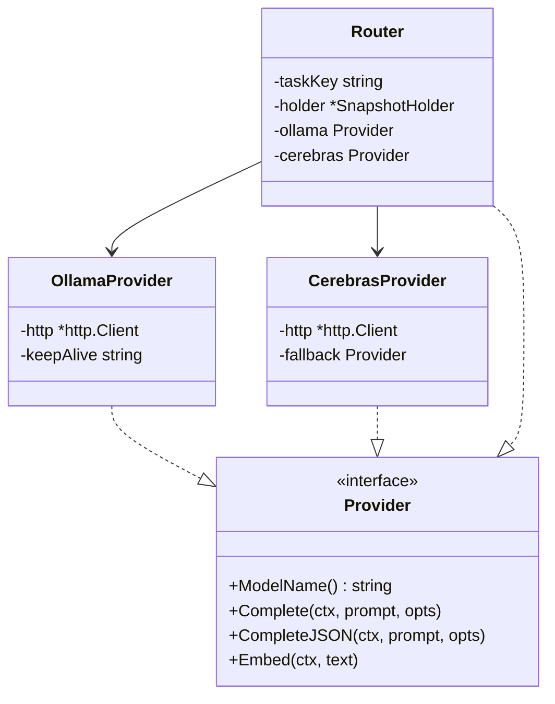
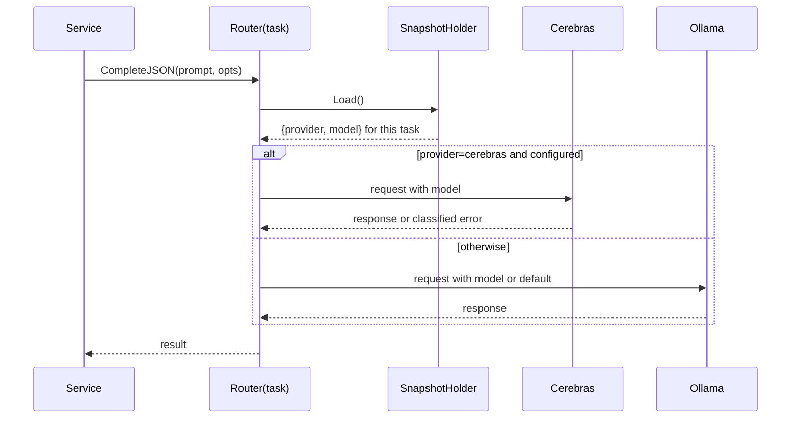
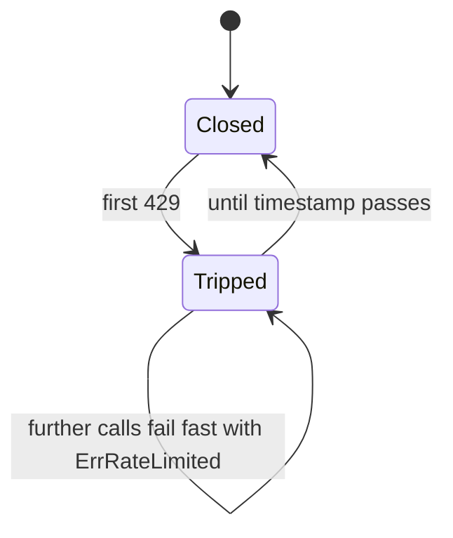
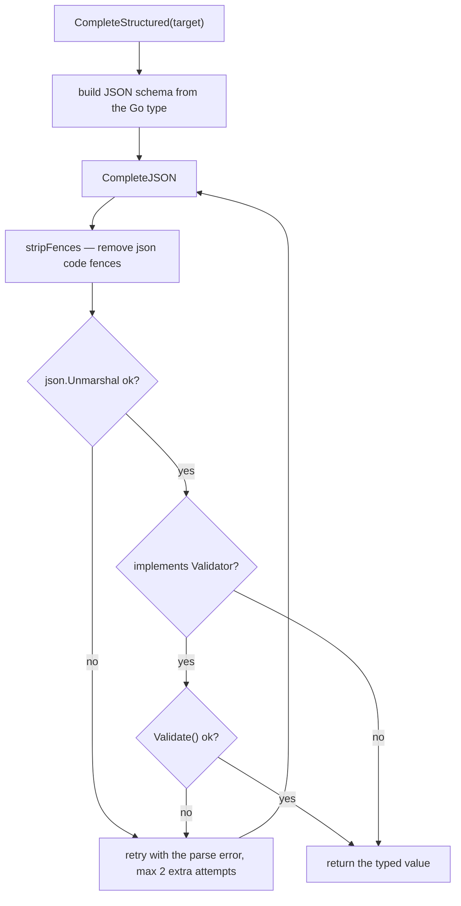

# LLM abstraction

## The interface

```go
// internal/llm/types.go
type Provider interface {
    ModelName() string
    Complete(ctx context.Context, prompt string, opts *CompleteOptions) (string, error)
    CompleteJSON(ctx context.Context, prompt string, opts *CompleteOptions) (string, error)
    Embed(ctx context.Context, text string) ([]float32, error)
}
```

`CompleteJSON` is the low-level "ask for JSON, no retry" call. The retry loop — strip
fences, parse, validate, retry with the error — lives in `CompleteStructured`.

```go
type CompleteOptions struct {
    System      string
    Temperature *float64
    MaxTokens   *int
    Model       string   // per-call override; empty uses the provider default
}
```

Pointers for `Temperature` and `MaxTokens` are deliberate: unset must be distinguishable
from an explicit zero (`types.go:19-27`).

## Implementations



| Provider | Chat | Embeddings | Notes |
| --- | --- | --- | --- |
| Ollama | yes | **yes** | local or Ollama Cloud via `OLLAMA_KEY`; `OLLAMA_KEEP_ALIVE` holds the model resident |
| Cerebras | yes | no | optional; constructed only when `CEREBRAS_API_KEY` is set, and given Ollama as a fallback (`factory.go:44-51`) |

`EMBED_URL` exists because Ollama Cloud serves no embedding models — point it at a local
Ollama when `OLLAMA_URL` is the cloud.

## The factory

```go
func NewProviders(cfg *config.Config) (ollama *OllamaProvider, cerebras *CerebrasProvider, err error) {
    transport := tunedTransport(cfg.LLMMaxIdleConnsPerHost)
    ollama = NewOllama(cfg.OllamaURL, cfg.OllamaKey, cfg.LLMModel, cfg.EmbedModel, cfg.EmbedURL)
    ollama.http.Transport = transport
    ollama.keepAlive = cfg.OllamaKeepAlive
    if cfg.CerebrasAPIKey != "" {
        cerebras, err = NewCerebras(cfg.CerebrasBaseURL, cfg.CerebrasAPIKey, "", ollama)
        // ...
    }
    return ollama, cerebras, nil
}
```

`tunedTransport` raises `MaxIdleConnsPerHost` so hosted concurrency does not force a fresh
TLS handshake on the third simultaneous request. Its doc comment is explicit that it is
*"deliberately distinct from retrieval.DefaultTransport (FR-003): AI provider traffic must
never pick up the scraper's request pacing."*

## The Router

```go
func (r *Router) resolve() (Provider, string) {
    snap := r.holder.Load()
    setting := snap.Tasks[r.taskKey]
    switch setting.Provider {
    case TaskProviderCerebras:
        if r.cerebras != nil {
            return r.cerebras, setting.Model
        }
        return r.ollama, ""
    }
    return r.ollama, setting.Model
}
```

Three behaviours to note:

1. Resolution happens **per call**, so a settings change takes effect on the next request.
2. A Cerebras selection with a nil provider falls back to Ollama **with an empty model**,
   because a Cerebras model id is meaningless to Ollama.
3. `Router` implements `Provider`, so services never learn that routing exists.



## Error taxonomy

| Sentinel | Trigger (`classifyProviderError`) | Class |
| --- | --- | --- |
| `ErrProviderUnavailable` | status `<= 0`, or any other 5xx/unhandled status | retryable |
| `ErrRateLimited` | `429` | neither — cancel |
| `ErrCredentialRejected` | `401`, `403` | terminal |
| `ErrInsufficientCredits` | `402` | terminal |
| `ErrModelUnavailable` | `400`, `404`, `422` | terminal |
| `ErrInvalidResponse` | 2xx with an unexpected body | retryable |

`Terminal(err)` and `Retryable(err)` are the two predicates handlers use
(`errors.go:41-57`). `providerErrMessage` parses OpenAI-style
`{"error":{"message":...}}` and Ollama's `{"error":"..."}`, falling back to the raw body —
and reads **only the response**, so an API key sent in a header cannot leak into an error
string.

## The rate-limit breaker



```go
const rateLimitCooldown    = 60 * time.Second   // fallback when no hint is given
const maxRateLimitCooldown = 15 * time.Minute   // cap on whatever a provider asks for
```

Design points from `errors.go:106-150`:

- **One instance per process**, shared by every task Router — the first 429 protects all
  queued work sharing that provider.
- **`tripFor` clamps and never shortens.** A later, shorter reset cannot undo an earlier,
  longer one; the CAS loop keeps the maximum.
- **The cap exists for a reason**: *"so one hostile or mistaken header cannot park a task
  queue for hours."*

`retryAfter(h)` reads, in order: RFC 7231 `Retry-After` in delta-seconds form, the
HTTP-date form, then the de-facto `X-RateLimit-Reset` (unix seconds, unix milliseconds, or
a duration). No usable hint means the 60-second fallback.

## Structured output



`structuredRetries = 2` (`types.go:68`), matching the original TypeScript provider.
Schemas are derived from the Go type via `invopop/jsonschema`, so the prompt's contract
and the parse target cannot drift apart.

## Curated model list

```go
const DefaultCerebrasModel = "gpt-oss-120b"

var CerebrasModels = []CerebrasModel{
    {ID: "gpt-oss-120b", Label: "GPT-OSS 120B", IsDefault: true},
    {ID: "llama-3.3-70b", Label: "Llama 3.3 70B"},
    {ID: "llama3.1-8b",  Label: "Llama 3.1 8B"},
    {ID: "qwen-3-32b",   Label: "Qwen 3 32B"},
}
```

`IsSupportedCerebrasModel("")` returns true — empty means "use the default". Exactly one
entry must carry `IsDefault`.
