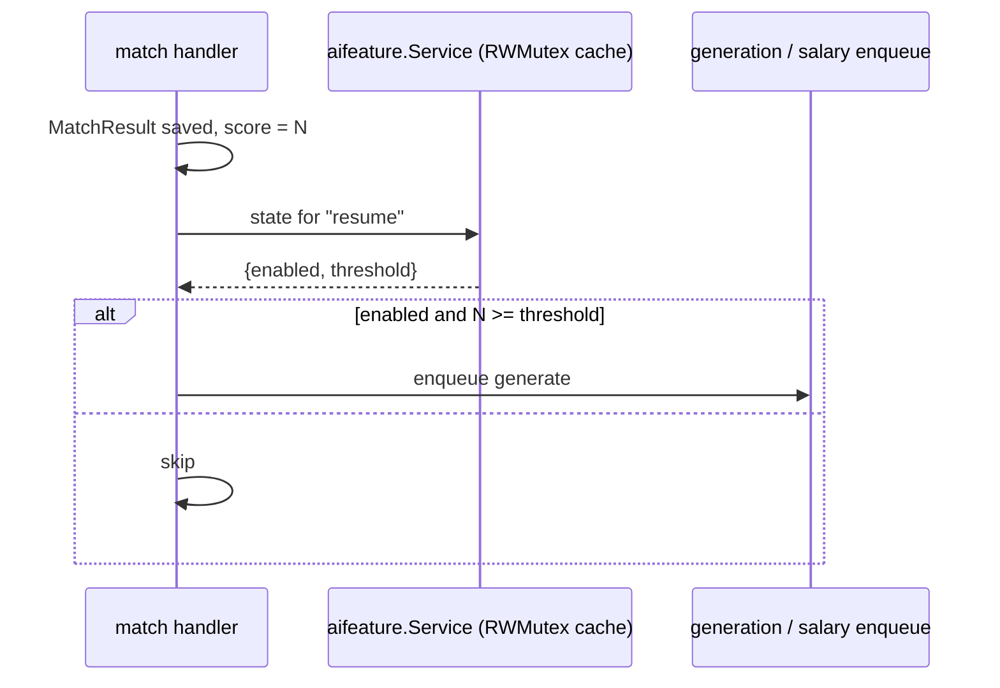

# AI settings

Three settings surfaces, each with its own service:

| Service | Table | Answers |
| --- | --- | --- |
| `aifeature` | `AiFeatureSetting` | *should this AI feature run at all, and above what score* |
| `resumeshape` | resume shape config | *what shape should a generated resume have* |
| — | — | *which provider and model runs a task* → **not a setting.** See below. |

## Provider and model selection is not a setting

There is no LLM settings service, no `LlmTaskSetting` table, and no dashboard control for
choosing an AI provider or model. Feature `030-litellm-model-routing` removed all of it;
migration `00033_drop_llm_task_setting.sql` dropped the table.

The application requests AI work **by task name only** — `match`, `generation`, `rephrase`,
`ghost`, `default` — and the LiteLLM gateway decides what serves it, from an ordered
failover chain declared in `gateway/config.yaml`. Changing which model serves a task is a
YAML edit plus `docker compose restart litellm` — no dashboard, no rebuild, no application
restart.

See [LLM abstraction](./llm-abstraction.md) for the routing mechanics and
`specs/domains/llm-routing.md` for the requirements that bind it.

Provider credentials (`CEREBRAS_API_KEY`, `GROQ_API_KEY`, `COHERE_API_KEY`,
`OPENROUTER_API_KEY`) live in the `litellm` compose service's environment only. The Go
backend never reads them and cannot expose them.

## `aifeature`

### Features and thresholds

```go
const (
    Resume      = "resume"
    CoverLetter = "cover_letter"
    SalaryInfer = "salary_infer"
)

var Keys = []string{Resume, CoverLetter, SalaryInfer}
```

```sql
CREATE TABLE "AiFeatureSetting" (
  "featureKey" text PRIMARY KEY,
  "enabled"    boolean NOT NULL DEFAULT false,
  "threshold"  integer NOT NULL DEFAULT 90,
  "updatedAt"  timestamp(3) NOT NULL DEFAULT now()
);
```

Each feature is **off by default** with a threshold of 90. The threshold is a match score:
"auto-generate a resume only for jobs scoring at least 90". Below the threshold, or when
disabled, the feature still runs on demand — the setting governs *auto-enqueue*, not
availability.

Match scoring itself has no entry here. It always runs unconditionally.

### Cached for the hot path

The service caches settings in memory behind an `RWMutex`, with the reason stated in the
type comment (`aifeature/service.go`): *"so the per-match hook (matching/handler.go) never
needs a DB round trip on the hot path."*



### HTTP surface

| Method | Path | Effect |
| --- | --- | --- |
| GET | `/api/settings/ai-features` | all features in display order |
| PUT | `/api/settings/ai-features/{feature}` | update `enabled` and `threshold`, refresh the cache |

## `resumeshape`

Controls the shape of every resume generated **after** the config is saved. A generation
already in flight finishes with the settings it started with.

`0` means *unlimited / no limit* for `skillsMaxGroups`, `projectsMin`, `projectsMax`,
`projectBulletsMax`, `certificationsMin` and `certificationsMax`.

| Field | Default | Range | Effect |
| --- | --- | --- | --- |
| `summaryLines` | 4 | 1–12 | Approximate summary length, in sentences |
| `skillsEnabled` | true | — | `false` removes the skills section entirely |
| `skillsMaxGroups` | 0 | 0–20 | Skill groups to keep; `0` keeps all |
| `experienceBulletsMin` | 8 | 1–20 | Target floor of bullets per job |
| `experienceBulletsMax` | 10 | 1–20 | Hard cap of bullets per job |
| `targetPages` | 2 | 1–3 | Page count the render loop aims for |
| `projectsEnabled` | true | — | `false` removes the projects section entirely |
| `projectsMin` | 0 | 0–20 | Target floor of projects; `0` = no minimum |
| `projectsMax` | 0 | 0–20 | Hard cap on projects; `0` includes all |
| `projectBulletsMax` | 0 | 0–10 | Hard cap of bullets per project; `0` keeps all |
| `certificationsEnabled` | true | — | `false` removes the certifications section entirely |
| `certificationsMin` | 0 | 0–20 | Target floor of certifications; `0` = no minimum |
| `certificationsMax` | 0 | 0–20 | Hard cap on certifications; `0` includes all |

The wire form is `dto.ResumeShapeConfigDto` (`apps/api/internal/dto/settings.go`), a
field-for-field mirror of `generation/domain.ShapeConfig`.

### Semantics that matter

- **Minima are targets; maxima are guarantees.** The model is *steered* toward a minimum;
  maxima are enforced deterministically after the model responds, so they always hold.
- **A minimum never causes fabrication.** When the master profile holds fewer bullets,
  projects or certifications than the floor asks for, generation keeps what exists and the
  run's activity trail records the shortfall.
- **The page target wins.** When `targetPages` conflicts with the configured section
  lengths, the page target is prioritised and the run records that it did. When the
  adjustment attempts are exhausted, the best result achieved is returned rather than a
  failure, with the final page count and reason reported.
- **Disabling a section is not a violation.** It is not reported as a structural or
  grounding failure; every other structure and grounding check still applies.
- **Section positions are fixed.** Projects, certifications and publications keep their
  established position in the enforced order regardless of configuration. There is no
  separate links section.

### HTTP surface

| Method | Path | Effect |
| --- | --- | --- |
| GET | `/api/settings/resume-shape` | current config |
| PUT | `/api/settings/resume-shape` | **replaces the whole config** — every field must be present |

Validation is all-or-nothing: any out-of-range value, or a minimum greater than its
corresponding maximum, rejects the entire update and stores none of it. The dashboard's
**Reset to defaults** restores the table above in one action, and the defaults reproduce
pre-settings generation behaviour exactly.

## Related singleton

`AutoGenerateSetting` (`00019_autogen_setting.sql`) is a single-row table —
`CHECK ("id" = 'default')` — holding a global enable plus threshold, predating the
per-feature table. Both exist in the schema; per-feature settings are the finer-grained
mechanism.
