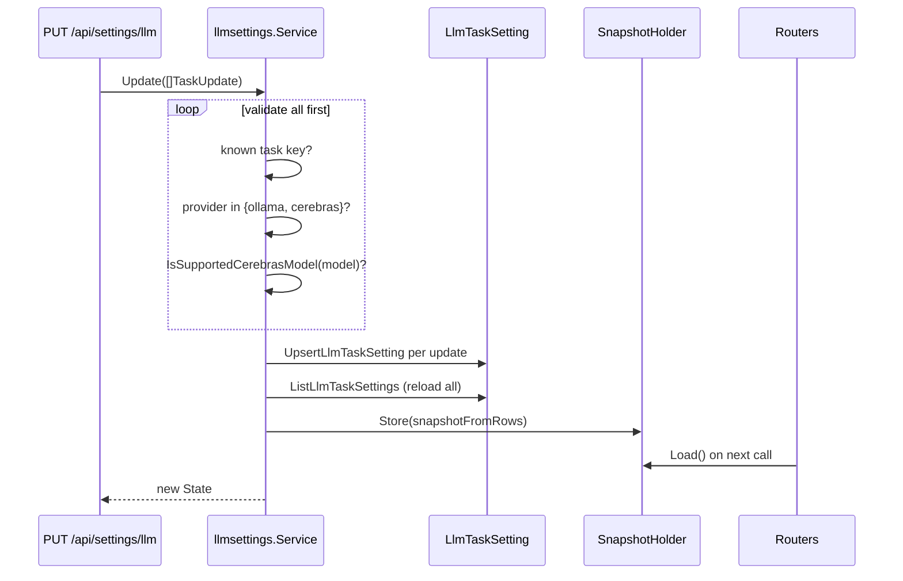
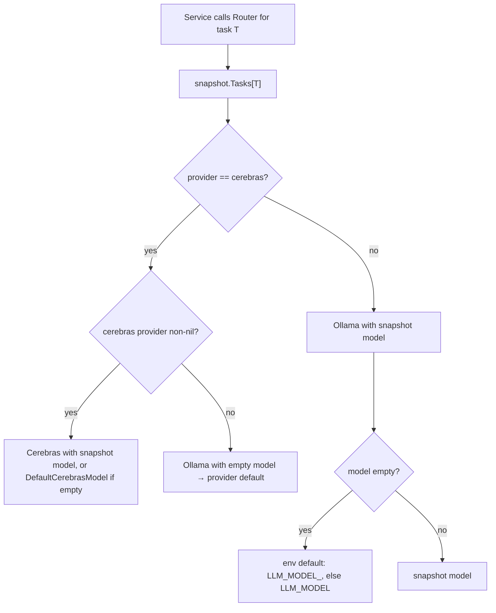
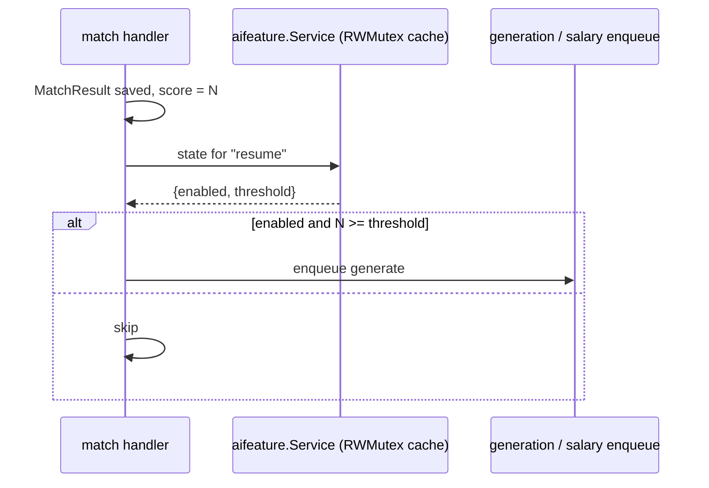

# LLM and AI-feature settings

Two independent settings services:

| Service | Table | Answers |
| --- | --- | --- |
| `llmsettings` | `LlmTaskSetting` | *which provider and model runs this task* |
| `aifeature` | `AiFeatureSetting` | *should this AI feature run at all, and above what score* |

## `llmsettings`

### State and persistence

```go
var TaskKeys = []string{"match", "generation", "rephrase", "ghost", "default"}
```

```sql
CREATE TABLE "LlmTaskSetting" (
  "taskKey"   text PRIMARY KEY,
  "provider"  text NOT NULL DEFAULT 'ollama' CHECK ("provider" IN ('ollama', 'cerebras')),
  "model"     text NOT NULL DEFAULT '',
  "updatedAt" timestamp(3) NOT NULL DEFAULT now()
);
```

The provider vocabulary is enforced by a `CHECK` constraint as well as in Go — the
database will not hold a value the router cannot resolve.

### Reads never hit the database

`Get()` reads the in-memory snapshot, which `Update` keeps authoritative
(`service.go:76-90`). The Settings page is a cheap call.

### Update is validate → persist → reload → publish



Validation runs over **all** updates before any write (`service.go:97-112`), so a partial
batch cannot half-apply. Errors are typed: `ErrUnknownTaskKey`, `ErrInvalidProvider`,
`ErrInvalidModel`.

A subset of `TaskKeys` is a legal payload — omitted tasks are unchanged.

### Credentials are env-only

```go
// cerebrasConfigured reflects whether config.CerebrasAPIKey was set at
// process start (a restart is required to change a credential itself, since
// it is env-only — see spec FR-013).
```

So: **model and provider changes are hot; adding a key is a restart.** The snapshot's
`CredentialConfigured` flag is how the dashboard explains a Cerebras selection that is
silently running on Ollama.

### Precedence



| Layer | Source | Wins when |
| --- | --- | --- |
| Per-call override | `CompleteOptions.Model` | always, when non-empty |
| Persisted setting | `LlmTaskSetting.model` | no per-call override |
| Env default | `LLM_MODEL_MATCH`, `_GENERATION`, `_REPHRASE`, `_GHOST` | setting empty |
| Global fallback | `LLM_MODEL` | task-specific env unset |
| Provider default | adapter's built-in | everything else empty |

### HTTP surface

| Method | Path | Returns |
| --- | --- | --- |
| GET | `/api/settings/llm` | current per-task settings + `credentialConfigured` |
| PUT | `/api/settings/llm` | validated, persisted, published state |
| GET | `/api/settings/llm/models` | the curated model list per provider |

`GET /settings/llm/models` serves `llm.CerebrasModels` from code, so rendering Settings
never depends on reaching Cerebras.

## `aifeature`

### Features and thresholds

```go
const (
    Resume      = "resume"
    CoverLetter = "cover_letter"
    SalaryInfer = "salary_infer"
)

var Keys = []string{Resume, CoverLetter, SalaryInfer}
```

```sql
CREATE TABLE "AiFeatureSetting" (
  "featureKey" text PRIMARY KEY,
  "enabled"    boolean NOT NULL DEFAULT false,
  "threshold"  integer NOT NULL DEFAULT 90,
  "updatedAt"  timestamp(3) NOT NULL DEFAULT now()
);
```

Each feature is **off by default** with a threshold of 90. The threshold is a match score:
"auto-generate a resume only for jobs scoring at least 90".

### Cached for the hot path

The service caches settings in memory behind an `RWMutex`, with the reason stated in the
type comment (`aifeature/service.go:38-40`): *"so the per-match hook
(matching/handler.go) never needs a DB round trip on the hot path."*



### HTTP surface

| Method | Path | Effect |
| --- | --- | --- |
| GET | `/api/settings/ai-features` | all features in display order |
| PUT | `/api/settings/ai-features/{feature}` | update `enabled` and `threshold`, refresh the cache |

## Related singleton

`AutoGenerateSetting` (`00019_autogen_setting.sql`) is a single-row table —
`CHECK ("id" = 'default')` — holding a global enable plus threshold, predating the
per-feature table. Both exist in the schema; per-feature settings are the finer-grained
mechanism.
