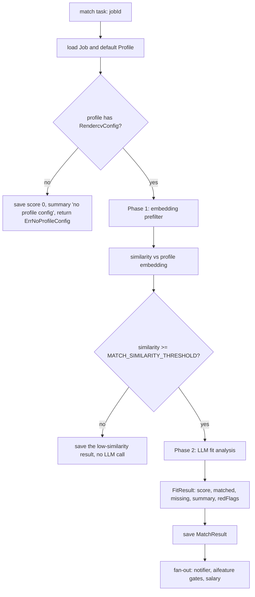
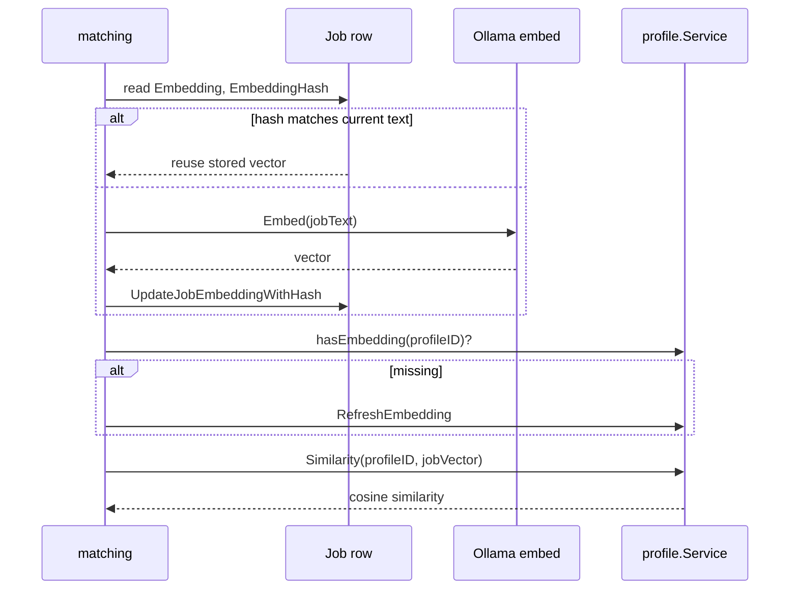
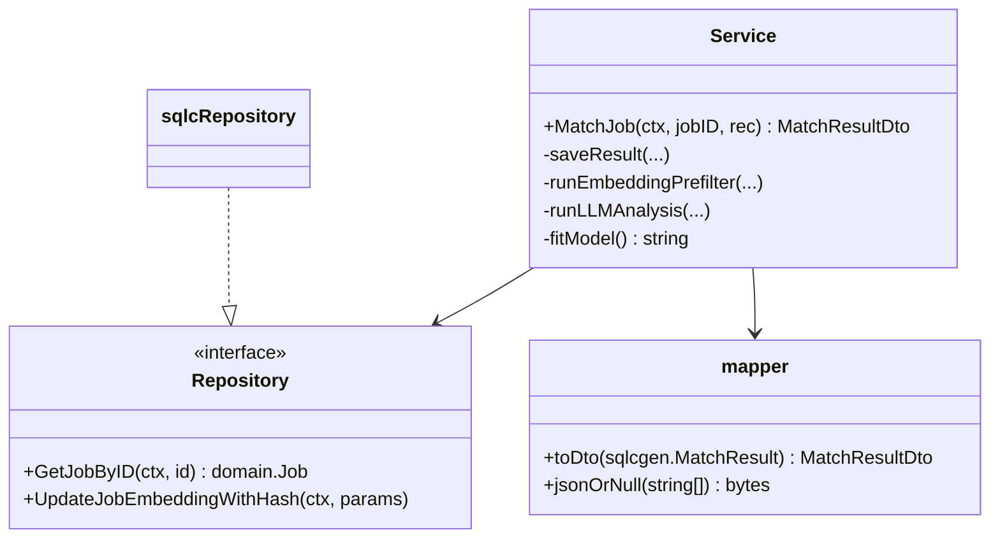
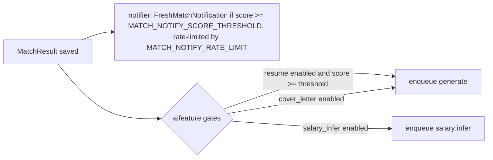

# Matching

Matching turns a `Job` plus your `Profile` into a `MatchResult`: a similarity, a score, the
skills you match and miss, a summary, and red flags.

## Two phases



The prefilter is what makes the feed affordable: an embedding call is cheap and a fit
analysis is not.

## Phase 1 — embedding prefilter

The prefilter is inlined in `MatchJob`
(`internal/matching/application/service.go:83-117`):

```go
jobText := strutil.Truncate(fmt.Sprintf("%s at %s\n%s", job.Title, job.Company, job.Description), 8000)
jobEmbedding, err := s.llmc.Embed(ctx, jobText)
...
similarity, err := s.profiles.Similarity(ctx, profileID, jobEmbedding)
if similarity < s.threshold { /* save a similarity-only result and stop */ }
    jobEmbedding = job.Embedding          // unchanged content: reuse
} else {
    jobEmbedding, err = s.llmc.Embed(ctx, jobText)
    // persist embedding + hash together
    s.q.UpdateJobEmbeddingWithHash(ctx, ...)
}
```

Three details worth internalising:

1. **The embedded text is exactly `"Title at Company\nDescription"`, truncated to 8000
   characters.** The hash is over that string, so any change to the format invalidates
   every cached embedding.
2. **Embedding and hash are written in one statement**
   (`UpdateJobEmbeddingWithHash`), so they cannot diverge.
3. **Enrichment invalidates naturally.** When the enrich pass replaces a teaser with the
   full description, the hash changes and the next match re-embeds.



`profiles.HasEmbedding` is consulted before refreshing, and a refresh is attempted **only**
when the answer is a confident "no": `if has, err := s.profiles.HasEmbedding(...); err == nil
&& !has` (`service.go:96-98`). An error skips the refresh rather than forcing one — a
spurious refresh is worse than a skipped one.

:::note A similarity error is not a task failure
`MatchJob` sets `similarity = 0` when `profiles.Similarity` fails (`service.go:105-107`).
Matching proceeds with a zero similarity rather than aborting the task.
:::

## Phase 2 — LLM fit analysis

Phase 2 is the second half of `MatchJob` (`service.go:119-165`): it builds the prompt, calls
`llm.CompleteStructured[domain.FitResult]`, and persists via `saveResult`.
It runs through the `match` router, so the provider and model come from settings.

The target type implements `Validator`:

```go
// internal/matching/types.go
func (f *FitResult) Validate() error { /* bounds and required fields */ }
```

which plugs into `CompleteStructured`'s retry loop — a model that returns a score of 130
gets asked again rather than writing nonsense to the database.

## Service construction

```go
func NewService(q Repository, profiles *profile.Service, snapshot *profile.SnapshotCache,
                llmc llm.Provider, threshold float64, matchModel string) *Service
```

| Dependency | Source |
| --- | --- |
| `q` | `Repository` port (`ports.go`), satisfied by `sqlcRepository` |
| `profiles` | `profile.Service` |
| `snapshot` | `profile.SnapshotCache` — avoids re-reading the profile per job |
| `llmc` | the `match` `llm.Router`, passed as a plain `Provider` |
| `threshold` | `MATCH_SIMILARITY_THRESHOLD` (default 0.35) |
| `matchModel` | `LLM_MODEL_MATCH`; `fitModel()` falls back to `llmc.ModelName()` |

## Progress reporting

`MatchJob` takes an `*activity.Recorder` and calls `rec.Step(ctx, "embedding", nil)` and
`rec.Step(ctx, "prefilter (similarity)", nil)` as it goes (`service.go:84-85`, `101-102`,
`148-149`).
Those strings are what the Status page shows as the current step.

## Persistence and the mapper



`jsonOrNull` (`service.go:215-221`) writes SQL `NULL` rather than `[]` for absent skill
lists, so "not analysed" and "analysed, none found" stay distinguishable.

`MatchResult` is `UNIQUE(jobId)` — one current score per job, replaced on re-match.

## Downstream fan-out



`NewHandler(svc, notifier, features, generator, salary)` (`handler.go:51`) wires exactly
those four collaborators — the handler is the policy layer, the service is the
computation.

## The no-profile path

Without a `RendercvConfig` on the default profile, `MatchJob` saves a zero-score result
with the summary `"no profile config"` and returns `ErrNoProfileConfig`
(`service.go:52-60`). Nothing crashes, and the dashboard's `RequireProfileConfig` guard
tells the user what to do.
