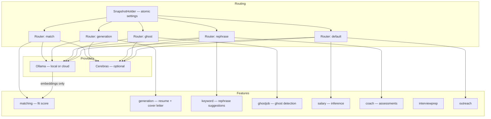
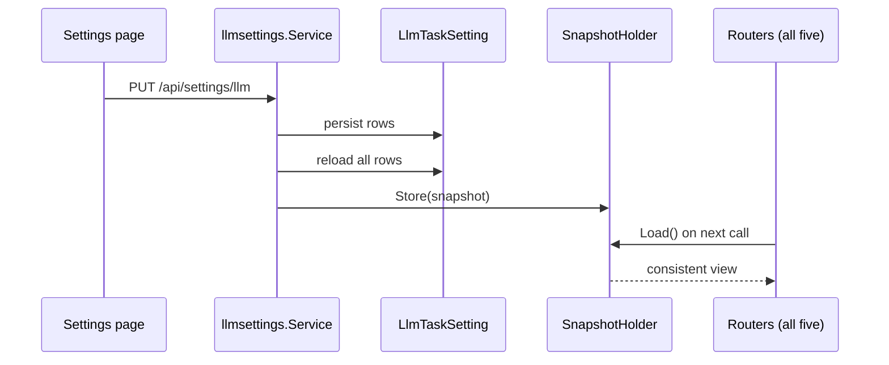

# AI overview

## Capability map



Five task keys, five routers, two providers. Embeddings are Ollama-only.

## Principles

### The LLM is an adapter, not a dependency of the domain

Services take an `llm.Provider`. `Router` *is* a `Provider`, so per-task routing, provider
fallback and runtime switching are invisible to every call site
(`internal/llm/router.go:60-70`).

### Settings change without a restart

`SnapshotHolder` wraps an `atomic.Value`. The settings service stores a new snapshot after
persisting; in-flight calls keep the snapshot they loaded, and the next call sees the new
one (`router.go:33-58`).



### Degrade to Ollama, always

A task set to Cerebras with no key configured resolves to Ollama rather than failing
(`router.go:79-90`, FR-008). The HTTP layer surfaces `CredentialConfigured` so the
operator can see why; the task itself keeps working.

### Classify provider errors; do not retry blindly

Six sentinels, two predicates, one circuit breaker
([LLM abstraction](/ai/llm-abstraction)). Terminal errors fail immediately; rate limits
cancel rather than retry.

### Cost and latency are policy, not accident

Per-task concurrency is a function of *where the model runs*: `AI_CONCURRENCY_LOCAL`
(default 1) for local Ollama, `AI_CONCURRENCY_CLOUD` (default 3) for hosted providers,
enforced by an admission gate at run time (`cmd/server/servers.go:36-51`). Flipping a task
to a hosted provider changes its effective concurrency without a restart.

### Cheap recall before expensive scoring

Matching embeds once and filters with pgvector, then spends LLM calls only on survivors —
and reuses a stored embedding when `EmbeddingHash` shows the text has not changed.

### Model lists are code, not live lookups

`llm.CerebrasModels` is a curated list *"code-defined rather than fetched live, so Settings
never depends on reaching Cerebras just to render its options"* (`models.go:1-6`).

### Structured output is validated, with bounded retries

`CompleteStructured` strips fences, parses, validates, and retries at most twice more
(`internal/llm/types.go:68-80`). Target types may implement `Validator` for semantic
checks — `matching.FitResult.Validate` is the example.

## Task keys

```go
// internal/llmsettings/service.go
var TaskKeys = []string{"match", "generation", "rephrase", "ghost", "default"}
```

| Task key | Used by | Env default model |
| --- | --- | --- |
| `match` | matching fit scoring | `LLM_MODEL_MATCH` |
| `generation` | resume and cover letters | `LLM_MODEL_GENERATION` |
| `rephrase` | keyword suggestions, coach | `LLM_MODEL_REPHRASE` |
| `ghost` | ghost-job detection | `LLM_MODEL_GHOST` |
| `default` | salary, outreach, everything else | `LLM_MODEL` |

Note the asymmetry with queues: there are five task keys but only four queues carry an
LLM task key (`match`, `generation`, `default` for salary, `ghost`) —
`rephrase` runs on synchronous request paths, not on a queue
(`internal/queue/policy.go:40-95`).

## Reading order

- [LLM abstraction](/ai/llm-abstraction) — providers, router, errors, breaker
- [LLM settings](/ai/llm-settings) — persistence, precedence, HTTP surface
- [Matching](/ai/matching) — the two-phase scoring pipeline
- [Enrichment](/ai/enrichment) — detail backfill
- [Generation](/ai/generation) — documents and PDFs
- [Assistants](/ai/assistants) — coach, interview prep, outreach, intel
