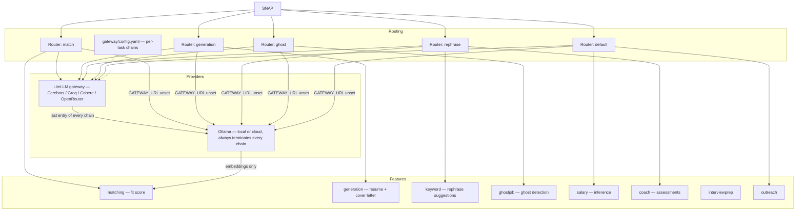
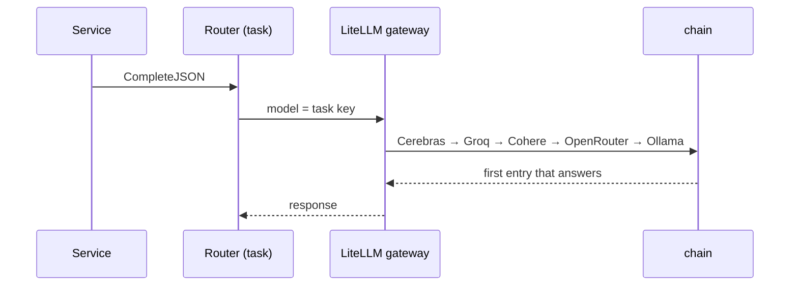

# AI overview

## Capability map

Five task keys, five routers, two adapters. Embeddings are Ollama-only, always.

## Principles

### The LLM is an adapter, not a dependency of the domain

Services take a `domain.Provider`. `Router` *is* a `Provider`, so per-task routing and
gateway fallback are invisible to every call site
(`internal/platform/llm/application/router.go`).

### Model choice is configuration, not a setting

There is no dashboard control, no database row and no API for choosing a provider or model.
The application asks for a task by name; `gateway/config.yaml` declares what serves it.
Changing a task's model is a YAML edit plus `docker compose restart litellm` — no
application restart, no rebuild.

### Degrade to Ollama, always

Every task's chain terminates at the local Ollama model, so AI work keeps completing when
every external provider is unavailable. Entries whose credential is absent are skipped
rather than failing the request, and with `GATEWAY_URL` unset the Router bypasses the
gateway entirely and talks to Ollama directly. This is Constitution V made mechanical.

### Classify provider errors; do not retry blindly

Six sentinels, two predicates, one circuit breaker
([LLM abstraction](/ai/llm-abstraction)). Terminal errors fail immediately; rate limits
cancel rather than retry.

### Cost and latency are policy, not accident

Per-task concurrency is a function of *where the model runs*: `AI_CONCURRENCY_LOCAL`
(default 1) for local Ollama, `AI_CONCURRENCY_CLOUD` (default 3) for hosted providers,
enforced by an admission gate at run time. `Router.ProviderClass()` decides which applies:
a configured gateway is hosted by definition, since every hop from there is remote.

### Cheap recall before expensive scoring

Matching embeds once and filters with pgvector, then spends LLM calls only on survivors —
and reuses a stored embedding when `EmbeddingHash` shows the text has not changed.

### Which provider served a request is observable

The gateway records the upstream that answered, and the application logs it as
`served_model`. That log line is the only thing the Go backend ever learns about the
upstream — it never holds a provider credential and never sees which one has quota left.

### Structured output is validated, with bounded retries

`CompleteStructured` strips fences, parses, validates, and retries at most twice more
(`internal/llm/types.go:68-80`). Target types may implement `Validator` for semantic
checks — `matching.FitResult.Validate` is the example.

## Task keys

The five task keys the application can ask for. Each is a `model_name` in
`gateway/config.yaml` and a `Router` in `cmd/server/compose.go`.

| Task key | Used by | Env default model |
| --- | --- | --- |
| `match` | matching fit scoring | `LLM_MODEL_MATCH` |
| `generation` | resume and cover letters | `LLM_MODEL_GENERATION` |
| `rephrase` | keyword suggestions, coach | `LLM_MODEL_REPHRASE` |
| `ghost` | ghost-job detection | `LLM_MODEL_GHOST` |
| `default` | salary, outreach, everything else | `LLM_MODEL` |

Note the asymmetry with queues: there are five task keys but only four queues carry an
LLM task key (`match`, `generation`, `default` for salary, `ghost`) —
`rephrase` runs on synchronous request paths, not on a queue
(`internal/queue/policy.go:40-95`).

## Reading order

- [LLM abstraction](/ai/llm-abstraction) — providers, router, errors, breaker
- [AI settings](/ai/llm-settings) — per-feature toggles, resume shape, and why model choice is not a setting
- [Matching](/ai/matching) — the two-phase scoring pipeline
- [Enrichment](/ai/enrichment) — detail backfill
- [Generation](/ai/generation) — documents and PDFs
- [Assistants](/ai/assistants) — coach, interview prep, outreach, intel
