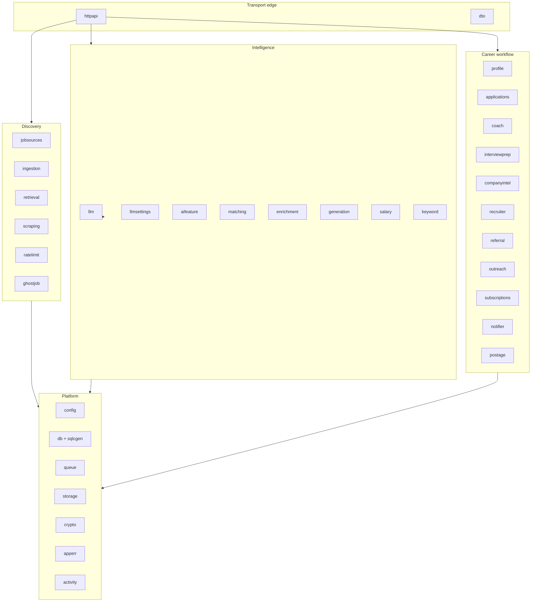
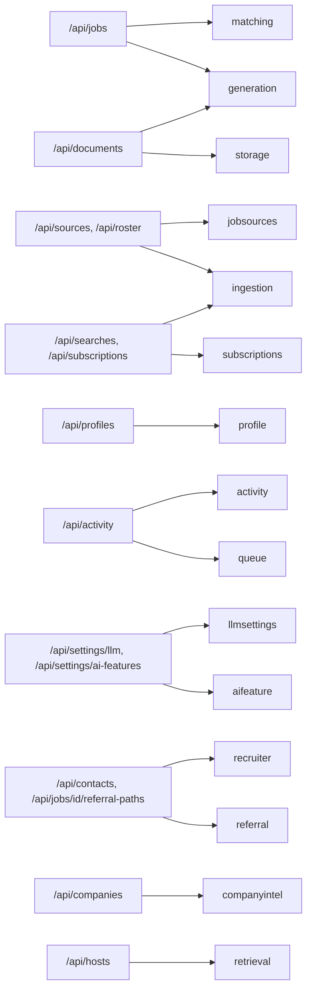

# Component map

## Package groups

## Platform packages

| Package | Owns |
| --- | --- |
| `config` | typed configuration loaded from environment (`mapstructure` tags) |
| `db` | pool, `Migrate`, generated `sqlcgen` queries |
| `dbutil` | UUID parse/format and other SQL glue |
| `dbtest` | helpers for tests that need a real database |
| `queue` | task types, payloads, `TaskPolicy`, admission gate + deadline middleware |
| `activity` | `ActivityRun` recorder, heartbeat, `Sweeper` for vanished workers |
| `storage` | generated documents on MinIO or local disk |
| `crypto` | encryption for secrets at rest (`CONFIG_ENCRYPTION_KEY`) |
| `apperr` | error kinds and the single HTTP status mapping |
| `dto` | wire types, source of `packages/shared/generated.ts` |
| `httpapi` | chi router, middleware, one file per handler group |
| `strutil`, `testutil` | small shared helpers |

## Discovery packages

| Package | Owns |
| --- | --- |
| `jobsources` | the adapter contract, the registry, and ~20 adapters under `adapters/` |
| `jobsources/roster` | ATS board roster and candidate discovery |
| `ingestion` | scheduler, run/reconcile logic, dedupe, saved-search and subscription runners |
| `retrieval` | the three-rung fetch ladder, browser identity, per-host state, transport |
| `scraping` | headless-browser service built on `retrieval` |
| `ratelimit` | crawl-delay-aware pacing |
| `ghostjob` | ghost-posting detection |

## Intelligence packages

| Package | Owns |
| --- | --- |
| `llm` | `Provider` interface, Ollama and Cerebras adapters, `Router`, error taxonomy, structured-output retry |
| `llmsettings` | persisted per-task provider/model settings, snapshot publication |
| `aifeature` | per-feature enable/disable settings |
| `matching` | similarity + LLM fit scoring, `MatchResult` persistence, ranking |
| `enrichment` | full job-detail fetch after ingest |
| `generation` | tailored resume and cover-letter generation, PDF rendering |
| `salary` | salary inference, levels.fyi CSV loader, `SalaryCache` |
| `keyword` | JD keyword diff, rephrase suggestions, STAR stories |

## Career-workflow packages

| Package | Owns |
| --- | --- |
| `profile` | master profile, resume document, embeddings |
| `applications` | kanban statuses, events, stats |
| `coach` | assessment of profile vs job |
| `interviewprep` | interview preparation built from profile + company intel |
| `companyintel` | company signals and intel refresh |
| `recruiter`, `referral` | contacts, contact graph, referral paths, CSV/GitHub import |
| `outreach` | outreach message generation and tones |
| `subscriptions` | recurring searches with their own cron |
| `notifier` | fresh-match notifications |
| `postage` | post-age response-rate analytics |

## Handler-to-package map

The full route inventory is in [HTTP API](/backend/http-api).

## Dependency rules

1. `httpapi` may import any service package; **no service package imports `httpapi`**.
2. Service packages import `db/sqlcgen` only through their own `ports.go`.
3. `llm` imports `config`; nothing in `llm` imports a business package.
4. Only `cmd/server` imports everything — that is the composition root.
