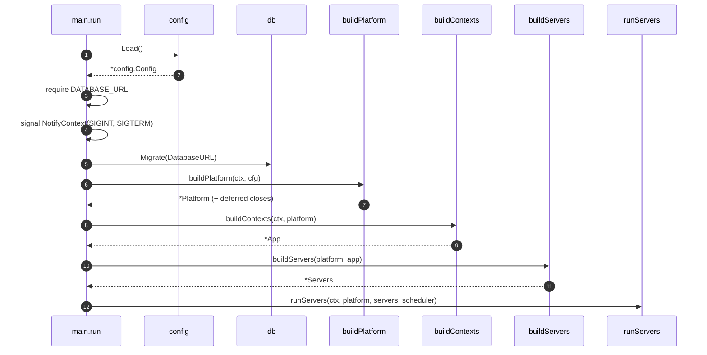
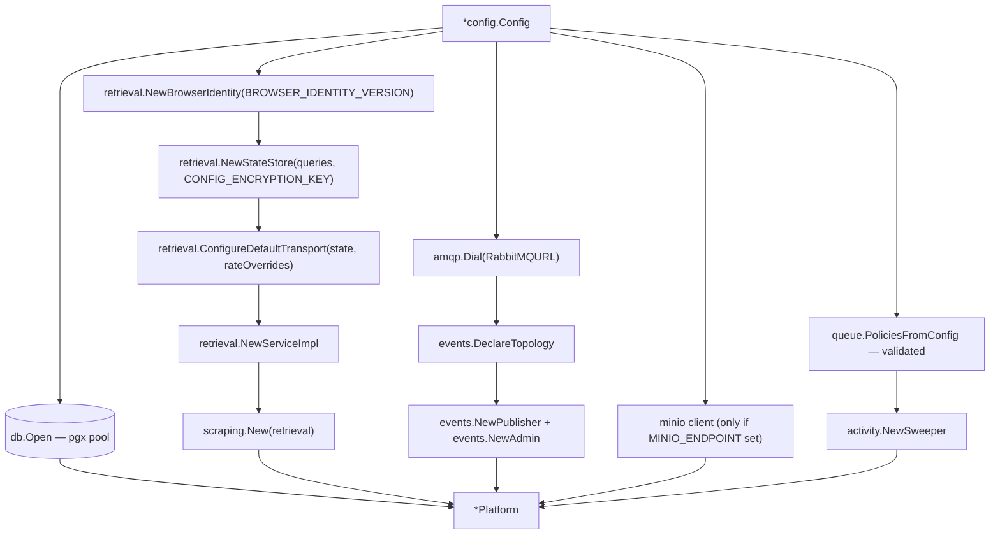
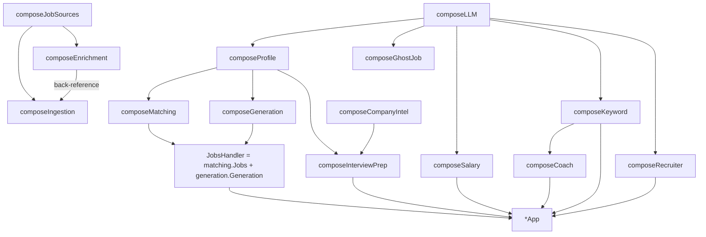
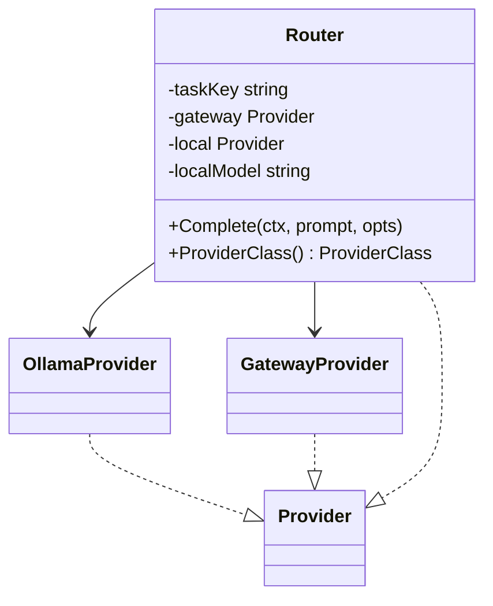
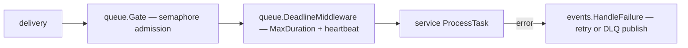

# Composition root

`apps/api/cmd/server` is the only package that knows the whole system. Everything else
receives its collaborators.

## Startup sequence

`main.go:21-54` is short enough to read in full — that is the point. The complexity lives
in the composers, and each one has a single reason to change.

## What `buildPlatform` owns

Two details worth internalising (`cmd/server/platform.go`):

- **Failure unwinds what it opened.** Every early return closes the database and the
  scraping service before returning the error — no leaked pool or connection on a bad
  `RabbitMQURL`.
- **`MinioReady` is nil when MinIO is disabled** (`platform.go:100-110`), and the
  readiness handler treats nil as "not configured" rather than "unhealthy". Optionality is
  represented by absence, not by a boolean flag.
- **Per-host rate overrides** are assembled here: `DJINNI_RATE_OVERRIDE_RPS` becomes an
  entry in the transport's override map (`platform.go:80-84`).

## What `buildContexts` owns

`compose.go:711-806` runs the composers in dependency order and performs the two wires that
cannot live inside any single composer.

The two cross-composer wires are called out in the function's doc comment:

1. `jobsHandler` needs `jobs.Service` from **matching** and `generation.Service` from
   **generation** (`compose.go:754`).
2. `ingestionH.Sources.Enrichment = enrichHandler` is a back-reference set after both
   exist (`compose.go:752`).

Naming a cycle-breaking assignment explicitly beats hiding it behind lazy initialisation.

## Routers are constructed per task, immutably

`composeLLM` builds five routers — `MatchRouter`, `GenerationRouter`, `RephraseRouter`,
`GhostRouter`, `DefaultRouter` — and hands each to the services that need it. Each is
fixed at construction: there is no holder, no atomic swap and no runtime reconfiguration.
Routing state lives in `gateway/config.yaml` and environment variables. Because `Router`
itself implements `Provider`, no service knows routing exists.

The same routers are handed to the activity handler as `queue.ClassResolver`s —
`queueClassResolvers` maps each policy's queue to the router that serves it — so the queue
view can report a provider class per queue, though since 044 removed the local/hosted split
this is always `hosted` for any LLM-backed queue.

## What `buildServers` owns

`servers.go`: the chi router with its mounts, and the six `events.Consumer`s. Each is built
by `Platform.consumer(...)` which composes admission gate → deadline middleware → handler,
then wraps a handler failure as a durable retry/dead-letter publish before ack:

`policyFor(taskType)` panics for an unknown type (`servers.go`) — every wired consumer must
have a validated policy. That is a startup invariant, not a runtime error path.

## Adding a feature to the graph

1. Write the service with its own `domain/port.go` declaring the queries it calls.
2. Add a `composeX` function in `compose.go`.
3. Add its handler to the `App` struct at the top of `compose.go`, and fold the handles in
   from `buildContexts`.
4. Add `app.X.Mount` to the `NewRouter(...)` call in `servers.go`.
5. If it is async: add the work type to `internal/queue` and `events.WorkTypes`
   (`internal/events/topology.go`), a payload, a `TaskPolicy`, then a `p.consumer(...)`
   line in `buildServers`.
