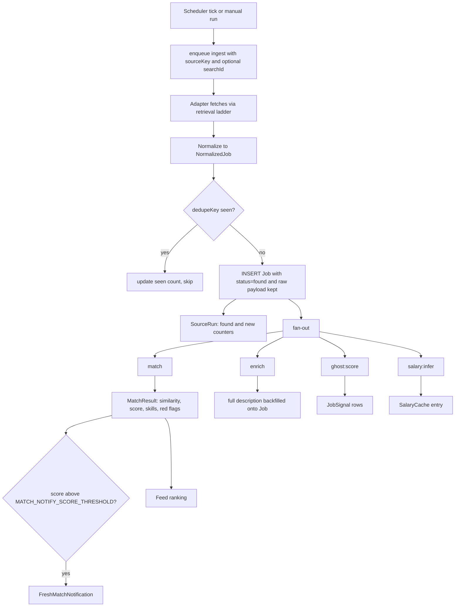
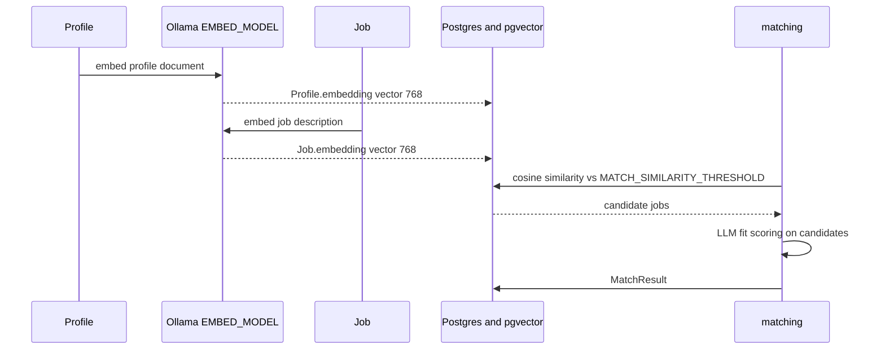
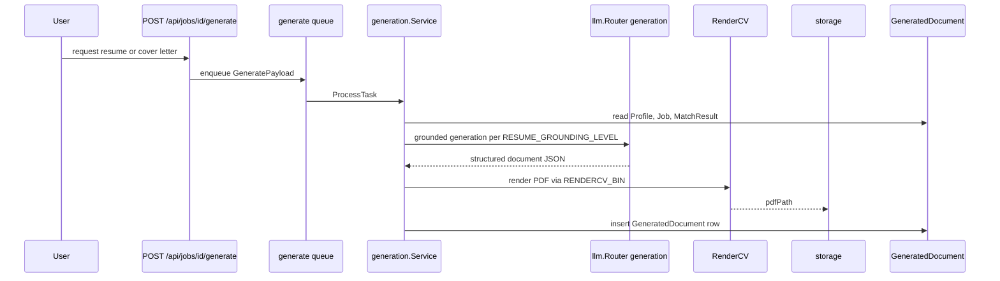
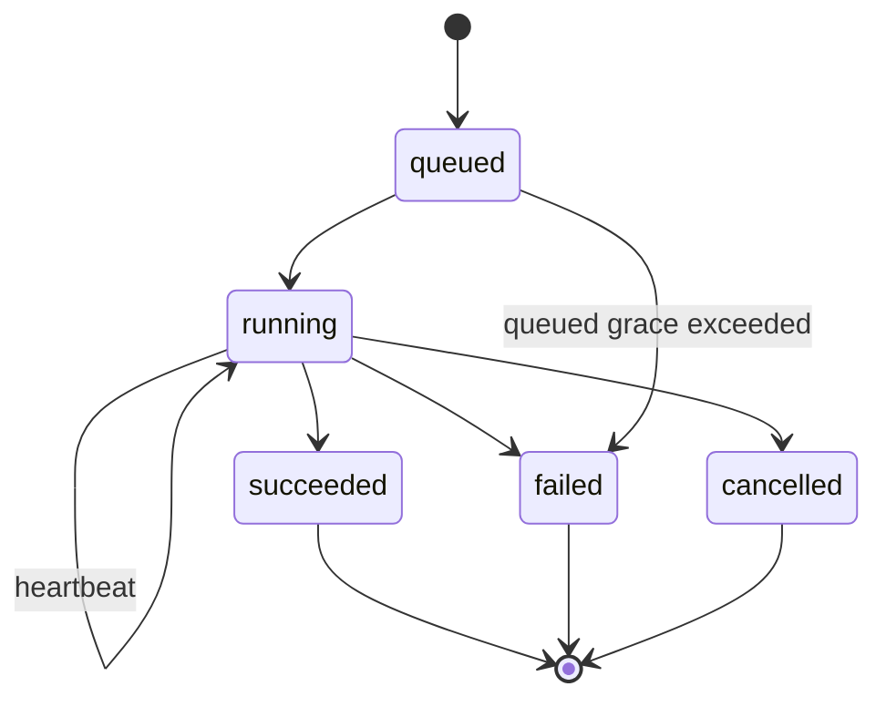
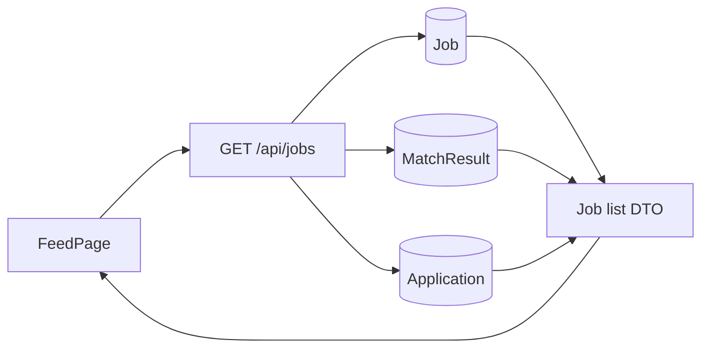

# Data flow

## The whole pipeline

## Stage by stage

| Stage | Package | Writes |
| --- | --- | --- |
| Schedule | `ingestion` (`scheduler.go`) | enqueues `ingest` |
| Fetch | `jobsources/adapters` + `retrieval` | `host_retrieval_state` |
| Normalize + dedupe | `ingestion` (`dedupe.go`) | `Job`, `SourceRun` |
| Score | `matching` | `MatchResult` |
| Detail backfill | `enrichment` | `Job.description`, `Job.raw` |
| Ghost detection | `ghostjob` | `JobSignal` |
| Salary inference | `salary` | `SalaryCache` |
| Notify | `notifier` | `FreshMatchNotification` |
| Generate | `generation` | `GeneratedDocument` + PDF in storage |
| Track | `applications` | `Application` (status, events) |

## Embeddings and similarity

:::note Embeddings stay on Ollama
Chat tasks can be routed to Cerebras; embeddings cannot — neither remote provider exposes
an embeddings API. `EMBED_URL` therefore always points at an Ollama instance
(`internal/llm/factory.go:24-30`).
:::

The two-phase design — cheap vector recall, then expensive LLM scoring on the survivors —
is what keeps a local model viable for a feed of thousands of jobs.

## Document generation

`GeneratedDocument` is versioned by `UNIQUE(jobId, type, version)`
(`00001_init.sql:19-28`) — regenerating never overwrites the copy you already sent.

## Activity as the cross-cutting spine

Every async operation writes an `ActivityRun`, which is what the Status page reads.

## Read path for the feed

The join happens in SQL (`internal/db/queries/joblist.sql`) so the dashboard renders one
paginated payload rather than issuing per-job follow-ups.
