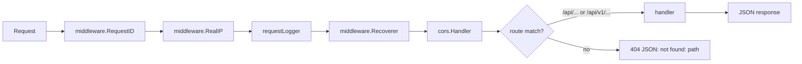
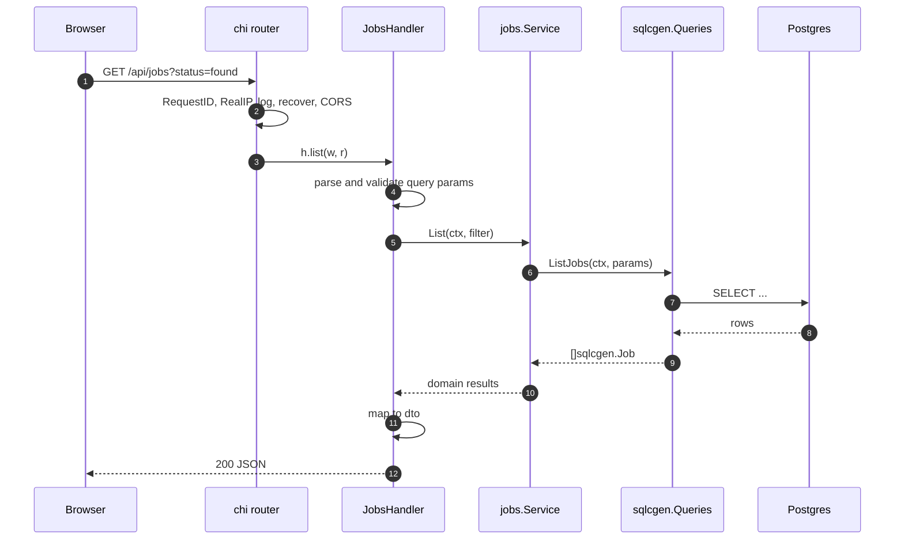
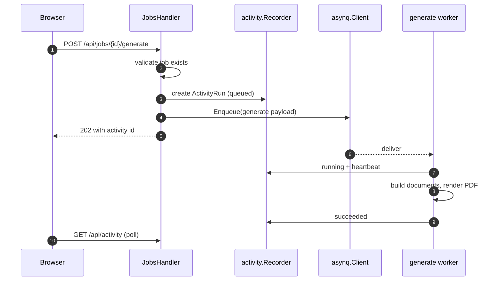
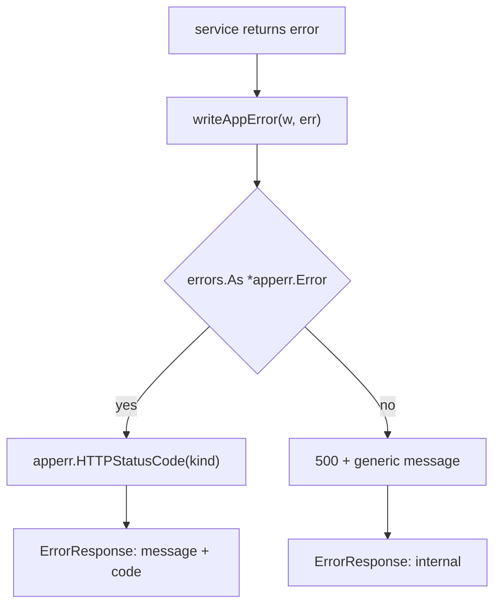
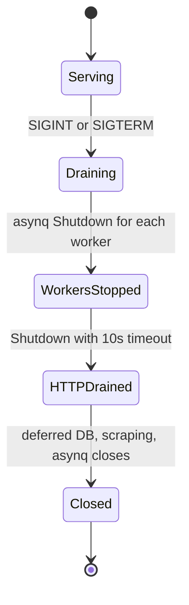

# Request lifecycle

## The middleware chain

`NewRouter` (`internal/httpapi/router.go:13-41`) builds the chain once, for all routes:



Notable choices:

- **Dual mount.** The same `mountAll` closure is registered under `/api` and `/api/v1`
  (`router.go:38-39`). Handlers therefore declare unversioned paths; adding a version
  prefix inside a `Mount` produces `/api/v1/v1/...`.
- **`/health` is inside `mountAll`** (`router.go:28`), so it exists at both prefixes, and
  it is a liveness probe only: `{ok, uptime}`. Readiness is a separate handler at
  `/health/ready` (`internal/httpapi/health.go:34`).
- **CORS is permissive with credentials off.** Appropriate for a self-hosted single-user
  app served from a different dev-server origin.
- **`Recoverer` before the handlers** means a panic becomes a 500 rather than killing the
  process.

## A read request, end to end



The mapping step is deliberate: generated row structs never appear on the wire. See
[Domain modeling](/principles/domain-modeling).

## A write request that starts async work



The HTTP request returns as soon as the task is durable in Redis. Progress is observed
through `/api/activity`, never by holding the connection open.

## Error mapping



Response envelope (`internal/httpapi/helpers.go:12-16`):

```json
{ "message": "job 8f3c… not found", "code": "not_found" }
```

## Handler conventions

| Concern | Convention |
| --- | --- |
| Registration | `func (h *XHandler) Mount(r chi.Router)`, passed to `NewRouter` in `servers.go` |
| Path params | `chi.URLParam(r, "id")`, validated before use |
| Body decoding | `decodeJSON(r, &dst)` (`helpers.go:51-54`) |
| Success | `writeJSON(w, status, payload)` |
| Failure | `writeAppError(w, err)` — never a hand-picked status |
| Multipart | detected by `Content-Type` prefix, e.g. `profiles.go:133`, `referral.go:59` |

## Timeouts and shutdown

`http.Server` sets `ReadHeaderTimeout: 10s` (`cmd/server/servers.go:71`). On SIGINT or
SIGTERM the context from `signal.NotifyContext` (`main.go:31`) cancels; workers shut down
first, then the HTTP server drains with a 10-second timeout
(`servers.go:108-114`).


