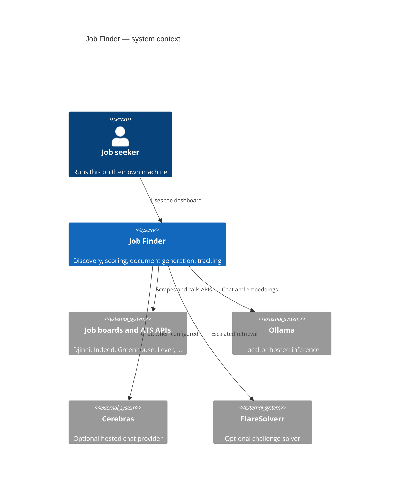
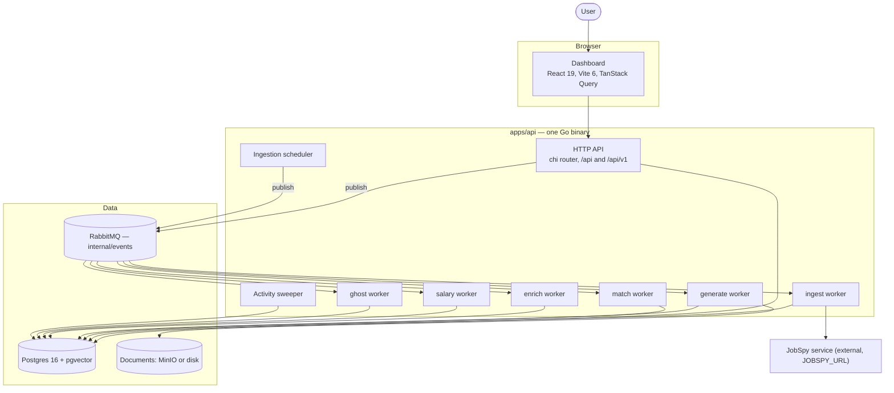
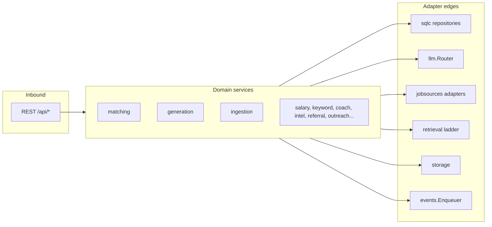
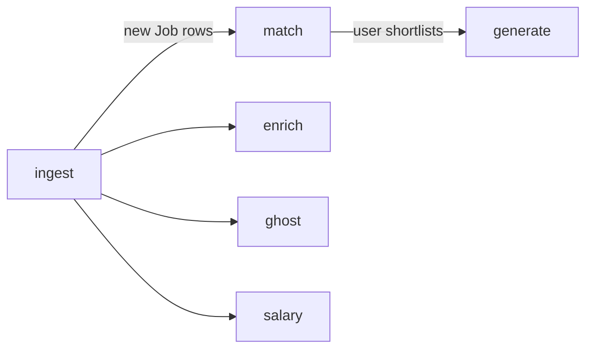

# System overview

## Context

## Containers

Everything inside `Process` is a goroutine started by `runServers`
(`cmd/server/servers.go:86-114`). There is no inter-service RPC to configure, secure or
debug.

## Why one binary

| Force | Consequence |
| --- | --- |
| Single-user, self-hosted | no multi-tenant isolation, no horizontal scaling requirement |
| Workers need the same DB and config as the API | shared process avoids duplicating wiring |
| Operators are the users | one `make run-backend` beats a compose topology |
| But: task types have very different concurrency | six **separate** RabbitMQ queues and consumers, one per work type |

The last row is the interesting one. Rather than one worker pool with weighted queues, each
work type gets its own `work.<work_type>` queue and its own `events.Consumer`, whose
RabbitMQ prefetch is a hard per-type ceiling (`internal/events/topology.go`,
`cmd/server/servers.go`).

## Runtime boundaries

Every arrow leaving `Core` crosses an interface the core declared
([ports and adapters](/principles/dependency-injection)). That is what makes the domain
testable without Postgres, RabbitMQ, or a network.

## The six work queues at a glance

`ingest` is the fan-out point: persisting a new job triggers the per-job pipelines.
`generate` is the only queue driven by an explicit human action.

## Failure isolation

| Failure | Blast radius |
| --- | --- |
| One job source is down | that source's `ingest` task; `SourceRun.ok=false`, other sources unaffected |
| Cerebras key revoked | affected task fails terminally with the reason on its `ActivityRun`; Ollama tasks unaffected |
| Provider 429 | breaker holds that provider; queued tasks cancelled, retried by the operator later |
| RabbitMQ down | HTTP reads still serve from Postgres; publishes fail; consumers reconnect with bounded backoff once it returns |
| Postgres down | readiness fails (`/api/health/ready`); the process stays up |
| A worker goroutine wedges | the activity sweeper closes out its stale `ActivityRun` |

## Where to go next

- [Component map](/architecture/component-map) — every package and what it owns
- [Composition root](/architecture/composition-root) — how it is all wired
- [Request lifecycle](/architecture/request-lifecycle) — one request, end to end
- [Data flow](/architecture/data-flow) — one job, from board to kanban
