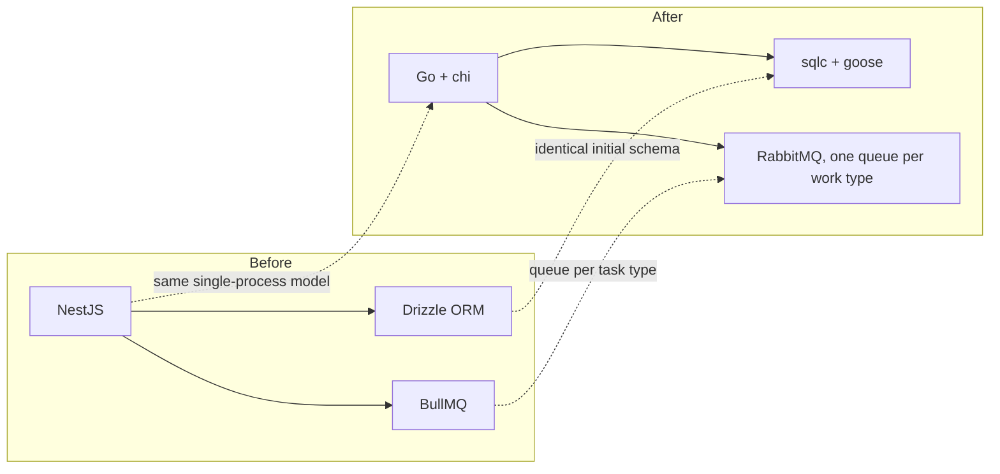
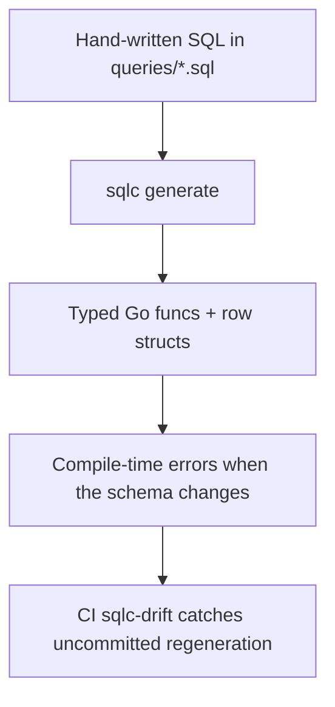
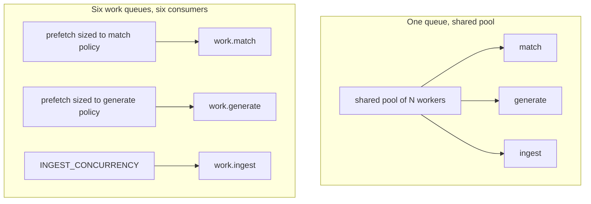

# Technology choices

## The stack

| Layer | Choice | Notes |
| --- | --- | --- |
| Backend language | Go | single static binary, cheap goroutines for API + workers + scheduler |
| HTTP router | `chi` v5 | `net/http`-native, middleware chain, no framework lock-in |
| DB access | `sqlc` over pgx | generated type-safe Go from hand-written SQL |
| Migrations | `goose` | plain SQL with `-- +goose Up` / `Down` markers |
| Database | Postgres + `pgvector` | relational data and embeddings in one store |
| Queue | RabbitMQ, direct `amqp091-go` | quorum queues, dead-lettering and delayed retry natively; management UI available |
| Inference | Ollama (default), Cerebras (optional) | local-first, remote opt-in |
| Object storage | MinIO, or local disk | optional; absence means disk |
| Frontend | React 19 + Vite 6 | fast dev loop |
| Data fetching | TanStack Query v5 | cache, invalidation, polling for activity |
| Styling | Tailwind 4 + Radix primitives | unstyled accessible primitives, utility CSS |
| Kanban | dnd-kit | tracker drag and drop |
| Type sharing | `tygo` → `packages/shared` | Go DTOs are the source of truth |
| Tests | `go test`, Vitest, Playwright | plus opt-in live smoke tests |

## Migration from the original NestJS stack

This project was a NestJS + Drizzle + BullMQ application. The Go port kept the shape and
replaced the pieces:

The evidence is still in the tree: `00001_init.sql:1-5` states it reuses Drizzle's initial
migration SQL verbatim so `goose up` produces a byte-identical schema. The queue-per-type
shape BullMQ set also outlived an intermediate stop at `asynq` (on Redis): the API moved to
RabbitMQ, one `work.<work_type>` quorum queue per type, in the 047 migration.

:::note What the current tree actually runs
Go backend, sqlc + goose, RabbitMQ (`internal/events`), and Ollama as the local-first LLM
provider. Hosted inference, when enabled, goes through the LiteLLM gateway rather than
through a provider adapter in Go.
:::

## Why sqlc rather than an ORM

Accepted trade-offs: no dynamic query builder (complex filters are written out), and
generated code in the diff. Gained: the query you read is the query that runs, and schema
drift is a compile error rather than a runtime surprise.

## Why one RabbitMQ queue and consumer per work type

A single connection with a shared weighted queue map would control *priority*, not a
per-queue ceiling. Each work type needs its own hard concurrency cap — historically because
local inference tolerated one concurrent request while hosted inference tolerated several;
since 044 removed that split it is simply each work type's own configured concurrency — so
each gets its own `work.<work_type>` queue and its own `events.Consumer`, whose RabbitMQ
`Qos` prefetch is that hard ceiling (`internal/events/topology.go`,
`internal/queue/policy.go`).

## Why pgvector instead of a dedicated vector database

One store means one backup, one connection pool, and joins between embeddings and
relational data in a single query. `Job.embedding` and `Profile.embedding` are
`vector(768)` columns (`00001_init.sql:44`, `:79`), sized to `EMBED_DIMS`.

## Why local-first inference

Job descriptions and your resume are personal data. Ollama runs on your machine by
default; remote providers are opt-in per task and fall back to Ollama when unconfigured
(`internal/llm/router.go:79-90`). Embeddings never leave Ollama at all.

## The `sidecar` source kind

`dto.SourceKind` lists `sidecar` alongside `api`, `scrape` and `manual`
(`internal/dto/scraper_aliases.go:21-28`, aliased from the job-scraper library). One
registered adapter uses it: `jobspy`, which delegates to a JobSpy service reached over
HTTP at `JOBSPY_URL` (`cmd/server/compose.go:194`). The Python sidecar that used to ship
in this repo as `apps/jobspy-sidecar/` is gone (commit `b433986`) — the service is now
deployed separately. Every other source is a direct API client or a scrape adapter going
through `internal/retrieval`.
