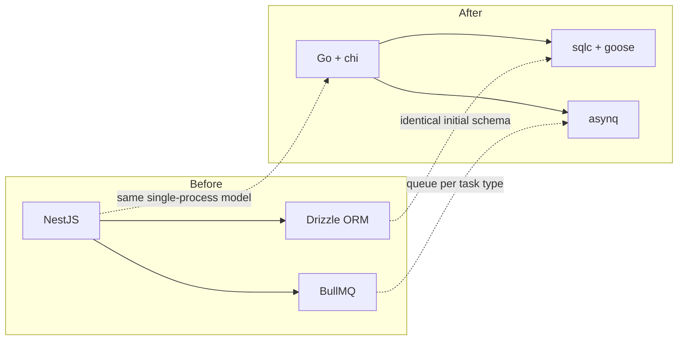
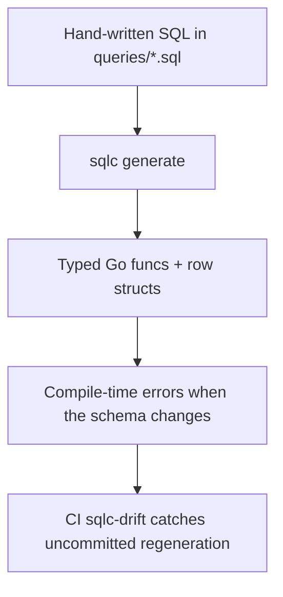
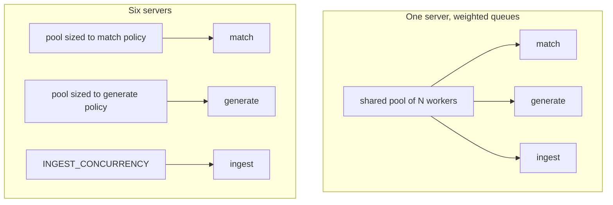

# Technology choices

## The stack

| Layer | Choice | Notes |
| --- | --- | --- |
| Backend language | Go | single static binary, cheap goroutines for API + workers + scheduler |
| HTTP router | `chi` v5 | `net/http`-native, middleware chain, no framework lock-in |
| DB access | `sqlc` over pgx | generated type-safe Go from hand-written SQL |
| Migrations | `goose` | plain SQL with `-- +goose Up` / `Down` markers |
| Database | Postgres + `pgvector` | relational data and embeddings in one store |
| Queue | `asynq` on Redis | Go-native, inspectable, asynqmon UI available |
| Inference | Ollama (default), Cerebras (optional) | local-first, remote opt-in |
| Object storage | MinIO, or local disk | optional; absence means disk |
| Frontend | React 19 + Vite 6 | fast dev loop |
| Data fetching | TanStack Query v5 | cache, invalidation, polling for activity |
| Styling | Tailwind 4 + Radix primitives | unstyled accessible primitives, utility CSS |
| Kanban | dnd-kit | tracker drag and drop |
| Type sharing | `tygo` → `packages/shared` | Go DTOs are the source of truth |
| Tests | `go test`, Vitest, Playwright | plus opt-in live smoke tests |

## Migration from the original NestJS stack

This project was a NestJS + Drizzle + BullMQ application. The Go port kept the shape and
replaced the pieces:

The evidence is still in the tree: `00001_init.sql:1-5` states it reuses Drizzle's initial
migration SQL verbatim so `goose up` produces a byte-identical schema, and `queue.go`
describes its queue layout as mirroring "the BullMQ setup's separate queues".

:::note What the current tree actually runs
Go backend, sqlc + goose, asynq on Redis, and Ollama as the local-first LLM provider.
Hosted inference, when enabled, goes through the LiteLLM gateway rather than through a
provider adapter in Go.
:::

## Why sqlc rather than an ORM

Accepted trade-offs: no dynamic query builder (complex filters are written out), and
generated code in the diff. Gained: the query you read is the query that runs, and schema
drift is a compile error rather than a runtime surprise.

## Why asynq with one server per task type

A single `asynq.Server` with a `Queues` weight map shares one worker pool across queues —
weights control *priority*, not a per-queue ceiling. Since local inference tolerates one
concurrent request while hosted inference tolerates several, each task type needs its own
hard cap, so each gets its own server (`internal/queue/queue.go:22-37`).

## Why pgvector instead of a dedicated vector database

One store means one backup, one connection pool, and joins between embeddings and
relational data in a single query. `Job.embedding` and `Profile.embedding` are
`vector(768)` columns (`00001_init.sql:44`, `:79`), sized to `EMBED_DIMS`.

## Why local-first inference

Job descriptions and your resume are personal data. Ollama runs on your machine by
default; remote providers are opt-in per task and fall back to Ollama when unconfigured
(`internal/llm/router.go:79-90`). Embeddings never leave Ollama at all.

## The Python sidecar that no longer exists

`dto.SourceKind` still lists `sidecar` alongside `api` and `scrape`
(`internal/dto/dto.go:8`), a remnant of a JobSpy-backed Python sidecar. The adapter and the
sidecar were removed in commit `b433986`; `apps/jobspy-sidecar/` retains only a stale
virtualenv and test directory, and no registered adapter uses the `sidecar` kind. Every
source today is either a direct API client or a scrape adapter going through
`internal/retrieval`.
