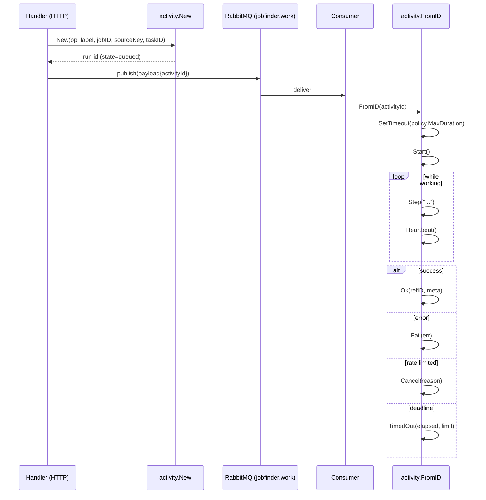
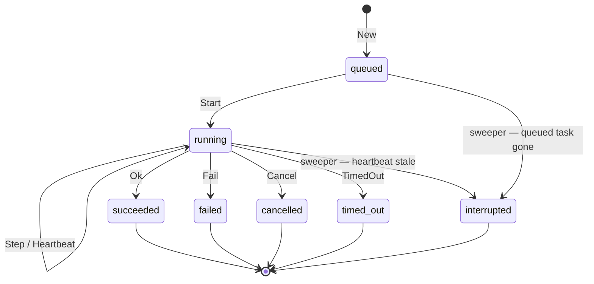
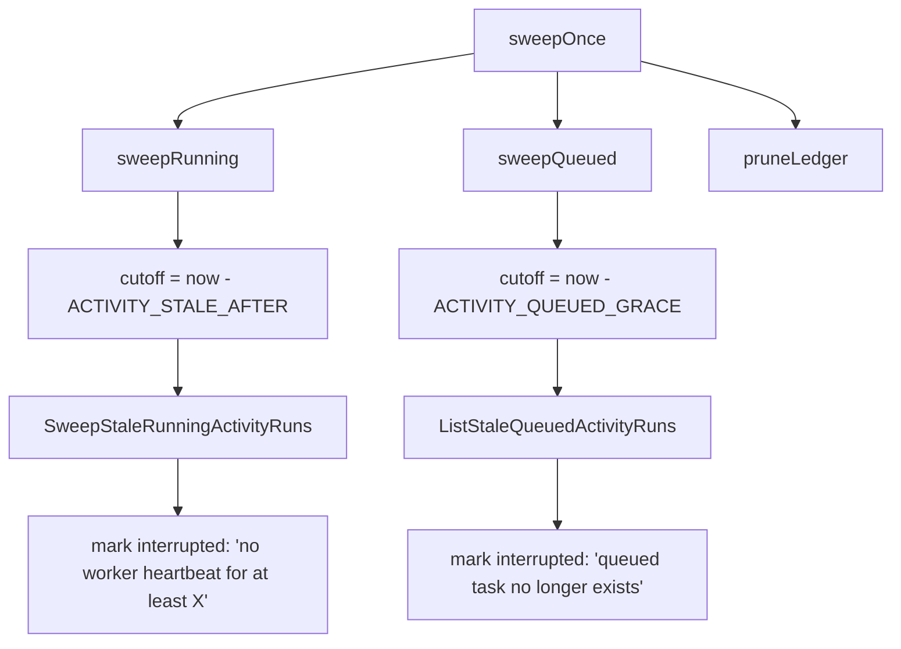
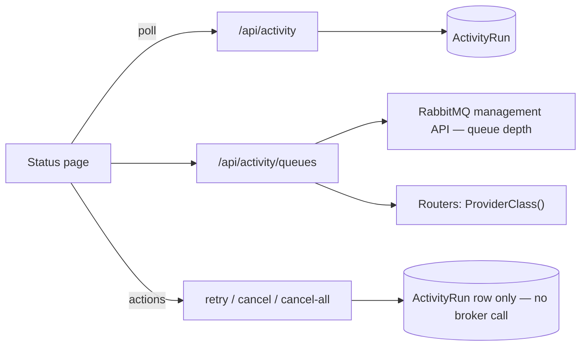

# Activity tracking

`ActivityRun` is how every async operation becomes visible. One row per task attempt, from
enqueue to terminal state.

## The row

```sql
CREATE TABLE "ActivityRun" (
  "id"          uuid PRIMARY KEY DEFAULT gen_random_uuid(),
  "op"          text NOT NULL,
  "state"       text NOT NULL DEFAULT 'queued',
  "label"       text NOT NULL,
  "step"        text,
  "jobId"       uuid,
  "sourceKey"   text,
  "queueTaskId" text,
  "refId"       text,
  "error"       text,
  "meta"        jsonb NOT NULL DEFAULT '{}'::jsonb,
  "createdAt"   timestamp (3) DEFAULT now() NOT NULL,
  "startedAt"   timestamp (3),
  "finishedAt"  timestamp (3)
);
```

| Column | Role |
| --- | --- |
| `op` | which operation — used to find the queue (`queueForOp`) |
| `label` | human-readable description shown in the UI |
| `step` | current stage, e.g. `embedding`, `prefilter (similarity)` |
| `queueTaskId` | historical name, kept for the column; RabbitMQ has no per-message id to store here the way asynq did, so this is no longer used to look anything up |
| `refId` | the produced artefact's id on success |
| `error` | terminal reason |
| `meta` | free-form jsonb |

## Recorder API

```go
func New(ctx, q Store, op, label string, jobID, sourceKey *string, taskID string) *Recorder
func FromID(q Store, id string) *Recorder

func (r *Recorder) Start(ctx)
func (r *Recorder) Step(ctx, label string, meta map[string]any)
func (r *Recorder) Heartbeat(ctx)
func (r *Recorder) SetTimeout(ctx, ms int32)
func (r *Recorder) Ok(ctx, refID string, meta map[string]any)
func (r *Recorder) Fail(ctx, err error)
func (r *Recorder) Cancel(ctx, reason string)
func (r *Recorder) TimedOut(ctx, elapsed, limit time.Duration)
```

Two construction paths, for the two sides of the queue:

- **`New`** — the HTTP handler or scheduler creates the run *before* enqueueing, so a task
  is observable even while queued.
- **`FromID`** — the worker attaches to the existing run using the `activityId` from the
  payload.

`Recorder` is nil-safe (`valid()`, `recorder.go:40-42`): code paths without a run call the
same methods and they no-op.



## States



## The sweeper

A worker killed mid-task cannot mark its own run. `activity.Sweeper` closes those out
(`sweeper.go:40-52`).

```go
func NewSweeper(store SweeperStore,
                staleAfter, sweepInterval, queuedGrace time.Duration) *Sweeper
```

It runs **once at startup** — catching runs orphaned by the previous process — then every
`ACTIVITY_SWEEP_INTERVAL`.

### Two sweeps



**This is a behavior change from asynq.** RabbitMQ has no cheap "does this message still
exist" query the way asynq's Redis-backed `Inspector.GetTaskInfo` did, so `NewSweeper` no
longer takes a broker inspector at all (`internal/activity/sweeper.go`). `sweepQueued` is
now DB-authoritative and unconditional: any `ActivityRun` still `queued` past
`ACTIVITY_QUEUED_GRACE` is marked `interrupted`, whether or not its message is still
genuinely sitting in `work.<work_type>`. `ACTIVITY_QUEUED_GRACE` (default 30 minutes) is the
only thing protecting a long-queued-but-still-pending run from a false positive — there is
no broker check to fall back on if that window is set too tight.

`sweepOnce` also runs a third pass, `pruneLedger`, deleting idempotency-ledger rows older
than the longest retry budget plus a day's margin — unrelated to asynq, but new in this
migration (`internal/events`, data-model.md § 7).

:::note The sweeper never reopens a finished run
Its comment is explicit: the underlying queries filter to `running` / `queued`, *"so a run
that finished between sweep read and write is never re-opened."* This is why the fix is a
narrow query rather than a read-modify-write in Go.
:::

### Bounds, validated at startup

`validateLiveness` (`internal/queue/policy.go:113-125`) enforces:

| Rule | Reason |
| --- | --- |
| `ACTIVITY_HEARTBEAT_INTERVAL > 0` | there must be a heartbeat |
| `ACTIVITY_STALE_AFTER >= 2 × heartbeat` | one missed beat must not look like death |
| `ACTIVITY_STALE_AFTER + ACTIVITY_SWEEP_INTERVAL < 5m` | a dead run is visible within five minutes |

Defaults: heartbeat `30s`, stale after `2m`, sweep `1m`, queued grace `30m`.

## HTTP surface

| Method | Path | Effect |
| --- | --- | --- |
| GET | `/api/activity` | recent runs |
| GET | `/api/activity/queues` | per-queue backlog and the provider class each queue will use |
| POST | `/api/activity/retry` | retry failed or cancelled work |
| POST | `/api/activity/{id}/cancel` | cancel one run — **DB-state only, see below** |
| POST | `/api/activity/cancel-all` | cancel everything queued — same caveat |

:::warning Cancel no longer pulls the message off the queue
This is the one behavior regression from asynq, not a deliberate design choice. asynq's
Redis-backed Inspector could delete a specific task by id; RabbitMQ has no per-message
cancel/delete-by-id, so a queued unit of work can no longer be surgically pulled off the
broker. `cancelOne` (`internal/activity/interfaces/http/activity.go`) only marks the
`ActivityRun` row `cancelled` — the underlying message may still be delivered and run to
completion by its handler, which does not check for a cancelled activity before starting
work. This is flagged for a follow-up rather than silently narrowed.
:::

`NewActivityHandler(queries, client, inspector, policies, resolvers)` receives an
`ActivityInspector` backed by RabbitMQ's management API (`events.Admin`) for queue depth,
and the four LLM routers as `ClassResolver`s for `/activity/queues`'s `providerClass` field
— which, since 044 removed the local/hosted split, is always `hosted` for any queue with an
LLM task key.



## Reading a run

| You see | It means |
| --- | --- |
| `queued` for a long time | a worker slot is busy, or the provider class is saturated |
| `running` with an old `step` | the task is inside a long model call — check the heartbeat |
| `interrupted` | the process died, or the run sat `queued` past `ACTIVITY_QUEUED_GRACE` |
| `timed_out` | the task exceeded its `MaxDuration`; safe to retry |
| `cancelled` | a provider rate limit tripped the breaker |
| `failed` with a provider reason | terminal: key, credits, or model — fix and retry |
