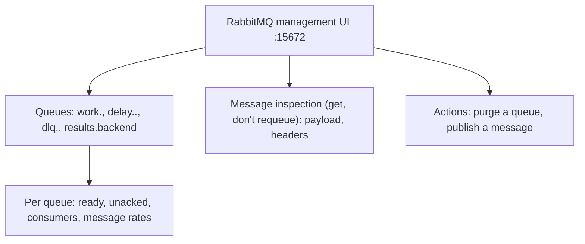
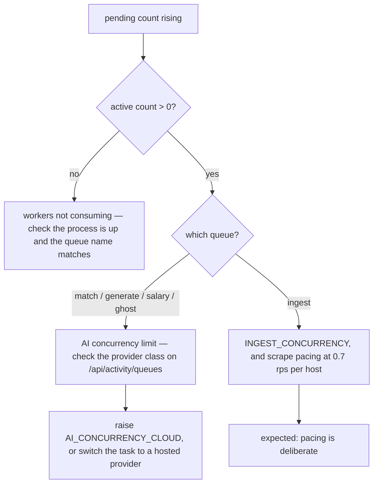
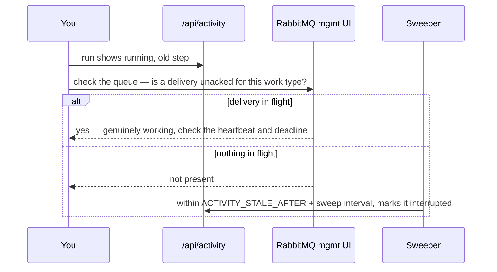

# Queue monitoring

## RabbitMQ management UI

asynqmon is gone along with asynq and Redis. RabbitMQ's own management plugin fills the
same "look inside the broker" role, published in development at `http://localhost:15672`
after `just up`.

:::warning Development only
Like asynqmon before it, the management UI is not published in `docker-compose.prod.yml` —
no auth in front of it, so it must never ship to production. In production, reach it through
`docker compose exec rabbitmq rabbitmqctl` or a tunnel.
:::

Unlike asynqmon, the management UI reads live broker state directly rather than something
asynq curated — it shows every exchange, queue and binding `internal/events/topology.go`
declares, not just work-type-shaped queues, and it has no notion of "retry count" or
"archived" the way asynq's Redis structures did (see below).

## What it shows

RabbitMQ has no per-message "retry count" or "archived" state the way asynq's Redis
structures did — that information now lives in the message's `x-attempt` and
`x-first-failure-reason` headers (`internal/events/retry.go`), visible only by opening the
message, and in which queue it currently sits (a work queue, a `delay.*` rung, or a `dlq.*`).

## Two views, two purposes

| View | Source | Use it for |
| --- | --- | --- |
| RabbitMQ management UI (`:15672`) | The broker itself | queue mechanics: is the message there, which rung/DLQ, what is the raw payload and headers |
| Status page (`/api/activity`) | Postgres `ActivityRun` | business meaning: which job, which step, why it failed |
| `GET /api/health/ready` | Postgres + RabbitMQ management API | `dlq_depth` per work type, without opening the management UI |

All three are needed. A message can be gone from RabbitMQ while its `ActivityRun` still says
`queued` — which is exactly the case the [sweeper](/async/activity-tracking) resolves,
though note the sweeper itself no longer checks the broker before doing so (see
[Activity tracking](/async/activity-tracking)).

## Triage playbook

### Queue backlog is growing

### Tasks are retrying

Open the message in the RabbitMQ management UI — while it sits in a work or delay queue —
and read the payload/headers, or check `x-first-failure-reason` once it lands in a
`dlq.<work_type>`.

| Error text | Meaning | Action |
| --- | --- | --- |
| `llm: provider unavailable` | 5xx or transport | transient — let it retry |
| `llm: invalid provider response` | bad body | transient |
| `llm: provider credential rejected` | bad key | terminal — fix the key, restart, retry |
| `llm: provider account out of credits` | quota | terminal |
| `llm: model unavailable` | unknown model | terminal — pick a supported model in Settings |
| `llm: rate limited` | 429 | the breaker is holding; retry from the Status page after it clears |
| `queue: task exceeded its deadline` | over `MaxDuration` | safe to retry; consider raising the timeout |

### Everything is stuck on one provider

`GET /api/activity/queues` reports the resolved provider class per queue. A queue reports
`hosted` whenever `GATEWAY_URL` is set — every hop from the gateway is remote, including
its own Ollama tier. To find which upstream actually served a request, read the
`served_model` log line, or `docker compose logs litellm`.

### Runs stuck in `running`

Defaults put the maximum detection delay at three minutes (`2m` stale + `1m` sweep), and
`validateLiveness` refuses to boot with settings that would exceed five. RabbitMQ has no
per-message "is this task active" query the way asynq's Inspector did, so this cross-check
is a manual read of consumer/unacked counts, not something the sweeper itself performs.

### RabbitMQ queue was purged, or a message was lost

Queued `ActivityRun` rows have no message behind them. Unlike under asynq, the sweeper's
queued pass no longer checks the broker at all — it unconditionally marks any row still
`queued` past `ACTIVITY_QUEUED_GRACE` (default 30 minutes) as `interrupted`, whether or not
a message ever actually existed. Re-run the affected searches.

## Safe actions

| Action | Where | Safe? |
| --- | --- | --- |
| Retry a failed run | Status page (`POST /api/activity/retry`) | yes — handlers re-read state |
| Cancel one run / cancel all queued | Status page | marks the `ActivityRun` row cancelled only — the message may still be delivered and processed (see [Activity tracking](/async/activity-tracking)) |
| Re-dispatch a message stuck in a DLQ | RabbitMQ management UI, manual | yes, once the failure cause is fixed — see [below](#rabbitmq-dead-letter-re-dispatch) |
| Purge a queue in the management UI | RabbitMQ management UI | discards messages permanently; leaves orphaned `ActivityRun` rows for the sweeper to close out |

## RabbitMQ dead-letter re-dispatch

Every work type has a dead-letter queue, `dlq.<work_type>` (e.g. `dlq.ingest`), bound to the
`jobfinder.dlx` exchange. A message lands there either because it was non-retryable (a
terminal `Failure` category) or because it exhausted its retry budget on the fixed backoff
ladder — `1s → 10s → 1m → 10m` — reusing the longest rung past four attempts
(`apps/api/internal/events/retry.go`). The message carries an `x-first-failure-reason`
header recording why it was first dead-lettered, and an `x-attempt` header at the count it
reached.

The backend health endpoint (`GET /api/health/ready`) reports DLQ depth per work type under
`dlq_depth`, so a non-empty DLQ is visible without opening the RabbitMQ management UI. It
does not affect the endpoint's overall `ok` status — a non-empty DLQ is a signal to
investigate, not an outage.

To re-dispatch a message stuck in a DLQ once its cause is fixed (e.g. a bad credential
corrected, a downstream bug patched):

1. Open the RabbitMQ management UI (`:15672` in development; not published in production —
   use `docker compose exec rabbitmq rabbitmqctl` or a tunnel there) and inspect the message
   in `dlq.<work_type>` to confirm the fix actually addresses `x-first-failure-reason`.
2. **Reset the `x-attempt` header to `0`** before republishing — leaving the exhausted
   attempt count in place sends it straight back to `dlq.<work_type>` the moment it fails
   once more, since `Decide` treats `x-attempt` as already-consumed budget.
3. Republish the message body and headers to the `jobfinder.work` exchange with the
   work type as routing key (e.g. routing key `ingest` for `dlq.ingest`) — the same
   exchange and routing convention `apps/api/internal/events/topology.go` binds every
   `work.<work_type>` queue to. Do not publish directly to `work.<work_type>`; publishing to
   the exchange keeps routing centralized in the topology's bindings.
4. Confirm the message is gone from the DLQ and its result lands on `jobfinder.results` (or
   check `/api/health/ready`'s `dlq_depth` for that work type dropping).

There is no automated re-dispatch tool yet — this is a manual operator action, deliberately
gated behind inspecting the failure reason first, since blindly replaying a DLQ can
re-trigger the same terminal failure for every message in it.

## Logs

Structured `slog` output from the process complements both views. Useful prefixes:

| Prefix | Source |
| --- | --- |
| `activity: swept stale running runs` | sweeper found orphans |
| `scheduler: bad cron expression` | a `SavedSearch` has an invalid cron |
| `retrieval: browser rung unavailable, will skip` | headless browser failed to initialise |
| `retrieval: flaresolverr rung configured` | FlareSolverr is in the ladder |
| `salary: LEVELS_FYI_CSV not set` | optional salary source disabled |
| `events: consumer disconnected, reconnecting` | a consumer's broker connection dropped and is retrying with backoff |
| `consumer error` | a consumer's `Run` returned (context cancelled, or a non-retriable dial failure) |
