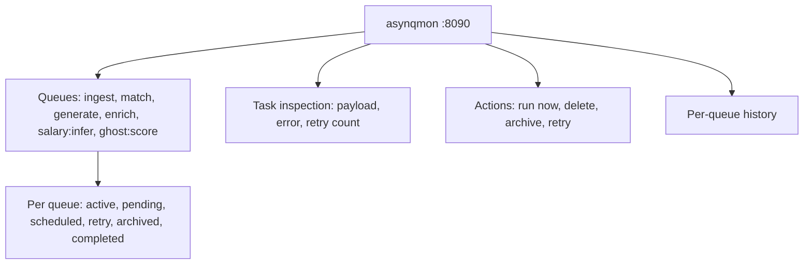
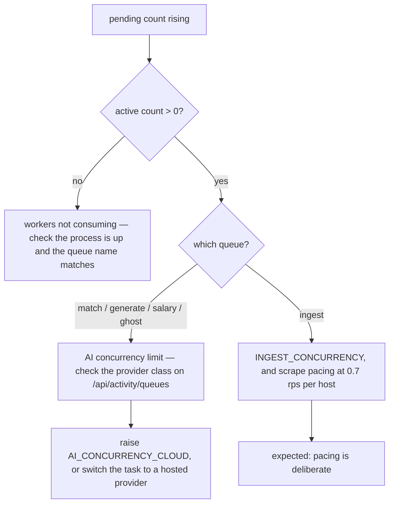
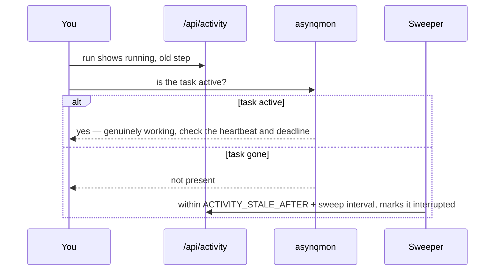

# Queue monitoring

## asynqmon

Spec 018 added `hibiken/asynqmon` to the development compose stack.

```yaml
# docker-compose.yml
asynqmon:
  image: hibiken/asynqmon:0.7.2
  command: ["--redis-addr=redis:6379", "--port=8090"]
  depends_on:
    - redis
  ports:
    - "8090:8090"
```

Open http://localhost:8090 after `make up`.

:::warning Development only
The compose file says it plainly: *"docker-compose.prod.yml — no auth in front of it, so
it must never ship to production."* asynqmon is deliberately absent from
`docker-compose.prod.yml`. It offers full task inspection **and mutation** — anyone who
reaches the port can delete or replay your queue.
:::

Two other notes from the same block:

- **Port 8090, not 8080** — 8080 is the dashboard's port in the production compose file
  and the README.
- **No healthcheck** — the image is distroless, with no shell, wget or curl to probe with;
  readiness is verified externally.

## What it shows



## Two views, two purposes

| View | Source | Use it for |
| --- | --- | --- |
| asynqmon (`:8090`) | Redis, via asynq | queue mechanics: is the task there, how many retries, what is the raw payload |
| Status page (`/api/activity`) | Postgres `ActivityRun` | business meaning: which job, which step, why it failed |

Both are needed. A task can be gone from Redis while its `ActivityRun` still says
`queued` — which is exactly the case the [sweeper](/async/activity-tracking) resolves.

## Triage playbook

### Queue backlog is growing



### Tasks are retrying

Open the task in asynqmon and read the error.

| Error text | Meaning | Action |
| --- | --- | --- |
| `llm: provider unavailable` | 5xx or transport | transient — let it retry |
| `llm: invalid provider response` | bad body | transient |
| `llm: provider credential rejected` | bad key | terminal — fix the key, restart, retry |
| `llm: provider account out of credits` | quota | terminal |
| `llm: model unavailable` | unknown model | terminal — pick a supported model in Settings |
| `llm: rate limited` | 429 | the breaker is holding; retry from the Status page after it clears |
| `queue: task exceeded its deadline` | over `MaxDuration` | safe to retry; consider raising the timeout |

### Everything is stuck on one provider

`GET /api/activity/queues` reports the resolved provider class per queue. A queue reports
`hosted` whenever `GATEWAY_URL` is set — every hop from the gateway is remote, including
its own Ollama tier. To find which upstream actually served a request, read the
`served_model` log line, or `docker compose logs litellm`.

### Runs stuck in `running`



Defaults put the maximum detection delay at three minutes (`2m` stale + `1m` sweep), and
`validateLiveness` refuses to boot with settings that would exceed five.

### Redis was flushed

Queued `ActivityRun` rows have no task behind them. The sweeper's queued pass detects this
via `Inspector.GetTaskInfo` and marks them `interrupted` after
`ACTIVITY_QUEUED_GRACE` (default 30 minutes). Re-run the affected searches.

## Safe actions

| Action | Where | Safe? |
| --- | --- | --- |
| Retry a failed task | Status page or asynqmon | yes — handlers re-read state |
| Cancel all queued | `POST /api/activity/cancel-all` | yes |
| Delete a task in asynqmon | asynqmon | leaves an orphan `ActivityRun`; the sweeper cleans it up |
| Archive in asynqmon | asynqmon | yes |
| Flush Redis | `redis-cli` | loses all pending work; `ActivityRun` rows are swept afterwards |

## Logs

Structured `slog` output from the process complements both views. Useful prefixes:

| Prefix | Source |
| --- | --- |
| `activity: swept stale running runs` | sweeper found orphans |
| `scheduler: bad cron expression` | a `SavedSearch` has an invalid cron |
| `retrieval: browser rung unavailable, will skip` | headless browser failed to initialise |
| `retrieval: flaresolverr rung configured` | FlareSolverr is in the ladder |
| `salary: LEVELS_FYI_CSV not set` | optional salary source disabled |
| `asynq worker error` | a worker server exited |
