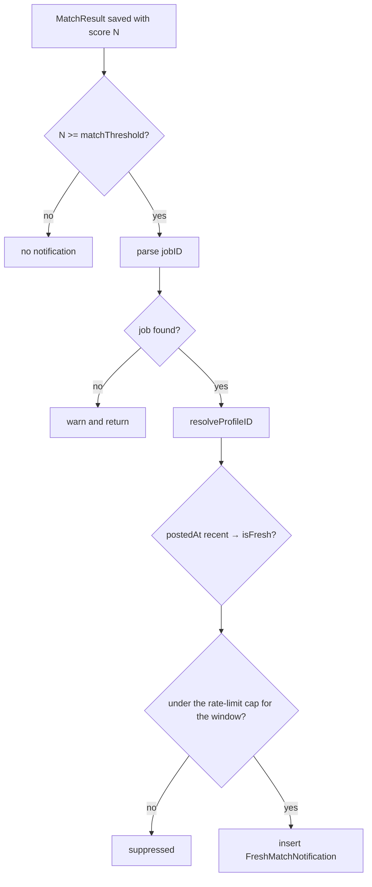
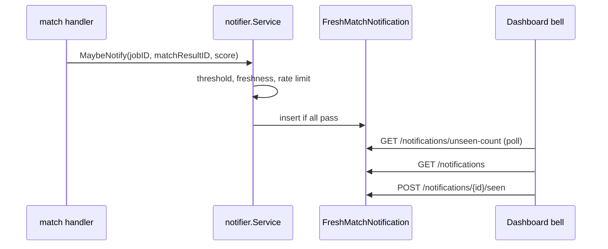
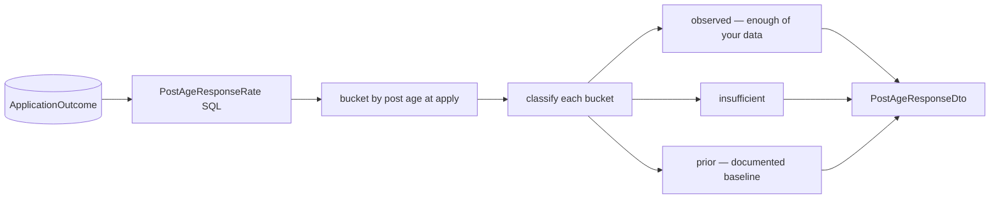

# Notifications and analytics

## Fresh-match notifications

`internal/notifier` decides whether a new `MatchResult` is worth telling you about.

```go
type Service struct {
    q              Repository
    matchThreshold int
    rateLimitCap   int
    rateLimitHours int
}

func WithMatchThreshold(t int) Option
func WithRateLimitCap(c int) Option
```

Functional options with defaults, overridden from config (`MATCH_NOTIFY_SCORE_THRESHOLD`,
`MATCH_NOTIFY_RATE_LIMIT`).

### The decision



Notice the failure posture in `MaybeNotify` (`notifier/service.go:52-70`): every error path
logs a warning and **returns** — it never propagates. A notification is a nicety; failing
to send one must not fail the match task that produced it.

### Freshness

`isFresh(postedAt)` / `IsFresh(postedAt)` (`service.go:128-140`) classify a posting by age.
`FreshMatchNotification.fresh` stores that verdict, so the UI can distinguish "great match,
posted today" from "great match, posted three weeks ago" — the second is worth much less.

### The row

```sql
CREATE TABLE "FreshMatchNotification" (
    "id"            uuid PRIMARY KEY DEFAULT gen_random_uuid(),
    "jobId"         uuid NOT NULL REFERENCES "Job"("id") ON DELETE CASCADE,
    "matchResultId" uuid NOT NULL REFERENCES "MatchResult"("id") ON DELETE CASCADE,
    "profileId"     uuid NOT NULL REFERENCES "Profile"("id") ON DELETE CASCADE,
    "fresh"         boolean NOT NULL,
    "seen"          boolean DEFAULT false NOT NULL,
    "createdAt"     timestamp (3) DEFAULT now() NOT NULL
);
```

All three foreign keys cascade — deleting a job removes its notification.

### HTTP surface

| Method | Path | Handler |
| --- | --- | --- |
| GET | `/api/notifications` | `NotificationService.ListNotifications` |
| POST | `/api/notifications/{id}/seen` | `MarkSeen` |
| GET | `/api/notifications/unseen-count` | `UnseenCount` |

`NotificationService` takes a `ProfileResolver` interface rather than the profile service
(`notifications.go:21-27`) — the smallest port that does the job.



## Subscriptions

`internal/subscriptions` manages recurring searches bound to a source URL.

```sql
CREATE TABLE "Subscription" (
  "id"        uuid PRIMARY KEY DEFAULT gen_random_uuid(),
  "sourceKey" text NOT NULL REFERENCES "JobSource"("key") ON DELETE cascade,
  "name"      text,
  "url"       text NOT NULL,
  "enabled"   boolean DEFAULT true NOT NULL,
  "lastRunAt" timestamp (3)
);
```

Migration `00024_subscription_cron.sql` added per-subscription scheduling. The package
declares a `SourceEnsurer` port (`subscriptions/ports.go:25`) so creating a subscription
can lazily create the `JobSource` row it references — matching the "source rows are created
on first use" rule from [job sources](/ingestion/job-sources).

| Method | Path |
| --- | --- |
| GET/POST | `/api/subscriptions` |
| PUT/DELETE | `/api/subscriptions/{id}` |
| POST | `/api/subscriptions/{id}/run` |
| POST | `/api/subscriptions/run-all` |

A subscription run enqueues `ingest` with `SubscriptionID` set, which is how ingested jobs
carry `Job.subscriptionId` back to the subscription that found them
(migration `00021_job_subscription.sql`, backfilled by `00028`).

## Post-age analytics

`internal/postage` computes the post-age-at-apply versus response-rate signal from the
`ApplicationOutcome` event log. Its type comment is worth quoting:

> It is a deterministic SQL aggregation — no model, no LLM in the signal path.



### Cold-start honesty

The interesting design is what happens when you have not applied to enough jobs yet. Rather
than showing a confident rate from three data points, buckets below the threshold are
labelled with `DocumentedPriorLabel`:

> `"Typical baseline — not yet your data"`

and the whole signal is marked `PostAgeStatePrior` when `totalApps` is under
`GlobalColdStartThreshold` (`postage/service.go:45-60`). Three states — `observed`,
`insufficient`, `prior` — travel in the DTO so the UI can render the distinction rather
than the backend rounding it away.

Exposed at `GET /api/postage-response-rate`.

## Summary

| Concern | Package | Model calls | Storage |
| --- | --- | --- | --- |
| Fresh-match alerts | `notifier` | none | `FreshMatchNotification` |
| Recurring searches | `subscriptions` | none | `Subscription` |
| Response-rate signal | `postage` | none | reads `ApplicationOutcome` |

None of the three calls an LLM. They are cheap, deterministic, and safe to run on every
match.
