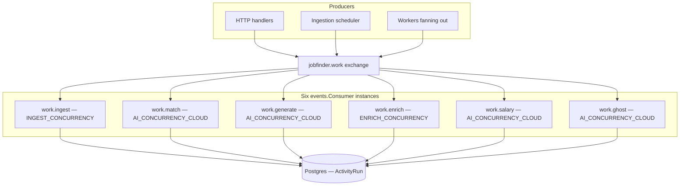
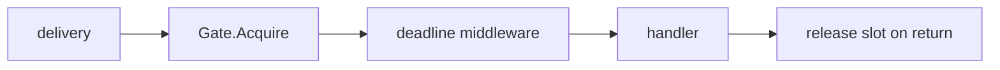
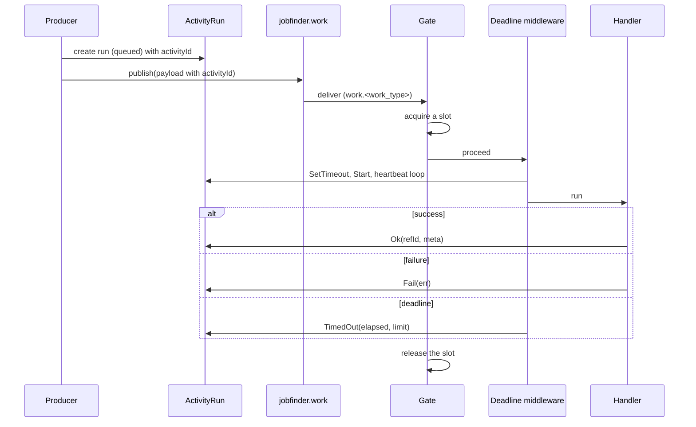

# Async overview

## Topology

Six work types, six work queues, six `events.Consumer` instances, all inside the one
process, consuming over RabbitMQ (`internal/events`).



## Why one consumer per work type

Each work type gets its own `work.<work_type>` queue (`internal/events/topology.go`) and its
own `events.Consumer`, so RabbitMQ's `Qos` prefetch — set to `policy.PoolSize()` — is a hard
per-queue ceiling rather than a shared-pool weighting. Local Ollama tolerated one concurrent
inference while a hosted provider tolerated several; since 044 removed the local/hosted split
there is a single concurrency pool per work type, sized by `TaskPolicy.Concurrency`.

## Principles

### Payloads carry ids, not objects

```go
type MatchPayload struct {
    JobID      string  `json:"jobId"`
    ActivityID *string `json:"activityId,omitempty"`
}
```

Every payload is a handful of identifiers. The worker re-reads current state from Postgres,
so a task queued before an edit does not act on a stale copy.

### Every task is observable

`ActivityID` appears in **every** payload. The worker attaches to that `ActivityRun` and
reports `running`, steps, heartbeats, and a terminal state. If it is not on the Status
page, it did not happen.

### Concurrency is admission-controlled, not pool-controlled

The consumer's RabbitMQ prefetch is sized to `policy.PoolSize()`; the actual limit is
enforced at run time by `Gate`, a single semaphore per work type
(`internal/queue/middleware.go:22-58`).



### Every task has a deadline

`TaskPolicy.MaxDuration` per type, enforced by `DeadlineMiddleware`, which also drives the
heartbeat. A wedged handler is finalised `timed_out` rather than holding a slot forever.

### Retries are bounded and classified

Transient failures retry over the fixed backoff ladder (`1s → 10s → 1m → 10m`, republished
to a `delay.<work_type>.<rung>` queue); permanent ones are wrapped in `queue.SkipRetry` and
go straight to the dead-letter queue; provider rate limits enter the ladder at the `1m` rung.
See [Errors](/principles/error-handling) and the retry-budget note in
[Workers and queues](/async/workers-and-queues).

### Nothing important depends on a worker surviving

The `activity.Sweeper` closes out runs whose worker vanished. A `kill -9` mid-task leaves
a correctly-marked `interrupted` run, not a permanent "running" ghost.

## Queue characteristics

| Queue | Concurrency source | Deadline default | LLM key | Producer |
| --- | --- | --- | --- | --- |
| `work.ingest` | `INGEST_CONCURRENCY` (2) | `30m` | — | scheduler, HTTP, subscriptions |
| `work.match` | `AI_CONCURRENCY_CLOUD` | `5m` | `match` | ingest, enrich |
| `work.generate` | `AI_CONCURRENCY_CLOUD` | `15m` | `generation` | HTTP, aifeature auto-gen |
| `work.enrich` | `ENRICH_CONCURRENCY` (1) | `10m` | — | ingest, backfill |
| `work.salary` | `AI_CONCURRENCY_CLOUD` | `5m` | `default` | ingest, match |
| `work.ghost` | `AI_CONCURRENCY_CLOUD` | `5m` | `ghost` | ingest, HTTP |

## Lifecycle of a task



## RabbitMQ

The API connects to `RabbitMQURL` (`amqp://` DSN) and declares the full topology
(exchanges, work/delay/dead-letter queues) idempotently on startup and on every consumer
reconnect (`internal/events/topology.go`). There is no Redis in this path any more; Redis
was asynq's broker and is gone along with it.

## Next

- [Task catalog](/async/task-catalog) — payloads, policies, producers
- [Workers and queues](/async/workers-and-queues) — gates, deadlines, shutdown
- [Activity tracking](/async/activity-tracking) — runs, heartbeats, the sweeper
- [Notifications](/async/notifications) — fresh matches and analytics
- [Monitoring](/async/monitoring) — RabbitMQ and triage
