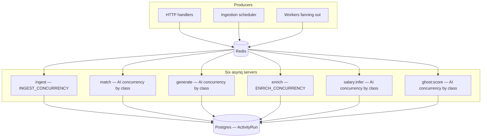
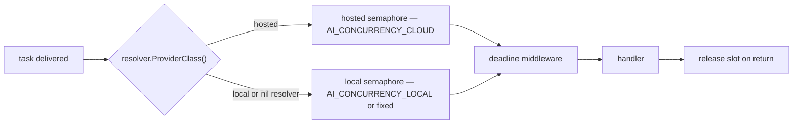
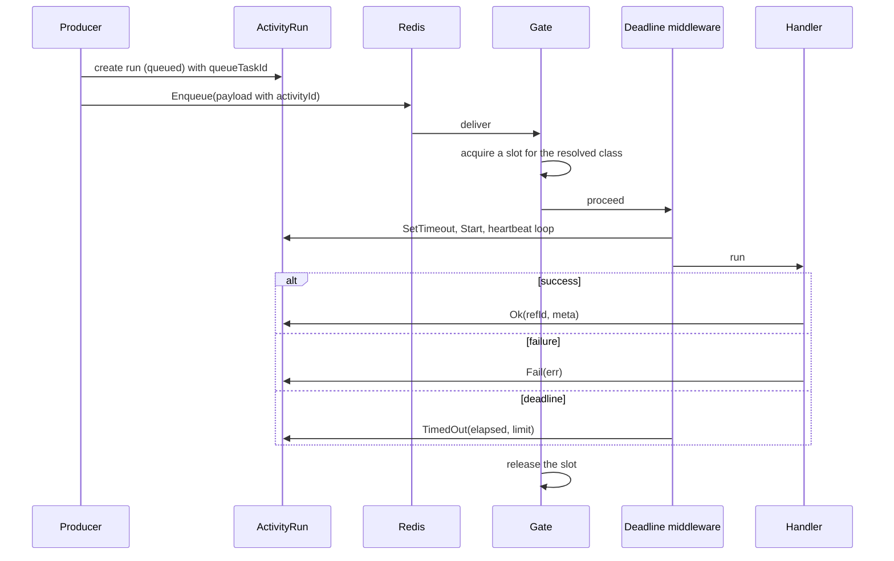

# Async overview

## Topology

Six task types, six queues, six `asynq.Server` instances, all inside the one process.



## Why one server per task type

Stated in `internal/queue/queue.go:22-37`: a single `asynq.Server`'s `Queues` map controls
priority weighting *within* one shared pool — it is not a hard per-queue ceiling. Local
Ollama tolerates one concurrent inference while a hosted provider tolerates several, so
each task type needs its own cap, and therefore its own server.

## Principles

### Payloads carry ids, not objects

```go
type MatchPayload struct {
    JobID      string  `json:"jobId"`
    ActivityID *string `json:"activityId,omitempty"`
}
```

Every payload is a handful of identifiers. The worker re-reads current state from Postgres,
so a task queued before an edit does not act on a stale copy.

### Every task is observable

`ActivityID` appears in **every** payload. The worker attaches to that `ActivityRun` and
reports `running`, steps, heartbeats, and a terminal state. If it is not on the Status
page, it did not happen.

### Concurrency is admission-controlled, not pool-controlled

The worker pool is sized to `max(local, hosted)`; the actual limit is enforced at run time
by a semaphore chosen from the resolved provider class
(`internal/queue/middleware.go:22-58`). Flipping a task to a hosted provider changes its
effective concurrency with no restart.



### Every task has a deadline

`TaskPolicy.MaxDuration` per type, enforced by `DeadlineMiddleware`, which also drives the
heartbeat. A wedged handler is finalised `timed_out` rather than holding a slot forever.

### Retries are bounded and classified

Transient failures retry with backoff; permanent ones are wrapped in `asynq.SkipRetry`;
provider rate limits cancel. See [Errors](/principles/error-handling).

### Nothing important depends on a worker surviving

The `activity.Sweeper` closes out runs whose worker vanished. A `kill -9` mid-task leaves
a correctly-marked `interrupted` run, not a permanent "running" ghost.

## Queue characteristics

| Queue | Concurrency source | Deadline default | LLM key | Producer |
| --- | --- | --- | --- | --- |
| `ingest` | `INGEST_CONCURRENCY` (2) | `30m` | — | scheduler, HTTP, subscriptions |
| `match` | AI, by class | `5m` | `match` | ingest, enrich |
| `generate` | AI, by class | `15m` | `generation` | HTTP, aifeature auto-gen |
| `enrich` | `ENRICH_CONCURRENCY` (1) | `10m` | — | ingest, backfill |
| `salary:infer` | AI, by class | `5m` | `default` | ingest, match |
| `ghost:score` | AI, by class | `5m` | `ghost` | ingest, HTTP |

## Lifecycle of a task



## Redis

`queue.RedisOpt(redisURL)` parses `redis://[:password@]host[:port][/db]` into asynq's
options, defaulting to `localhost:6379` (`queue.go:94-117`). Tests use database index `1`
(`TEST_REDIS_URL`), keeping development data intact.

## Next

- [Task catalog](/async/task-catalog) — payloads, policies, producers
- [Workers and queues](/async/workers-and-queues) — gates, deadlines, shutdown
- [Activity tracking](/async/activity-tracking) — runs, heartbeats, the sweeper
- [Notifications](/async/notifications) — fresh matches and analytics
- [Monitoring](/async/monitoring) — asynqmon and triage
