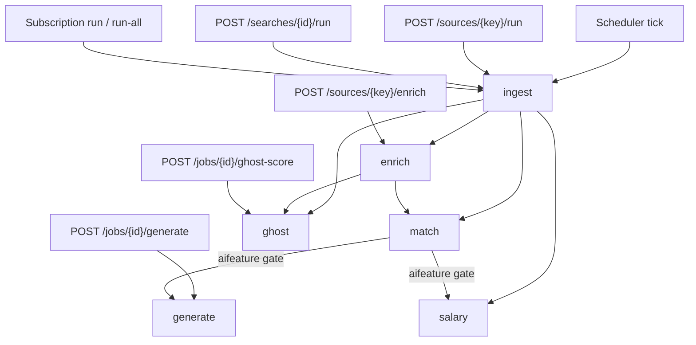
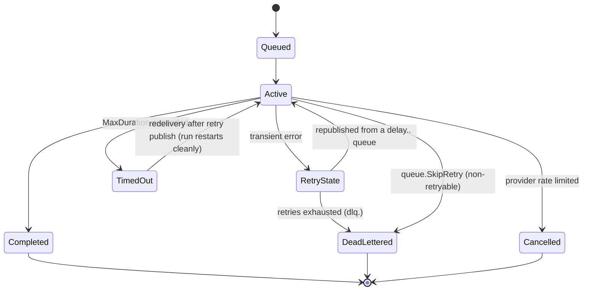

# Task catalog

## Summary

| Work type | Queue | Payload | Handler | Deadline env |
| --- | --- | --- | --- | --- |
| `ingest` | `work.ingest` | `IngestPayload` | `ingestion.Handler.ProcessTask` | `AI_TASK_TIMEOUT_INGEST` |
| `match` | `work.match` | `MatchPayload` | `matching.Handler.ProcessTask` | `AI_TASK_TIMEOUT_MATCH` |
| `generate` | `work.generate` | `GeneratePayload` | `generation.Handler.ProcessTask` | `AI_TASK_TIMEOUT_GENERATE` |
| `enrich` | `work.enrich` | `EnrichPayload` | `enrichment.Handler.ProcessTask` | `AI_TASK_TIMEOUT_ENRICH` |
| `salary` | `work.salary` | `SalaryInferPayload` | `salary.Handler.ProcessTask` | `AI_TASK_TIMEOUT_SALARY` |
| `ghost` | `work.ghost` | `GhostScorePayload` | `ghostjob` worker | `AI_TASK_TIMEOUT_GHOST` |

asynq's colon-namespaced work-type convention (`salary:infer`, `ghost:score`) is gone —
work types are now the flat set `internal/events.WorkTypes` declares: `ingest`, `enrich`,
`match`, `generate`, `salary`, `ghost`. Wiring is in `cmd/server/servers.go` (`buildServers`).

## Producer graph



## `ingest`

```go
type IngestPayload struct {
    SearchID       *string `json:"searchId"`
    SubscriptionID *string `json:"subscriptionId,omitempty"`
    SourceKey      string  `json:"sourceKey"`
    ActivityID     *string `json:"activityId,omitempty"`
}
```

Exactly one of `SearchID` / `SubscriptionID` is set; both nil means "scrape with an empty
query" — a direct source test (`queue.go:51-59`).

**Retries: `IngestMaxRetry = 2`** (three attempts total, unchanged by the RabbitMQ
migration — see [Workers and queues](/async/workers-and-queues) for how the other five work
types' budgets *did* change). The comment records the history: it was 0, inherited from
BullMQ's `{ attempts: 1 }`, and a single 503 cost a source its whole cron window. Permanent
failures are wrapped in `queue.SkipRetry` by `ingestion.permanent`, so the budget only ever
covers transient faults.

**Writes:** `Job` rows, `SourceRun` counters. **Fans out to:** `match`, `enrich`,
`ghost:score`, `salary:infer`.

## `match`

```go
type MatchPayload struct {
    JobID      string  `json:"jobId"`
    ActivityID *string `json:"activityId,omitempty"`
}
```

Embedding prefilter, then LLM fit analysis; writes `MatchResult`
([matching](/ai/matching)). Handler collaborators: notifier, aifeature gate, generator,
salary enqueuer (`matching/handler.go:51`).

## `enrich`

`EnrichPayload{JobID, ActivityID}`. Fetches the full posting for list-only sources, then
re-enqueues `match` and `ghost:score` ([enrichment](/ai/enrichment)). No LLM component, so
its gate always uses the local semaphore sized to `ENRICH_CONCURRENCY`.

## `generate`

```go
type GeneratePayload struct {
    JobID      string  `json:"jobId"`
    Type       string  `json:"type"` // "resume" | "cover_letter"
    ProfileID  *string `json:"profileId,omitempty"`
    ActivityID *string `json:"activityId,omitempty"`
}
```

The only payload carrying a discriminator. `ProfileID` nil means the default profile.
Longest deadline (`15m`) — tailoring plus rendering.

## `salary`

`SalaryInferPayload{JobID, ActivityID}`. Infers a salary range, caching into `SalaryCache`.
Uses the `default` LLM task key.

## `ghost`

```go
// Triggered by ingestion and by the manual POST /api/jobs/{id}/ghost-score
// endpoint only — never on a schedule (FR-014).
type GhostScorePayload struct {
    JobID      string  `json:"jobId"`
    ActivityID *string `json:"activityId,omitempty"`
}
```

The "never on a schedule" constraint is the interesting part: no background loop can
re-score the corpus against a paid provider. Writes `JobSignal`, unique on
`(jobId, kind)`.

## Policy table

Built and validated once at startup by `PoliciesFromConfig` (`internal/queue/policy.go`):

| Task | Concurrency | MaxDuration | LLMTaskKey |
| --- | --- | --- | --- |
| `ingest` | `INGEST_CONCURRENCY` | `AI_TASK_TIMEOUT_INGEST` | — |
| `match` | `AI_CONCURRENCY_CLOUD` | `AI_TASK_TIMEOUT_MATCH` | `match` |
| `generate` | `AI_CONCURRENCY_CLOUD` | `AI_TASK_TIMEOUT_GENERATE` | `generation` |
| `enrich` | `ENRICH_CONCURRENCY` | `AI_TASK_TIMEOUT_ENRICH` | — |
| `salary` | `AI_CONCURRENCY_CLOUD` | `AI_TASK_TIMEOUT_SALARY` | `default` |
| `ghost` | `AI_CONCURRENCY_CLOUD` | `AI_TASK_TIMEOUT_GHOST` | `ghost` |

`PoolSize()` is `policy.Concurrency` — since 044 removed the local/hosted split there is a
single concurrency figure per work type, used both as the RabbitMQ consumer's prefetch and
the `Gate` semaphore's size.

Validation rejects concurrency `< 1` and non-positive durations, and enforces the liveness
bounds: `ACTIVITY_STALE_AFTER >= 2 × ACTIVITY_HEARTBEAT_INTERVAL`, and
`ACTIVITY_STALE_AFTER + ACTIVITY_SWEEP_INTERVAL < 5m`.

## Failure semantics



:::note Timed out is safe to retry
`ErrDeadlineExceeded`'s comment (`middleware.go`): the run is already finalised `timed_out`
by the time the error returns, so the retry that follows simply starts a fresh run.
:::

## Adding a work type

1. Add `TypeX` and `QueueX` constants in `internal/queue/queue.go`, and add `"x"` to
   `events.WorkTypes` (`internal/events/topology.go`) so its `work.x`, `delay.x.<rung>` and
   `dlq.x` queues get declared.
2. Define `XPayload` with an `ActivityID *string` field.
3. Add a `TaskPolicy` entry in `PoliciesFromConfig`, plus its config fields.
4. Implement `ProcessTask(ctx, *queue.Task)` on the owning package's handler.
5. Add `p.consumer("x", p.policyFor(queue.TypeX), app.X.ProcessTask)` in `buildServers`
   (`cmd/server/servers.go`).
6. Add the queue to `queueOrder` in `internal/activity/interfaces/http/activity.go` so
   `/activity/queues` can report it.
