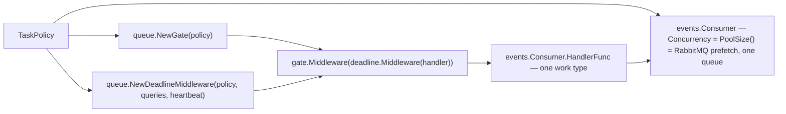
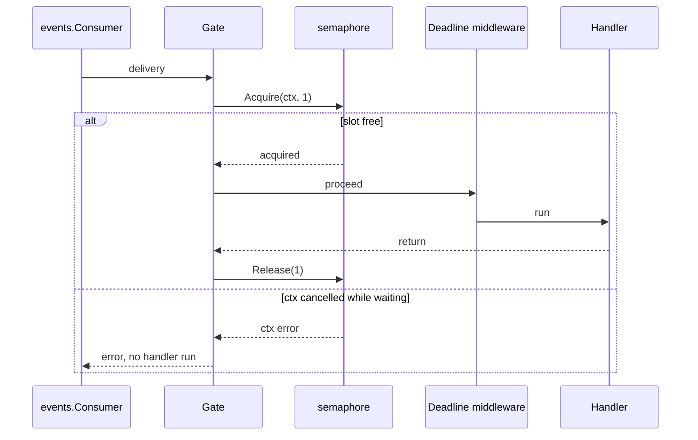
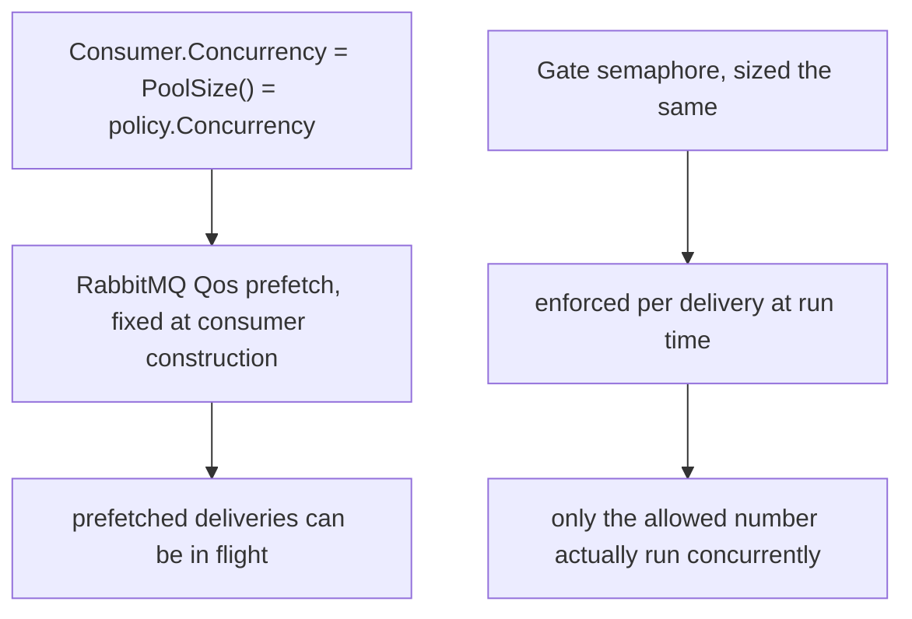
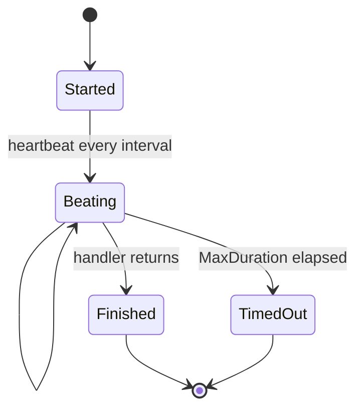
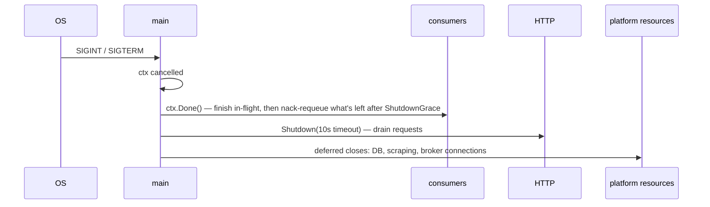

# Workers and queues

## Building a consumer

```go
// cmd/server/servers.go
func (p *Platform) consumer(name string, policy queue.TaskPolicy,
                             handler func(context.Context, *queue.Task) error) namedConsumer {
    gate := queue.NewGate(policy)
    deadline := queue.NewDeadlineMiddleware(policy, p.DB.Queries, p.Config.ActivityHeartbeatInterval)
    wrapped := gate.Middleware(deadline.Middleware(handler))

    return namedConsumer{
        name: name,
        c: &events.Consumer{
            Dial:        func() (*amqp.Connection, error) { return amqp.Dial(p.Config.RabbitMQURL) },
            Queue:       "work." + policy.TaskType,
            Concurrency: policy.PoolSize(),
            HandlerFunc: func(ctx context.Context, d amqp.Delivery) error {
                // decode headers, build a queue.Task from d.Body, run wrapped;
                // on failure, publish a retry/dead-letter via events.HandleFailure
                // and still ack the original delivery (never nack-and-redeliver)
            },
        },
    }
}
```



Each consumer handles exactly one work type on exactly one queue (`work.<work_type>`).
`Concurrency` becomes the consumer's `Qos` prefetch count and bounds the number of
deliveries handled concurrently by that consumer's goroutine pool
(`internal/events/consumer.go`).

## The admission gate

```go
type Gate struct {
    sem *semaphore.Weighted
}
```

`NewGate(policy)` sizes a single semaphore from `policy.Concurrency` — there is no
class-resolver split any more. Since 044 removed the local-vs-hosted routing, there is one
inference path and therefore one pool per work type; `Gate` no longer takes a
`ClassResolver` (`internal/queue/middleware.go:16-34`).



**Acquisition is context-aware** — a delivery waiting for a slot still honours its deadline
and shutdown (`internal/queue/middleware.go:22-34`).

## Pool size versus limit



The prefetch and the semaphore are sized identically today (both `policy.Concurrency`), so
the gate is currently redundant with prefetch for admission — it stays because
`DeadlineMiddleware` and `Gate` compose independently of the transport, and because prefetch
alone does not block a goroutine the way `Gate.Acquire` does.

## Deadline middleware

`NewDeadlineMiddleware(policy, queries, heartbeatInterval)`:

- applies `policy.MaxDuration` as a context deadline;
- calls `Recorder.SetTimeout` so the run records its limit
  (`internal/activity/recorder.go:169`);
- drives `Recorder.Heartbeat` every `ACTIVITY_HEARTBEAT_INTERVAL`;
- finalises the run `timed_out` via `Recorder.TimedOut(elapsed, limit)` and returns
  `ErrDeadlineExceeded`.

It finds the run through `payloadActivityID`, which extracts the `activityId` field common
to every payload without needing to know which payload type it is
(`middleware.go:79-82`).



## Startup and shutdown

```go
// runServers
for _, c := range servers.Consumers {
    go func() { c.c.Run(ctx) }()
}
go scheduler.Run(ctx)
go p.Sweeper.Run(ctx)
<-ctx.Done()
shutdownCtx, cancel := context.WithTimeout(context.Background(), 10*time.Second)
return servers.HTTP.Shutdown(shutdownCtx)
```

Each `events.Consumer.Run` exits on its own once `ctx` is cancelled — it finishes in-flight
deliveries up to `ShutdownGrace` (default 30s), then nacks-with-requeue anything still
outstanding, rather than being shut down explicitly from `runServers` the way `asynq.Server`
was (`internal/events/consumer.go`).



Consumers stop pulling as soon as `ctx` is cancelled so no new delivery starts while the
HTTP server is still draining. A delivery that is mid-flight when the process dies anyway is
requeued by RabbitMQ and picked up again on reconnect, or handled by the
[sweeper](/async/activity-tracking) for the `ActivityRun` side.

## Scheduling

The ingestion scheduler is a plain goroutine with a ticker — because "due" here is
per-`SavedSearch` cron compared against `lastRunAt`, with a compare-and-swap claim to
prevent double runs ([scheduler](/ingestion/scheduler)). This was true under asynq too;
nothing here changed with the RabbitMQ migration.

## Retry budget: down from 25 to a fixed ladder

**This is the one deliberate behavior change in the migration**, not a straight port. Every
work type's retries now go through a fixed four-rung backoff ladder — `1s → 10s → 1m → 10m`
— republished to `delay.<work_type>.<rung>` queues (`internal/events/retry.go`,
`internal/events/topology.go`).

| Work type | Max attempts | Note |
| --- | --- | --- |
| `ingest` | 3 | `IngestMaxRetry = 2` retries, unchanged from before the migration |
| `enrich`, `match`, `generate`, `salary`, `ghost` | 5 | down from asynq's inherited default of **25** |

asynq's default `MaxRetry` was 25, carried over literally by five of these work types. At 25
attempts against a paid LLM gateway, a request that has already exhausted its provider chain
would be retried well past the point of any plausible recovery — and a delay queue per
attempt would mean roughly 150 queues to declare. Five attempts across the four-rung ladder
covers the failure retries actually fix (a transient provider outage or a rate-limit window)
without burning budget on one that they do not. An attempt beyond the ladder's length reuses
its longest rung (`10m`) rather than growing the ladder. See data-model.md § 6 for the full
rationale.

## Operational levers

| Symptom | Lever |
| --- | --- |
| Local Ollama thrashing | lower `AI_CONCURRENCY_LOCAL` (already 1 by default) |
| Hosted provider underused | raise `AI_CONCURRENCY_CLOUD` and `LLM_MAX_IDLE_CONNS_PER_HOST` |
| Scrapers too aggressive | lower `INGEST_CONCURRENCY` |
| Long generations timing out | raise `AI_TASK_TIMEOUT_GENERATE` |
| Runs stuck "running" after a crash | `ACTIVITY_STALE_AFTER` / `ACTIVITY_SWEEP_INTERVAL` control how fast they are closed |
