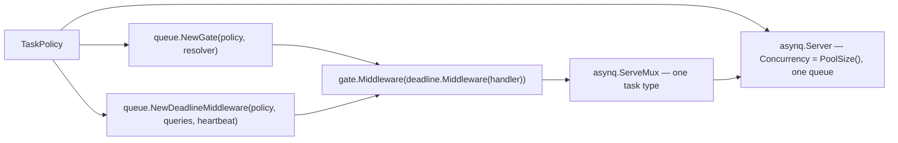
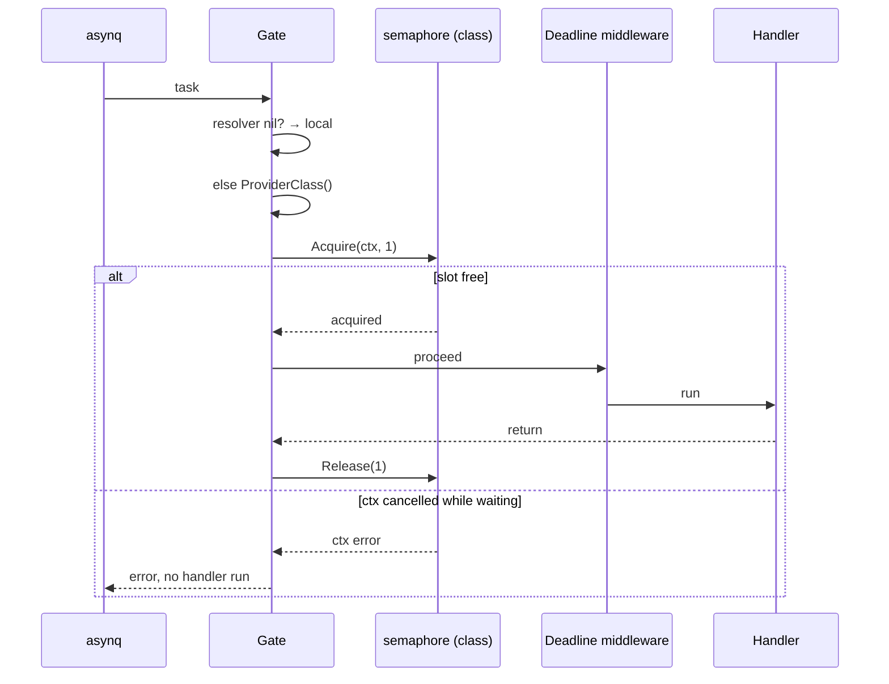
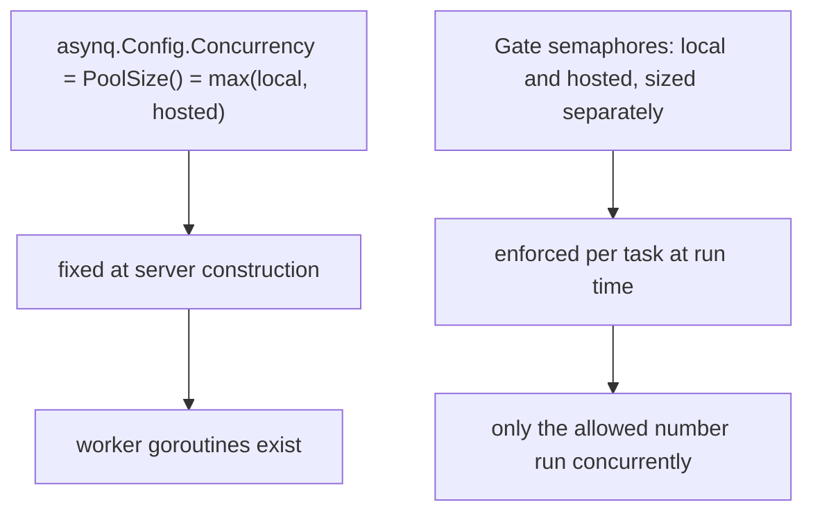
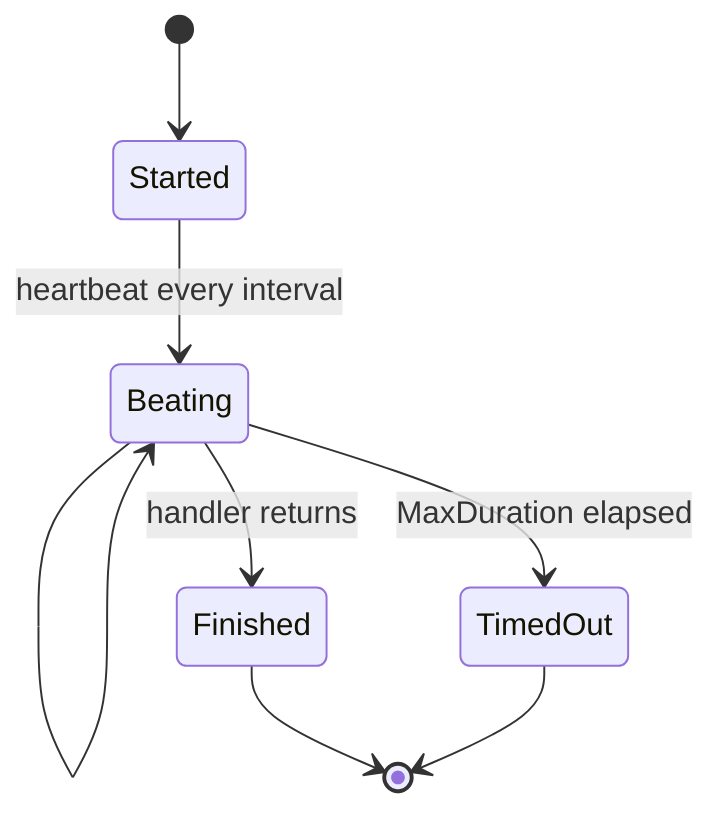
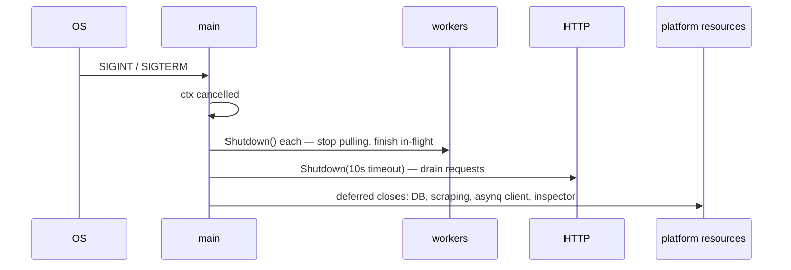

# Workers and queues

## Building a worker

```go
// cmd/server/servers.go
func (p *Platform) worker(name string, policy queue.TaskPolicy, resolver queue.ClassResolver,
                          handler func(context.Context, *asynq.Task) error) namedWorker {
    gate := queue.NewGate(policy, resolver)
    deadline := queue.NewDeadlineMiddleware(policy, p.DB.Queries, p.Config.ActivityHeartbeatInterval)
    wrapped := gate.Middleware(deadline.Middleware(handler))
    mux := asynq.NewServeMux()
    mux.HandleFunc(policy.TaskType, wrapped)
    return namedWorker{
        name: name,
        srv: asynq.NewServer(p.RedisOpt, asynq.Config{
            Concurrency: policy.PoolSize(),
            Queues:      map[string]int{policy.Queue: 1},
        }),
        mux: mux,
    }
}
```



Each server handles exactly one task type on exactly one queue. `Queues: {queue: 1}` is a
single-entry weight map, since weighting is meaningless with one queue — the ceiling comes
from `Concurrency`.

## The admission gate

```go
type Gate struct {
    hosted   *semaphore.Weighted
    local    *semaphore.Weighted
    resolver ClassResolver
}

type ClassResolver interface {
    ProviderClass() llm.ProviderClass
}
```

`*llm.Router` satisfies `ClassResolver` directly, which is why `buildServers` passes
`app.MatchRouter`, `app.GenerationRouter`, `app.DefaultRouter`, `app.GhostRouter` as the
resolvers, and `nil` for `ingest` and `enrich`.



Three properties from the doc comments (`internal/queue/middleware.go:22-58`):

1. **Acquisition is context-aware** — a task waiting for a slot still honours its deadline
   and shutdown.
2. **Class is resolved once per task and does not change mid-flight**, even if settings
   flip while the task waits.
3. **Non-LLM types bypass class resolution entirely** and always use the local semaphore,
   which for them is sized to their single configured concurrency.

## Pool size versus limit



Why not just size the pool to the right number? Because `asynq.Config.Concurrency` is
fixed at construction while the provider class can change at any moment via Settings. The
pool is sized to the maximum; the semaphore does the real work.

## Deadline middleware

`NewDeadlineMiddleware(policy, queries, heartbeatInterval)`:

- applies `policy.MaxDuration` as a context deadline;
- calls `Recorder.SetTimeout` so the run records its limit
  (`internal/activity/recorder.go:169`);
- drives `Recorder.Heartbeat` every `ACTIVITY_HEARTBEAT_INTERVAL`;
- finalises the run `timed_out` via `Recorder.TimedOut(elapsed, limit)` and returns
  `ErrDeadlineExceeded`.

It finds the run through `payloadActivityID`, which extracts the `activityId` field common
to every payload without needing to know which payload type it is
(`middleware.go:79-82`).



## Startup and shutdown

```go
// runServers
for _, w := range servers.Workers {
    go func() { w.srv.Run(w.mux) }()
}
go scheduler.Run(ctx)
go p.Sweeper.Run(ctx)
<-ctx.Done()
for _, w := range servers.Workers { w.srv.Shutdown() }
shutdownCtx, cancel := context.WithTimeout(context.Background(), 10*time.Second)
return servers.HTTP.Shutdown(shutdownCtx)
```



Workers stop first so no new task starts while the HTTP server is still draining. A task
that is mid-flight when the process dies anyway is handled by the
[sweeper](/async/activity-tracking).

## Scheduling

The ingestion scheduler is a plain goroutine with a ticker, not asynq's periodic-task
mechanism — because "due" here is per-`SavedSearch` cron compared against `lastRunAt`, with
a compare-and-swap claim to prevent double runs
([scheduler](/ingestion/scheduler)).

## Operational levers

| Symptom | Lever |
| --- | --- |
| Local Ollama thrashing | lower `AI_CONCURRENCY_LOCAL` (already 1 by default) |
| Hosted provider underused | raise `AI_CONCURRENCY_CLOUD` and `LLM_MAX_IDLE_CONNS_PER_HOST` |
| Scrapers too aggressive | lower `INGEST_CONCURRENCY` |
| Long generations timing out | raise `AI_TASK_TIMEOUT_GENERATE` |
| Runs stuck "running" after a crash | `ACTIVITY_STALE_AFTER` / `ACTIVITY_SWEEP_INTERVAL` control how fast they are closed |
