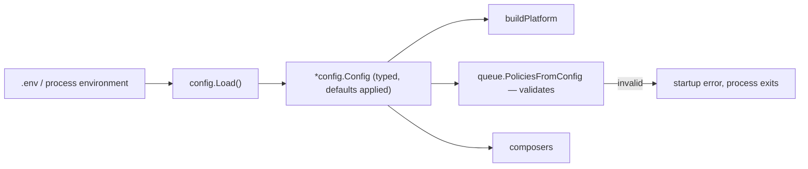
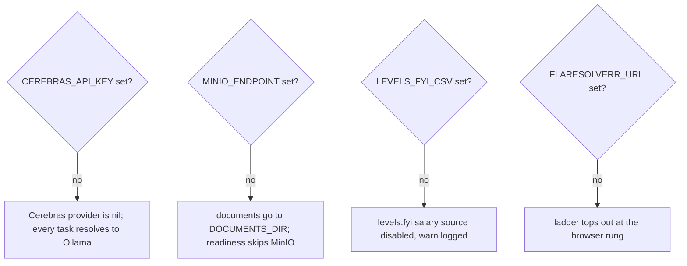
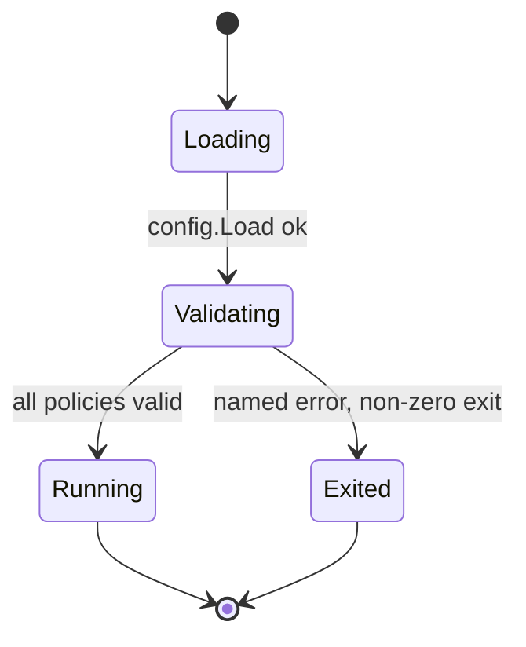
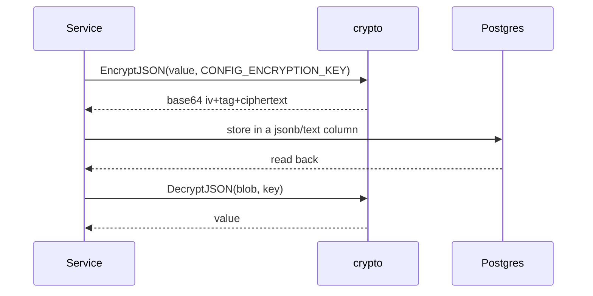

# Configuration

## Rule: configuration is environment, typed once

`internal/config/config.go` declares one struct whose fields carry `mapstructure` tags
naming the environment variable exactly:

```go
type Config struct {
    Port        int    `mapstructure:"PORT"`
    DatabaseURL string `mapstructure:"DATABASE_URL"`
    RedisURL    string `mapstructure:"REDIS_URL"`
    // ...
    AIConcurrencyCloud int           `mapstructure:"AI_CONCURRENCY_CLOUD"`
    AITaskTimeoutMatch time.Duration `mapstructure:"AI_TASK_TIMEOUT_MATCH"`
}
```

Nothing else in the codebase reads `os.Getenv`. A feature that needs a knob adds a field
here and a line to `.env.example`.



## Configuration groups

| Group | Variables |
| --- | --- |
| Core | `PORT`, `DATABASE_URL`, `REDIS_URL` |
| Inference | `OLLAMA_URL`, `OLLAMA_KEY`, `EMBED_URL`, `EMBED_MODEL`, `EMBED_DIMS`, `OLLAMA_KEEP_ALIVE`, `LLM_MAX_IDLE_CONNS_PER_HOST` |
| Models per task | `LLM_MODEL`, `LLM_MODEL_MATCH`, `LLM_MODEL_GENERATION`, `LLM_MODEL_REPHRASE`, `LLM_MODEL_GHOST` |
| Cerebras | `CEREBRAS_API_KEY`, `CEREBRAS_BASE_URL` |
| Matching | `MATCH_SIMILARITY_THRESHOLD`, `MATCH_NOTIFY_SCORE_THRESHOLD`, `MATCH_NOTIFY_RATE_LIMIT` |
| Throughput | `AI_CONCURRENCY_CLOUD`, `AI_CONCURRENCY_LOCAL`, `INGEST_CONCURRENCY`, `ENRICH_CONCURRENCY` |
| Deadlines | `AI_TASK_TIMEOUT_MATCH`, `_GENERATE`, `_SALARY`, `_GHOST`, `_ENRICH`, `_INGEST` |
| Liveness | `ACTIVITY_HEARTBEAT_INTERVAL`, `ACTIVITY_STALE_AFTER`, `ACTIVITY_SWEEP_INTERVAL`, `ACTIVITY_QUEUED_GRACE` |
| Retrieval | `FLARESOLVERR_URL`, `BROWSER_IDENTITY_VERSION`, `COOLING_OFF_THRESHOLD`, `COOLING_OFF_BASE_DURATION`, `CHEAP_RUNG_RETEST_INTERVAL`, `DJINNI_RATE_OVERRIDE_RPS`, `DJINNI_DETAIL_DELAY_MS`, `WORKUA_DETAIL_DELAY_MS` |
| Source credentials | `ADZUNA_APP_ID`, `ADZUNA_APP_KEY`, `ADZUNA_COUNTRY`, `JOBLEADS_EMAIL`, `JOBLEADS_PASSWORD`, `JOOBLE_API_KEY`, `LINKEDIN_SCRAPE_ENABLED` |
| Documents | `DOCUMENTS_DIR`, `RESUME_GROUNDING_LEVEL`, `RENDERCV_BIN` |
| Object storage | `MINIO_ENDPOINT`, `MINIO_ACCESS_KEY`, `MINIO_SECRET_KEY`, `MINIO_BUCKET`, `MINIO_USE_SSL` |
| Salary | `LEVELS_FYI_CSV`, `SALARY_FLOOR_USD` |
| Keyword | `KEYWORD_REPHRASE_CACHE_TTL_SEC` |
| Secrets | `CONFIG_ENCRYPTION_KEY` |

The annotated per-variable reference — purpose, default, required — is in
[Configuration reference](/operations/configuration-reference).

## Rule: absence means "disabled", not "broken"



Each of those is a real branch in the code: `llm/factory.go:44-51`,
`cmd/server/platform.go:100-110`, `compose_features.go` (`composeSalary`), and the
retrieval ladder.

## Rule: validate at startup, not at use

`queue.PoliciesFromConfig` rejects concurrency below 1, non-positive deadlines, and
liveness settings that break the sweeper's bounds — `ACTIVITY_STALE_AFTER` must be at
least twice `ACTIVITY_HEARTBEAT_INTERVAL`, and stale + sweep interval must stay under five
minutes (`internal/queue/policy.go:96-125`).



## Secrets at rest

`internal/crypto` implements AES-256-GCM with a layout byte-compatible with the original
Node implementation: `base64(iv(12) ‖ tag(16) ‖ ciphertext)`. Go's `cipher.AEAD.Seal`
appends the tag *after* the ciphertext, so the package slices and reassembles manually
(`internal/crypto/crypto.go:1-22`). The key is `CONFIG_ENCRYPTION_KEY`, 32 bytes hex —
generate with `openssl rand -hex 32`.



Encrypted at rest today: per-host retrieval state, including cookies
(`cmd/server/platform.go:78` passes the key to `retrieval.NewStateStore`), and source
configuration blobs.

:::warning Rotating the key
There is no re-encryption migration. Changing `CONFIG_ENCRYPTION_KEY` makes existing
ciphertext undecryptable — clear the affected rows (for example per-host cookies via
`POST /api/hosts/{host}/clear-cookies`) after rotating.
:::

## Per-worktree isolation

The `Makefile` derives `COMPOSE_PROJECT_NAME` and `POSTGRES_HOST_PORT` from a checksum of
the worktree directory name, so two branches never share a Postgres or leak migration
state into each other's test runs.

```bash
COMPOSE_PROJECT_NAME := jobfinder-$(WORKTREE_NAME)
POSTGRES_HOST_PORT   := $(shell echo "$$(( 5432 + ( $(WORKTREE_HASH) % 100 ) ))")
```
