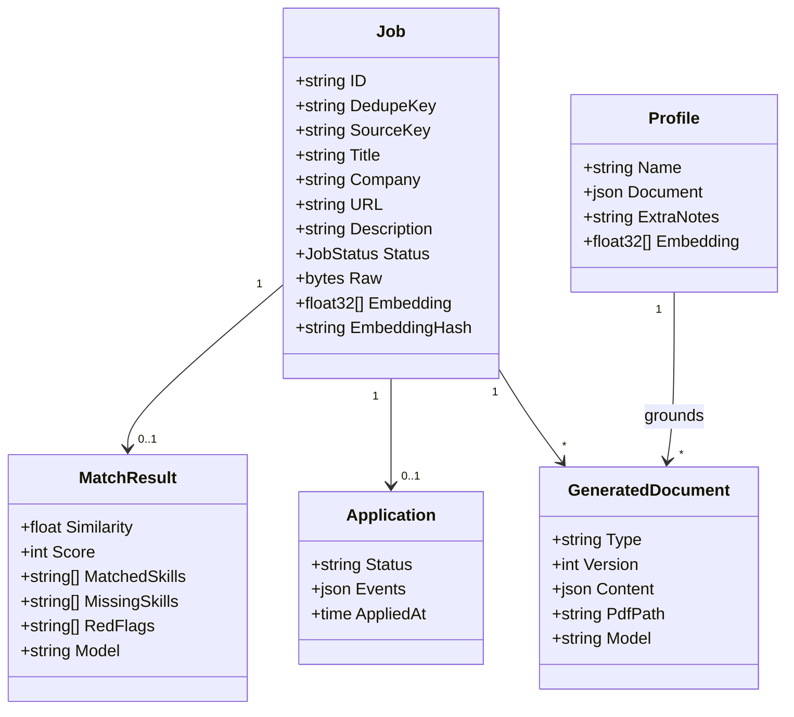
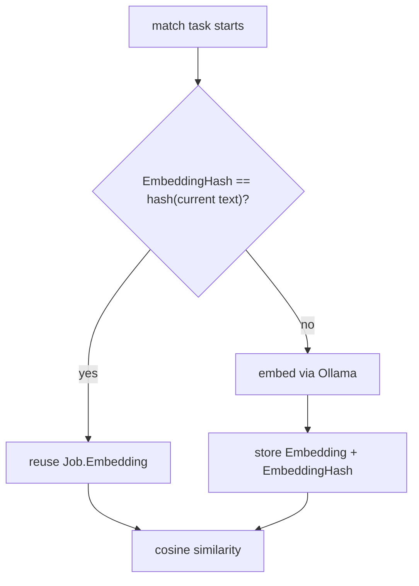
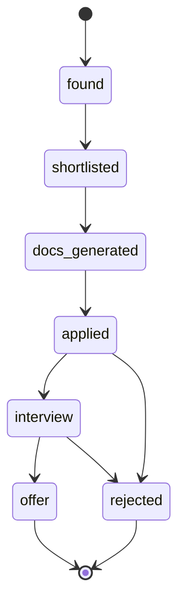
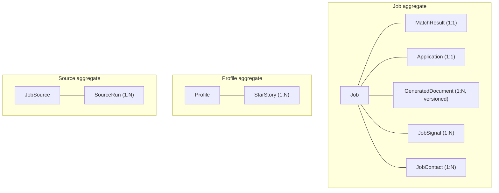

# Domain model

## Core entities



## `Job` — the central entity

`internal/domain/job.go:5-35`. Field groups and what each is for:

| Group | Fields | Notes |
| --- | --- | --- |
| Identity | `ID`, `DedupeKey`, `SourceKey`, `ExternalID` | `DedupeKey` is unique; `ExternalID` is optional per source |
| Content | `Title`, `Company`, `Location`, `URL`, `Description`, `DescriptionHTML` | `DescriptionHTML` is filled by enrichment |
| Provenance | `SubscriptionID`, `PostedAt`, `IngestedAt`, `Raw` | `Raw` is the untouched provider payload |
| Salary | `SalaryRaw`, `SalaryMin`, `SalaryMax`, `SalaryCurrency`, `SalaryConfidence`, `SalarySource` | raw text plus inferred structure |
| Vector | `Embedding`, `EmbeddingHash` | hash of the exact text embedded |
| Lifecycle | `Status` | `JobStatus` vocabulary |

### Invariant: dedupe key is identity

`DedupeKey` carries a `UNIQUE` constraint (`00001_init.sql:47`). Ingestion computes it and
uses it to decide insert-vs-skip; `URL` is explicitly *not* unique, because the same
posting is reachable through several URLs.

### Invariant: embeddings are content-addressed

`EmbeddingHash` is the hash of the exact text last embedded (019-ai-job-throughput). When
the hash matches current content, matching reuses the stored vector instead of paying for
a re-embed.



### Invariant: `Raw` is never discarded

`raw jsonb NOT NULL` (`00001_init.sql:41`). A parser fix can be replayed over history
rather than requiring a re-scrape of a source that may rate-limit you.

## Vocabularies

Statuses are strings with a Go-side vocabulary, mirrored in
`packages/shared/src/index.ts`:

```ts
export const APPLICATION_STATUSES = [
  'found', 'shortlisted', 'docs_generated', 'applied',
  'interview', 'offer', 'rejected',
] as const;
export const DOCUMENT_TYPES = ['resume', 'cover_letter'] as const;
export const SOURCE_KINDS = ['api', 'scrape', 'sidecar'] as const;
```



`SOURCE_KINDS` is the important one for [job sources](/ingestion/job-sources): a source is
an `api` client, a `scrape` adapter, or delegated to the `sidecar`.

## Optionality is a pointer

Nullable columns become pointers in both the domain type and the generated row structs
(`sqlc.yaml` sets `emit_pointers_for_null_types: true`). `*string` versus `""` is a real
distinction: "the source did not provide a location" is not "the location is empty".

## Type overrides at the SQL boundary

```yaml
# apps/api/sqlc.yaml
overrides:
  - db_type: "vector"
    go_type: "github.com/pgvector/pgvector-go.Vector"
  - db_type: "pg_catalog.jsonb"
    go_type: "encoding/json.RawMessage"
```

`jsonb` arrives as `json.RawMessage`, so a service decodes it into whatever shape it
owns — the database does not dictate the Go type of a JSON document.

## Aggregate boundaries



All child rows cascade on delete from their parent (`00001_init.sql:103-107`), so removing
a job removes its match, application, documents and signals in one statement.
