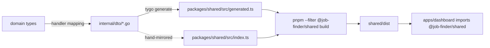
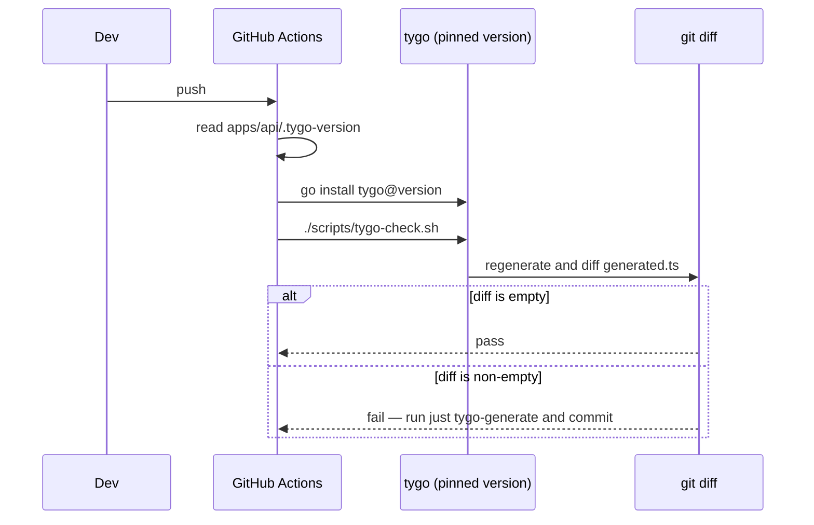
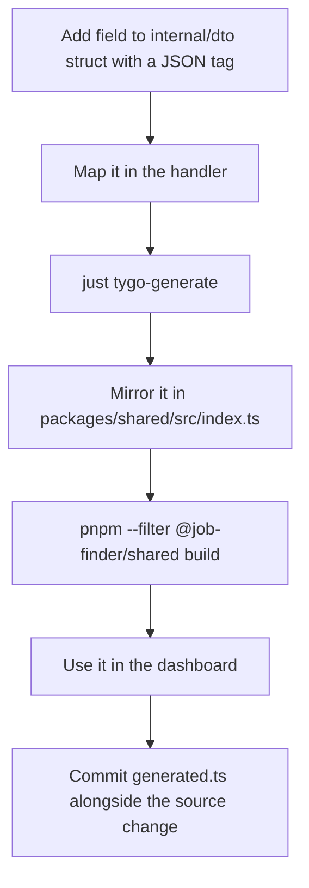

# DTOs and contracts

## The contract chain



Two paths leave `internal/dto`, and only one is automatic. That asymmetry is the single
most common source of contract bugs in this repo, so it gets its own rule in `AGENTS.md`:

> Go DTO field names/JSON tags in `apps/api/internal/dto` must match
> `packages/shared/src/index.ts` field-for-field — `index.ts` is hand-maintained (not
> auto-imported from the tygo-generated `generated.ts`), so update both when adding a DTO
> field.

## What lives in `internal/dto`

| File | Covers |
| --- | --- |
| `dto.go` | core shared types |
| `jobs.go` | job list/detail payloads |
| `profiles.go`, `resume.go` | profile and resume documents |
| `documents.go` | generated documents |
| `activity.go`, `queue_backlog.go` | activity runs and queue stats |
| `settings.go` | LLM and AI-feature settings |
| `analysis.go`, `intel.go`, `postage.go` | scoring, company intel, analytics |

## tygo configuration

```yaml
# apps/api/tygo.yaml
packages:
  - path: "github.com/job-finder/api/internal/dto"
    output_path: "../../packages/shared/src/generated.ts"
    type_mappings:
      "time.Time": "string"
```

One mapping matters: `time.Time` becomes `string`, because the wire format is JSON and the
dashboard parses timestamps itself (`apps/dashboard/src/lib/time.ts`).

Regenerate with:

```bash
cd apps/api && tygo generate     # or: just tygo-generate
```

## The hand-maintained side

`packages/shared/src/index.ts` declares the enums and interfaces the dashboard imports —
`APPLICATION_STATUSES`, `ENTRY_TYPES`, and narrowing aliases over the generated shapes.
It is where const-tuple enums live, which Go cannot express and tygo therefore cannot
generate:

```ts
export const APPLICATION_STATUSES = [
  'found', 'shortlisted', 'docs_generated', 'applied',
  'interview', 'offer', 'rejected',
] as const;
export type ApplicationStatus = (typeof APPLICATION_STATUSES)[number];
```

Those strings must match the Go status vocabulary (`internal/domain/job.go`).

## Drift detection



The same pattern guards SQL: `sqlc-check.sh` with `apps/api/.sqlc-version`. Both jobs are
in `.github/workflows/api-ci.yml`.

:::warning What CI cannot catch
`index.ts` is not generated, so **nothing** verifies it against the Go DTOs. A missing
field there surfaces as `undefined` at runtime. When you add a DTO field, edit both files
in the same commit.
:::

## Adding a field — the checklist



## Domain vs DTO

The `Job` domain type (`internal/domain/job.go:5-35`) carries fields the wire never sees —
`Raw []byte`, `Embedding []float32`, `EmbeddingHash *string`. Keeping them out of the DTO
is deliberate: a 768-dimension vector has no business in a feed response, and the raw
provider payload is for reprocessing, not for the client.

| Concern | Domain | DTO |
| --- | --- | --- |
| Embeddings and hashes | yes | no |
| Raw provider payload | yes | no |
| Nullable pointers | yes | yes, as optional JSON |
| Derived display fields | no | yes |
