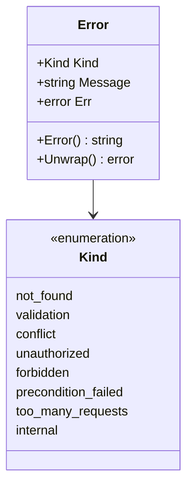
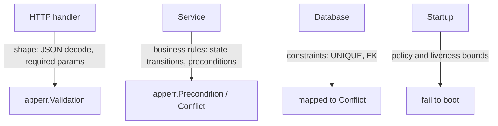
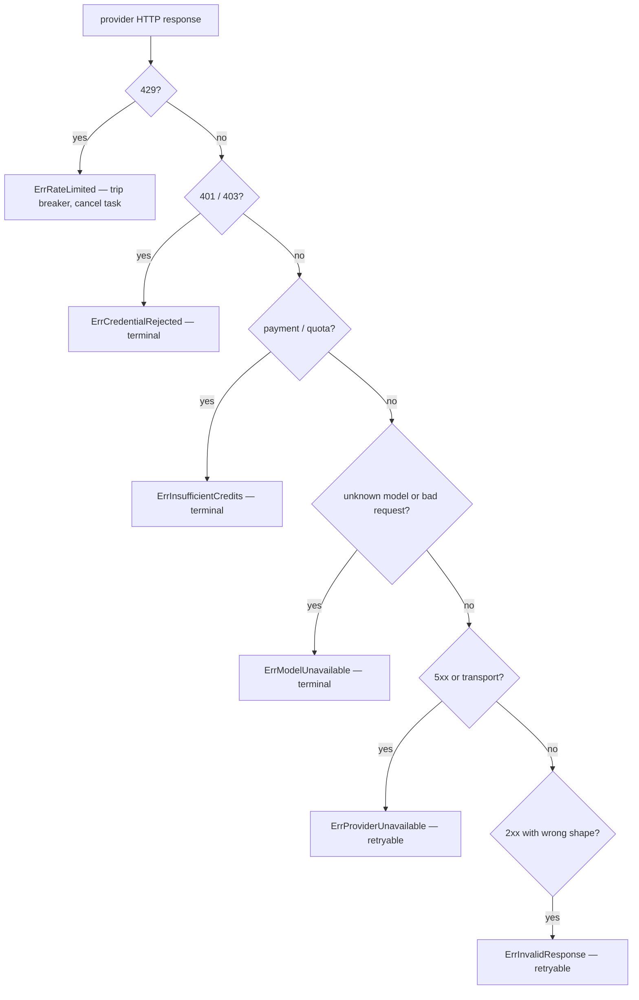

# Errors and validation

## `apperr` in one page

```go
// internal/apperr/apperr.go
type Error struct {
    Kind    Kind
    Message string
    Err     error
}

func New(kind Kind, message string) *Error
func Wrap(kind Kind, message string, err error) *Error
func NotFound(entity, id string) *Error
func Validation(message string) *Error
func Conflict(message string) *Error
func Precondition(message string) *Error
func HTTPStatusCode(k Kind) int
```

`Error` implements `error` and `Unwrap()`, so a wrapped sentinel stays reachable through
`errors.Is` while the outer `Kind` decides the status code.



## The mapping is in exactly one place

`writeAppError` (`internal/httpapi/helpers.go:36-49`):

```go
func writeAppError(w http.ResponseWriter, err error) {
    var ae *apperr.Error
    if errors.As(err, &ae) {
        status := apperr.HTTPStatusCode(ae.Kind)
        if status >= 500 {
            slog.Error("handler error", "kind", ae.Kind, "message", ae.Message, "error", ae.Unwrap())
        }
        writeJSON(w, status, ErrorResponse{Message: ae.Message, Code: ae.Kind})
        return
    }
    slog.Error("handler error", "error", err)
    writeJSON(w, http.StatusInternalServerError, ErrorResponse{Message: "internal server error", Code: apperr.KindInternal})
}
```

Behaviour worth noting:

- The `code` field in the body is the `Kind` string, giving clients a stable discriminator.
- Unclassified errors are logged in full and reported generically — no internal detail on
  the wire.
- Only 5xx is logged at error level; a 404 is a normal outcome, not an incident.

## Where validation happens



| Layer | Validates | Produces |
| --- | --- | --- |
| Handler | body decodes, path/query params parse, ids are UUIDs | `validation` |
| Service | preconditions (profile configured, source enabled), invariants | `precondition_failed`, `conflict`, `not_found` |
| Database | uniqueness, foreign keys | `conflict` |
| Startup | `queue.PoliciesFromConfig` | process exit |

The startup row is a design choice: prefer converting a class of runtime failure into a
boot failure. `AI_CONCURRENCY_LOCAL=0` cannot produce a silently idle worker because the
process refuses to start (`internal/queue/policy.go:102-112`).

## Provider errors are a separate taxonomy

`internal/llm/errors.go` classifies remote-provider failures independently of `apperr`,
because the decision they drive is "retry, cancel or fail", not "what status code".



Two predicates encode the policy: `Terminal(err)` (key, credits, model) and
`Retryable(err)` (5xx, invalid body). Rate limiting is neither — the breaker holds the
process off and the task is cancelled rather than re-queued
(`internal/llm/errors.go:41-57`).

:::note Error messages never contain credentials
`providerErrMessage` parses only the *response* body (`errors.go:59-84`). API keys travel
in the `Authorization` header, so they cannot appear in an error derived from the
response.
:::

## Structured output validation

`llm.CompleteStructured` runs a retry loop — strip code fences, parse JSON, validate,
retry with the error text — with `structuredRetries = 2` extra attempts
(`internal/llm/types.go:68-80`). Target types may implement `Validator` for semantic
checks beyond JSON typing:

```go
type Validator interface {
    Validate() error
}
```

That is where "score must be between 0 and 100" lives — not in a comment, and not
unchecked.

## Task-level error handling

| Situation | Handler action |
| --- | --- |
| Transient fetch failure | return the error; asynq retries with backoff |
| Permanently gone (404, removed source) | wrap in `asynq.SkipRetry` (`ingestion.permanent`) |
| Provider terminal error | fail the task, record the reason on the `ActivityRun` |
| Provider rate limited | cancel; the operator retries from the Status page |
| Deadline exceeded | `queue.DeadlineMiddleware` cancels at `MaxDuration` |
| Worker vanished | `activity.Sweeper` closes out the stale run |
