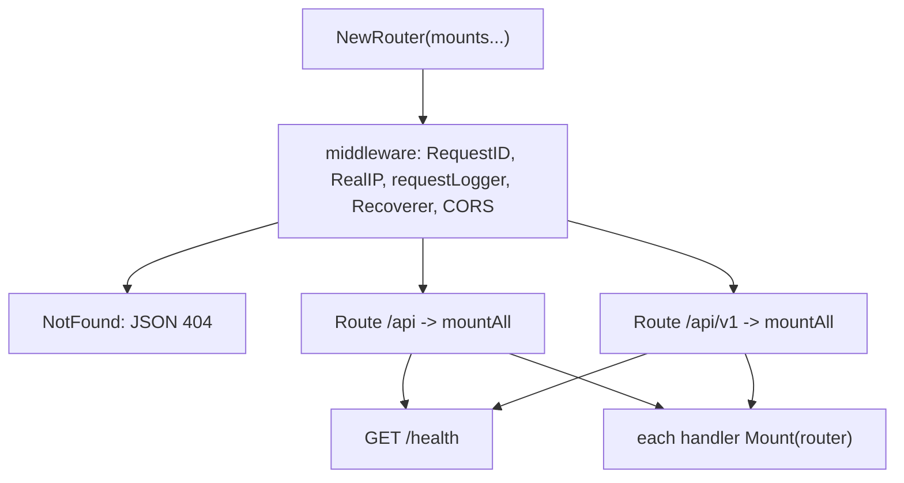
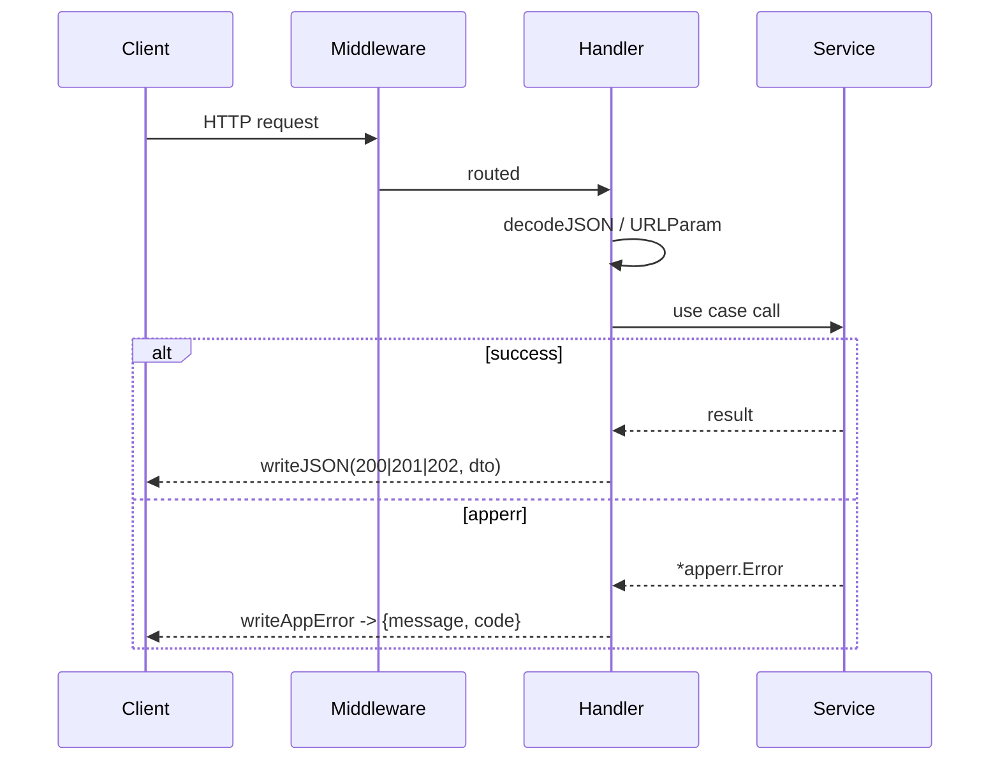

# HTTP API

## Router construction

`httpapi.NewRouter(mounts ...func(chi.Router))` takes the mount functions as variadic
arguments (`internal/httpapi/router.go:13`). Handlers are registered in
`cmd/server/servers.go:66-73` — `router.go` itself is never edited to add an endpoint.



:::warning No version prefix inside a Mount
Both prefixes call the same `mountAll`. A handler that declares `/v1/foo` becomes
`/api/v1/v1/foo`. Declare unversioned paths only.
:::

## Middleware chain

| Order | Middleware | Effect |
| --- | --- | --- |
| 1 | `middleware.RequestID` | correlation id per request |
| 2 | `middleware.RealIP` | trust proxy headers for the client IP |
| 3 | `requestLogger` | structured access log |
| 4 | `middleware.Recoverer` | panic becomes 500, process survives |
| 5 | `cors.Handler` | `*` origins, credentials off, standard methods |

## Handler conventions

```go
// internal/httpapi/subscriptions.go
func (h *SubscriptionsHandler) Mount(r chi.Router) {
    r.Get("/subscriptions", h.list)
    r.Post("/subscriptions", h.create)
    r.Put("/subscriptions/{id}", h.update)
    r.Delete("/subscriptions/{id}", h.remove)
    r.Post("/subscriptions/{id}/run", h.run)
    r.Post("/subscriptions/run-all", h.runAll)
}
```

- One file per handler group, named after the resource.
- A handler struct holds only services, never a database pool.
- Decode with `decodeJSON`, respond with `writeJSON`, fail with `writeAppError`
  (`helpers.go`).
- Multipart is detected by `Content-Type` prefix — `profiles.go:133` (profile config
  upload) and `referral.go:59` (contact CSV import).

## Endpoint inventory

All paths exist under both `/api` and `/api/v1`.

### Jobs and matching

| Method | Path | Handler |
| --- | --- | --- |
| GET | `/jobs` | `jobs.go:36` |
| DELETE | `/jobs` | `jobs.go:37` |
| GET | `/jobs/{id}` | `jobs.go:38` |
| POST | `/jobs/{id}/shortlist` | `jobs.go:39` |
| POST | `/jobs/{id}/hide` | `jobs.go:40` |
| POST | `/jobs/{id}/generate` | `jobs.go:41` |
| GET | `/jobs/{id}/documents` | `jobs.go:42` |
| POST | `/jobs/{id}/ghost-score` | `ghostjob.go:28` |
| GET | `/jobs/{id}/keyword-diff` | `keyword.go:26` |
| GET | `/jobs/{id}/interview-prep` | `interviewprep.go:26` |
| POST | `/jobs/{id}/coach/assess` | `coach.go:34` |
| GET | `/jobs/{id}/coach/assessment` | `coach.go:35` |
| GET | `/jobs/{id}/contacts` | `contacts.go:27` |
| POST | `/jobs/{id}/contacts/refresh` | `contacts.go:28` |
| GET | `/jobs/{id}/referral-paths` | `referral.go:36` |
| POST | `/jobs/{id}/outreach/generate` | `outreach.go:31` |
| GET | `/jobs/{id}/outreach/tones` | `outreach.go:32` |

### Sources, searches, subscriptions, roster

| Method | Path | Handler |
| --- | --- | --- |
| GET | `/sources` | `sources.go:38` |
| PUT | `/sources/{key}` | `sources.go:39` |
| POST | `/sources/{key}/test` | `sources.go:40` |
| POST | `/sources/{key}/run` | `sources.go:41` |
| POST | `/sources/{key}/enrich` | `sources.go:42` |
| GET/POST | `/searches` | `searches.go:29-30` |
| PUT/DELETE | `/searches/{id}` | `searches.go:31-32` |
| POST | `/searches/{id}/run` | `searches.go:33` |
| GET | `/searches/runs/recent` | `searches.go:34` |
| GET/POST | `/subscriptions` | `subscriptions.go:37-38` |
| PUT/DELETE | `/subscriptions/{id}` | `subscriptions.go:39-40` |
| POST | `/subscriptions/{id}/run`, `/subscriptions/run-all` | `subscriptions.go:41-42` |
| GET/POST | `/roster`, `/roster/candidates` | `roster.go:33-39` |
| POST | `/roster/discover` | `roster.go:39` |

### Profiles, documents, applications

| Method | Path | Handler |
| --- | --- | --- |
| GET/POST | `/profiles` | `profiles.go:35,37` |
| GET/PUT/DELETE | `/profiles/{id}` | `profiles.go:36,38,39` |
| POST | `/profiles/config` | `profiles.go:40` |
| GET | `/profiles/config/status` | `profiles.go:41` |
| GET/PUT | `/profiles/{id}/resume` | `profiles.go:42-43` |
| POST | `/documents/tailor` | `documents.go:31` |
| GET | `/documents/ad-hoc` | `documents.go:32` |
| GET/PUT | `/documents/{id}` | `documents.go:33-34` |
| GET | `/documents/{id}/pdf` | `documents.go:35` |
| GET | `/applications` | `applications.go:28` |
| PATCH | `/applications/{id}` | `applications.go:29` |
| GET | `/stats` | `applications.go:30` |

### Settings, activity, ops

| Method | Path | Handler |
| --- | --- | --- |
| GET | `/settings/ai-features` | `aifeature.go:30` |
| PUT | `/settings/ai-features/{feature}` | `aifeature.go:31` |
| GET | `/activity`, `/activity/queues` | `activity.go:79-80` |
| POST | `/activity/retry`, `/activity/cancel-all`, `/activity/{id}/cancel` | `activity.go:81-83` |
| GET | `/notifications`, `/notifications/unseen-count` | `notifications.go:23,25` |
| POST | `/notifications/{id}/seen` | `notifications.go:24` |
| GET | `/companies/{jobId}/intel` | `companies.go:29` |
| POST | `/companies/{jobId}/intel/refresh` | `companies.go:30` |
| GET | `/contacts` | `referral.go:33` |
| POST | `/contacts/import`, `/contacts/{id}/github-sync` | `referral.go:34-35` |
| GET | `/postage-response-rate` | `postage.go:24` |
| GET | `/health` | `router.go:28` |
| GET | `/health/ready` | `health.go:34` |
| GET | `/hosts/{host}/retrieval-status` | `hosts.go:28` |
| POST | `/hosts/{host}/clear-rung-preference`, `/clear-cookies`, `/override-cooling-off` | `hosts.go:29-31` |

## Request/response shape



## Authentication

There is no per-request authentication middleware in the router. This is a self-hosted
single-user deployment: the security boundary is the network the process is bound to,
plus the credentials it holds for third-party sources. Do not expose the port publicly
without putting an authenticating proxy in front of it.
