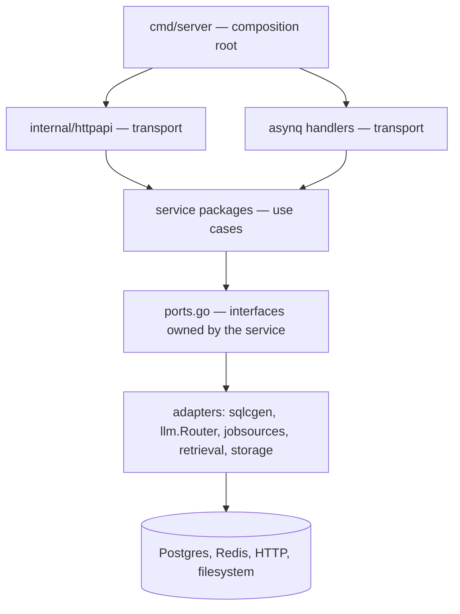
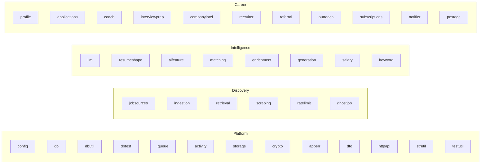
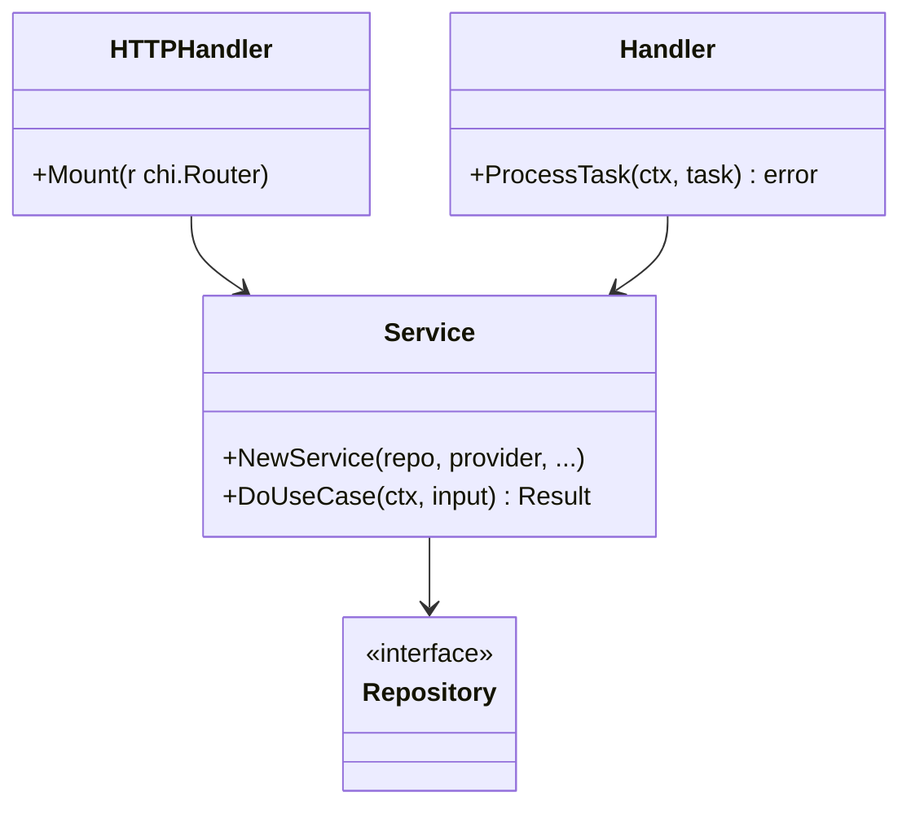

# Backend overview

`apps/api` is a single Go module producing three commands:

| Command | Purpose |
| --- | --- |
| `cmd/server` | the product: HTTP API + six workers + scheduler + sweeper |
| `cmd/seed` | seed and clean development data (`just seed`, `just seed-clean`) |
| `cmd/llmsmoke` | smoke-test complete/structured/embed against the configured provider |

## Layering

The rules, in order of how often they are violated by newcomers:

1. **No service package imports `httpapi`.** Transport depends on the domain, never the
   reverse.
2. **A service depends on interfaces it declares** in its own `ports.go`, not on concrete
   adapters.
3. **Only `cmd/server` imports everything.** If you need two services to know about each
   other, wire them in a composer (`compose.go:14-89` shows the two legitimate
   cross-composer wires).
4. **DTOs are transport-only.** Domain code never returns a `dto` type.

## Package taxonomy

Per-package responsibilities are catalogued in [Services catalog](/backend/services-catalog);
the dependency view is in [Component map](/architecture/component-map).

## Anatomy of a service package

| File | Contains |
| --- | --- |
| `service.go` | the use case; no HTTP, no asynq |
| `ports.go` | outbound interfaces |
| `repository.go` | persistence adapter over `sqlcgen` |
| `handler.go` | `ProcessTask` for the matching queue |
| `*_test.go` | colocated tests using fakes |

## Runtime model

The server process runs ten kinds of goroutine: the HTTP listener, six asynq servers,
the ingestion scheduler, the activity sweeper and the DB saturation sampler
(`cmd/server/servers.go:86-114`). Shutdown is ordered: workers first, then HTTP with a
10-second drain, then the deferred closes in `main.run` (`main.go:42-45`).

## Where to start reading

| Task | Entry point |
| --- | --- |
| Add an endpoint | [HTTP API](/backend/http-api) |
| Change a wire type | [DTOs and contracts](/backend/dto-and-contracts) |
| Add an error case | [Errors and validation](/backend/errors-and-validation) |
| Add a setting | [Configuration](/backend/configuration) |
| Find the code that owns X | [Services catalog](/backend/services-catalog) |
