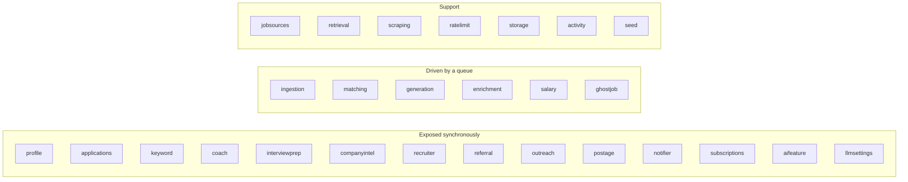
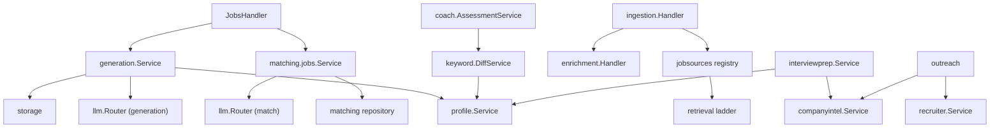

# Services catalog

Every package under `apps/api/internal` that owns a business capability, with what it
does, what it depends on, and where it is exposed.

## Discovery

### `jobsources`
Adapter contract, registry and ~20 provider adapters (`adapters/`), plus
`roster/` for ATS board discovery. Port: `Repository` (`ports.go:8-18`). HTTP:
`/sources`, `/roster`. Detail: [Job sources](/ingestion/job-sources).

### `ingestion`
Owns the scheduler (`scheduler.go`), the ingest task handler (`handler.go`), dedupe
(`dedupe.go`), reconciliation (`reconcile.go`), and the saved-search
(`searches.go`) and subscription (`subscription_runner.go`) runners. HTTP:
`/searches`. Queue: `ingest`.

### `retrieval`
The three-rung fetch ladder (`ladder.go`), browser identity (`identity.go`), per-host
state with encrypted cookies (`state.go`), challenge handling (`challenge.go`), and a
tuned transport (`transport.go`). HTTP: `/hosts/{host}/*`.

### `scraping`
Headless-browser service constructed over `retrieval` (`scraping.New(retSvc)` in
`cmd/server/platform.go:87`). Closed by `main.run` on shutdown.

### `ratelimit`
Crawl-delay-aware pacing. Per-host daily budgets were removed in migration
`00029_drop_host_budget.sql`. Detail: [Rate limiting](/ingestion/rate-limiting).

### `ghostjob`
Ghost-posting detection. Queue: `ghost:score`, LLM task key `ghost`. HTTP:
`POST /jobs/{id}/ghost-score` — manual or ingestion-triggered only, never scheduled.

## Intelligence

### `llm`
`Provider` interface, `OllamaProvider`, `CerebrasProvider`, `Router`, `SnapshotHolder`,
error taxonomy, structured-output retry loop. Detail:
[LLM abstraction](/ai/llm-abstraction).

### `llmsettings`
Persists per-task `{provider, model}` in `LlmTaskSetting` and publishes a new
`llm.RouterSnapshot` on change — no restart required. HTTP: `/settings/llm`,
`/settings/llm/models`.

### `aifeature`
Per-feature enable/disable settings backed by `AiFeatureSetting`. HTTP:
`/settings/ai-features`. Constructed inside `composeMatching`.

### `matching`
Two-phase scoring: pgvector recall, then LLM fit scoring; persists `MatchResult`. Owns
`jobs.Service` used by the jobs handler. Queue: `match`, LLM key `match`. Files include
`ports.go`, `repository.go`, `integration_test.go`.

### `enrichment`
Fetches full job detail after ingest, per-source delays (`DJINNI_DETAIL_DELAY_MS`,
`WORKUA_DETAIL_DELAY_MS`). Constructed with ten source adapters plus the asynq client
(`compose_features.go`). Queue: `enrich`.

### `generation`
Tailored resume and cover-letter generation grounded in the profile
(`RESUME_GROUNDING_LEVEL`), PDF rendering via `RENDERCV_BIN`, versioned
`GeneratedDocument` rows. Queue: `generate`, LLM key `generation`. HTTP: `/documents/*`,
`POST /jobs/{id}/generate`.

### `salary`
`salary.Service` with `LevelsFyiLoader` (CSV at `LEVELS_FYI_CSV`) and LLM inference;
caches into `SalaryCache`. Queue: `salary:infer`, LLM key `default`.

### `keyword`
JD keyword diff (`DiffService`), rephrase suggestions via `ProviderRephraseModel` behind
a `CachedRephraser` (`KEYWORD_REPHRASE_CACHE_TTL_SEC`), and STAR stories. HTTP:
`/jobs/{id}/keyword-diff`.

## Career workflow

### `profile`
Master profile, resume document, embeddings, config upload. HTTP: `/profiles/*`
including `/profiles/{id}/resume` and `/profiles/config/status`. Supplies
`ProfileEntries` to coach and STAR stories to interview prep.

### `applications`
Kanban statuses, event history (`Application.events` jsonb), stats. HTTP:
`/applications`, `/stats`.

### `coach`
`coach.Service` + `AssessmentService`, built over the keyword rephrase model and profile
entries (`compose_features.go`). HTTP: `POST /jobs/{id}/coach/assess`, cached read at
`/jobs/{id}/coach/assessment`.

### `interviewprep`
Combines profile STAR stories with company intel to produce prep material. HTTP:
`GET /jobs/{id}/interview-prep`.

### `companyintel`
Company profile and signals (`Company`, `CompanySignal`). HTTP:
`/companies/{jobId}/intel` and `/intel/refresh`.

### `recruiter`
Resolves hiring contacts for a job from posting text and company pages; LinkedIn
scraping is opt-in via `LINKEDIN_SCRAPE_ENABLED`. HTTP: `/jobs/{id}/contacts`,
`/contacts/refresh`.

### `referral`
Contact graph (`Contact`, `ContactConnection`), CSV import, GitHub sync, referral paths.
HTTP: `/contacts`, `/contacts/import`, `/contacts/{id}/github-sync`,
`/jobs/{id}/referral-paths`.

### `outreach`
Generates outreach messages in selectable tones, using recruiter and company-intel
services plus the default router. HTTP: `/jobs/{id}/outreach/generate`, `/outreach/tones`.

### `subscriptions`
Recurring searches with their own cron (`Subscription`, `00024_subscription_cron.sql`).
HTTP: `/subscriptions`, `/subscriptions/{id}/run`, `/subscriptions/run-all`.

### `notifier`
Fresh-match notifications gated by `MATCH_NOTIFY_SCORE_THRESHOLD` and
`MATCH_NOTIFY_RATE_LIMIT`, stored in `FreshMatchNotification`. HTTP: `/notifications`,
`/notifications/unseen-count`.

### `postage`
Post-age response-rate analytics. HTTP: `/postage-response-rate`.

## Platform

| Package | Responsibility |
| --- | --- |
| `activity` | `ActivityRun` recorder, heartbeat, `Sweeper` for vanished workers |
| `storage` | documents on MinIO or `DOCUMENTS_DIR` |
| `queue` | task types, payloads, policies, admission gate, deadline middleware |
| `config` | typed environment configuration |
| `crypto` | AES-256-GCM for secrets at rest |
| `apperr` | error kinds and HTTP mapping |
| `dto` | wire types, tygo source |
| `db`, `dbutil`, `dbtest` | pool, migrations, generated queries, test helpers |
| `seed` | development data (`cmd/seed`) |
| `strutil`, `testutil` | shared helpers |

## Collaboration graph for the busiest packages

