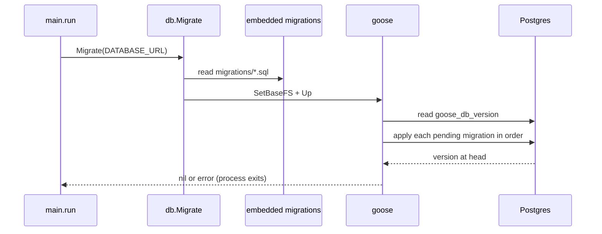
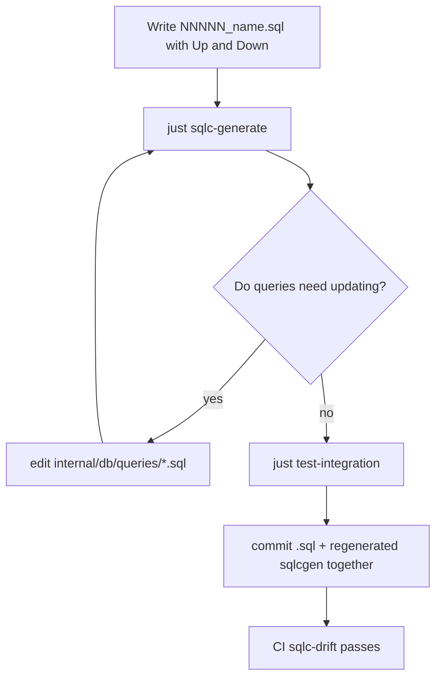
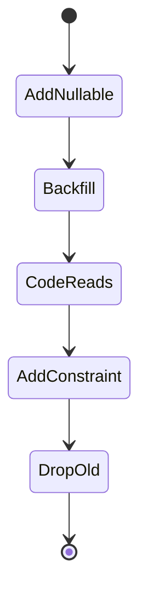

# Migrations

## Tooling

`goose`, driven from Go. Migrations are **embedded in the binary**
(`internal/db/db.go:21-23`):

```go
//go:embed migrations/*.sql
var migrationsFS embed.FS
```

and applied by `db.Migrate(cfg.DatabaseURL)` at startup, before anything else is built
(`cmd/server/main.go:37-39`).



## File format

```sql
-- +goose Up
CREATE TABLE "JobSignal" (
  "id"        uuid PRIMARY KEY DEFAULT gen_random_uuid(),
  "jobId"     uuid NOT NULL REFERENCES "Job"("id") ON DELETE CASCADE,
  "kind"      text NOT NULL,
  "score"     int NOT NULL,
  "signals"   jsonb NOT NULL,
  "model"     text,
  "createdAt" timestamp(3) NOT NULL DEFAULT now(),
  UNIQUE("jobId", "kind")
);

-- +goose Down
DROP TABLE IF EXISTS "JobSignal";
```

Naming: `NNNNN_snake_case_description.sql`, zero-padded to five digits. The current head is
`00030_activity_run_liveness.sql`.

:::note A gap in the sequence is fine
There is no `00013`. Goose orders by the numeric prefix; a gap from an abandoned change is
harmless. Never renumber an applied migration.
:::

## Rules

1. **Append-only.** Once a migration is on `master` it is immutable. Fix a mistake with a
   new migration.
2. **Always write the `Down`.** Even if you never run it, it documents the inverse.
3. **Regenerate sqlc in the same commit.** `just sqlc-generate`; CI's `sqlc-drift` job
   fails otherwise.
4. **Data migrations are migrations too.** `00028_backfill_job_subscription.sql` is a
   backfill; `00027_drop_djinni_dashboard_subs.sql` is a cleanup.
5. **Deprecate before dropping.** `00029_drop_host_budget.sql` removed the budget
   behaviour while leaving the columns in place — the code stopped reading them first.



## Migration history

| Range | Theme |
| --- | --- |
| `00001` | initial schema, reusing the Drizzle SQL verbatim |
| `00002`–`00006` | subscriptions, job detail, activity runs, RenderCV profile, ad-hoc documents |
| `00007`–`00012` | company intel, job signals, salary inference, contacts, keyword diff, outcomes |
| `00014`–`00017` | notifications, contact graph, seen counts |
| `00018`–`00024` | LLM task settings, autogen, provider changes, subscriptions, STAR stories, AI features, subscription cron |
| `00025`–`00030` | ATS roster, host retrieval state, Djinni cleanup, backfill, budget removal, activity liveness |

## Safe change patterns

| Change | Safe approach |
| --- | --- |
| Add a column | `ADD COLUMN ... NULL` or with a `DEFAULT`; backfill in a later migration if needed |
| Rename a column | add new → backfill → switch code → drop old, across separate migrations |
| Drop a column | stop reading it first; drop in a later release |
| Add an index | plain `CREATE INDEX` is fine at this data scale; the largest tables are `Job` and `ActivityRun` |
| Add a constraint | validate the data with a backfill migration first |



## Testing a migration

```bash
just test-integration     # starts a Postgres container, migrates it, runs the DB-backed tests
```

`internal/db/down_migration_integration_test.go` additionally runs every `Down` block: it
migrates up, rolls back to zero, and asserts the schema is empty, then migrates up again and
asserts the schema that comes back is identical. Until it existed no `Down` had ever run —
which is how `00001_init.sql` came to drop `"Job"` before the three tables that reference it,
and how `00027`'s non-idempotent `CREATE TABLE` came to block any roll-forward after a
rollback. Both are fixed; the test is what keeps them fixed.

Each git worktree gets its own compose project and Postgres host port (derived in the
`Justfile` from a checksum of the directory name), so a branch's migration state cannot
leak into another branch's test run.

## Rollback

`goose` supports `Down`, but the deployment model is "start the new binary", which only
runs `Up`. To roll back in development, run goose manually against the database, or
recreate it with `just test-db-setup`. In production, prefer a forward fix.
