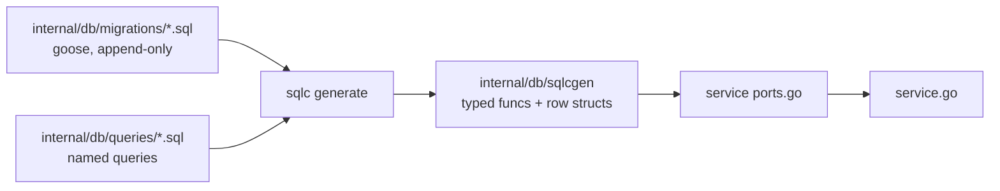
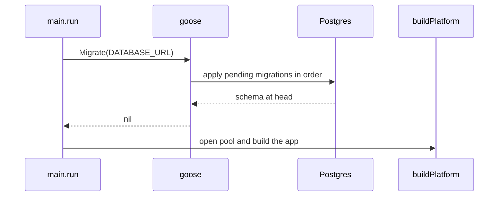

# Data overview

## Strategy: SQL first, code generated from it

There is no ORM. Migrations define the schema, hand-written queries define the access, and
`sqlc` generates the Go.



Consequences you can rely on:

- The SQL you read in `queries/` is byte-for-byte the SQL that runs.
- A column rename breaks compilation, not production.
- CI (`sqlc-drift`) fails if the generated code was not regenerated and committed.

## The stack

| Concern | Choice |
| --- | --- |
| Database | Postgres with the `vector` extension (`00001_init.sql:5`) |
| Driver | pgx v5 (`sqlc.yaml`: `sql_package: "pgx/v5"`) |
| Migrations | goose, plain SQL with `-- +goose Up` / `-- +goose Down` |
| Codegen | sqlc, version pinned in `apps/api/.sqlc-version` |
| JSON columns | `json.RawMessage` via a sqlc override |
| Vectors | `pgvector-go.Vector` via a sqlc override |
| Nullables | pointers (`emit_pointers_for_null_types: true`) |

```yaml
# apps/api/sqlc.yaml
gen:
  go:
    package: "sqlcgen"
    out: "internal/db/sqlcgen"
    sql_package: "pgx/v5"
    emit_json_tags: true
    emit_pointers_for_null_types: true
    overrides:
      - db_type: "vector"
        go_type: "github.com/pgvector/pgvector-go.Vector"
      - db_type: "pg_catalog.jsonb"
        go_type: "encoding/json.RawMessage"
```

## Migrations run at startup

`main.run` calls `db.Migrate(cfg.DatabaseURL)` **before** building anything
(`cmd/server/main.go:37-39`). A deployment is therefore "start the new binary"; there is
no separate migrate step to forget.



## Table inventory

30 tables, grouped by area:

| Area | Tables |
| --- | --- |
| Jobs and sources | `Job`, `JobSource`, `SourceRun`, `SavedSearch`, `Subscription`, `EmployerBoard`, `BoardCandidate` |
| Matching and AI | `MatchResult`, `AiFeatureSetting`, `AutoGenerateSetting`, `ResumeShapeSetting` |
| Documents and profile | `Profile`, `GeneratedDocument`, `StarStory` |
| Application tracking | `Application`, `ApplicationOutcome` |
| Signals and analysis | `JobSignal`, `KeywordDiff`, `NormalizedTerm`, `SynonymOverride`, `SalaryCache` |
| Company and contacts | `Company`, `CompanySignal`, `Contact`, `ContactConnection`, `JobContact` |
| Ops | `ActivityRun`, `FreshMatchNotification`, `host_retrieval_state`, `DjinniLegacySubAudit` |

Full column detail and ER diagrams: [Schema](/data/schema).

## Naming conventions

- Tables and columns are `"PascalCase"` / `"camelCase"` and therefore **quoted** — a
  legacy of the Drizzle-generated initial migration, kept so the Go port produced an
  identical schema (`00001_init.sql:1-5`).
- The one exception is `host_retrieval_state` (`00026`), added natively in the Go era with
  snake_case.
- Timestamps are `timestamp (3)` with `DEFAULT now()`.
- Primary keys are `uuid DEFAULT gen_random_uuid()`.

:::warning Quote your identifiers
`SELECT * FROM Job` fails; Postgres folds the unquoted name to lowercase. Write
`SELECT * FROM "Job"`.
:::

## Reading order

- [Schema](/data/schema) — the tables, with ER diagrams per area
- [Migrations](/data/migrations) — how to add one safely
- [Queries and sqlc](/data/queries-and-sqlc) — the codegen workflow
- [Repositories](/data/repositories) — how services consume it
- [Storage](/data/storage) — documents outside the database
