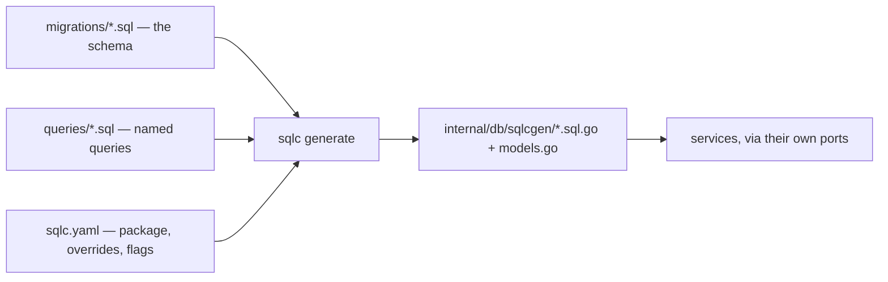
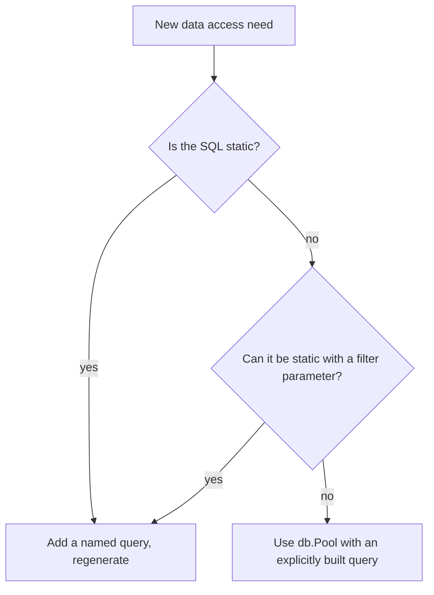
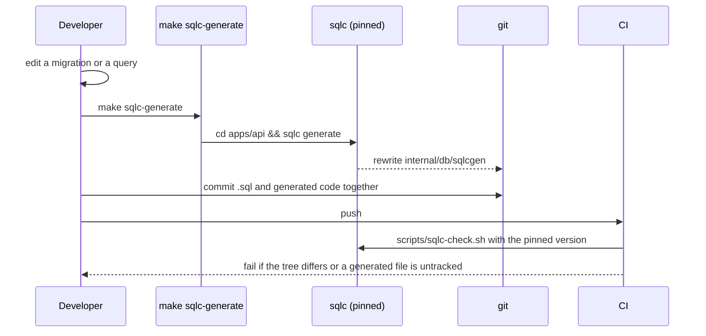

# Queries and sqlc

## The pipeline



sqlc parses the migrations to learn the schema, so a query referencing a column that does
not exist fails **at generation time**, not at runtime.

## Query files

One file per table or concern, 26 of them:

`activityrun`, `aifeaturesetting`, `application`, `applicationoutcome`, `company`,
`companysignal`, `contact`, `document`, `employerboard`, `freshmatchnotification`,
`hostretrievalstate`, `job`, `jobcontact`, `joblist`, `jobsignal`, `jobsource`,
`keyworddiff`, `llmsetting`, `matchresult`, `postage`, `profile`, `salary`, `savedsearch`,
`sourcerun`, `starstory`, `subscription`.

## Annotations

```sql
-- name: GetJobByID :one
SELECT * FROM "Job" WHERE "id" = $1;

-- name: UpdateJobEmbeddingWithHash :exec
-- Stores the hash of the exact text embedded, so a later match on unchanged
-- content can skip re-embedding (019-ai-job-throughput, research.md R5).
UPDATE "Job" SET "embedding" = $2, "embeddingHash" = $3 WHERE "id" = $1;

-- name: DeleteAllJobs :execrows
```

| Annotation | Returns |
| --- | --- |
| `:one` | a single row struct; error if absent |
| `:many` | a slice of row structs |
| `:exec` | error only |
| `:execrows` | number of affected rows |
| `:copyfrom` | bulk insert (Postgres COPY) |

Naming is `VerbNoun` in Go-exported form — `GetJobByDedupeKey`, `InsertJob`,
`UpdateJobStatus`, `SetJobSourceEnabled`. The generated method name is exactly the
annotation name.

:::tip Comments below the `-- name:` line become Go doc comments
The rationale you write in SQL travels into the generated code, which is where the next
reader will be.
:::

## Parameters

Positional `$1..$n` become either individual arguments or a generated `<Name>Params`
struct when there are several. Note `InsertJob` reusing `$2` twice — once as `sourceKey`
and once inside `ARRAY[$2]` for `seenOnSources` — which sqlc handles without a second
parameter.

## Type mapping

```yaml
# apps/api/sqlc.yaml
emit_json_tags: true
emit_pointers_for_null_types: true
overrides:
  - db_type: "vector"
    go_type: "github.com/pgvector/pgvector-go.Vector"
  - db_type: "pg_catalog.jsonb"
    go_type: "encoding/json.RawMessage"
```

| SQL | Go |
| --- | --- |
| `text NOT NULL` | `string` |
| `text` (nullable) | `*string` |
| `jsonb` | `json.RawMessage` |
| `vector(768)` | `pgvector.Vector` |
| `timestamp (3)` | `time.Time` / `*time.Time` |
| `uuid` | `pgtype.UUID` (helpers in `internal/dbutil`) |

`json.RawMessage` means the service decodes jsonb into a type it owns — see the STAR-story
decoding in `cmd/server/compose_features.go` (`composeInterviewPrep`), which unmarshals
`row.Skills` and `row.Categories`.

## When SQL is not enough

`db.DB` exposes both the generated queries **and** the raw pool
(`internal/db/db.go:24-28`):

```go
type DB struct {
    Pool    *pgxpool.Pool
    Queries *sqlcgen.Queries
}
```

The doc comment names the two legitimate uses of `Pool`: dynamic job-list filters and
pgvector cosine-similarity lookups — queries whose shape depends on user input and which
sqlc cannot express statically.



## Regeneration workflow



`scripts/sqlc-check.sh` does three things worth knowing:

1. **Refuses to run on a mismatched sqlc version.** The pin lives in
   `apps/api/.sqlc-version`; different versions emit different code, so an unpinned check
   would flap between machines.
2. **Checks untracked files too**, not just modified ones — a brand-new query whose
   `.sql.go` was never `git add`ed is caught.
3. **Prints the fix**: `make sqlc-generate && git add apps/api/internal/db/sqlcgen`.

Install the pinned version with `make sqlc-install`.
