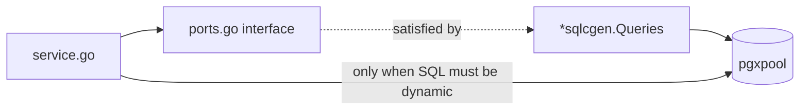
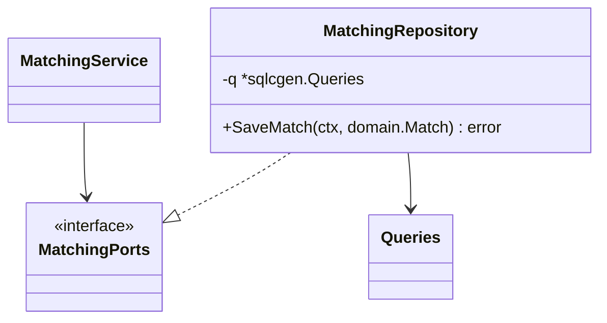
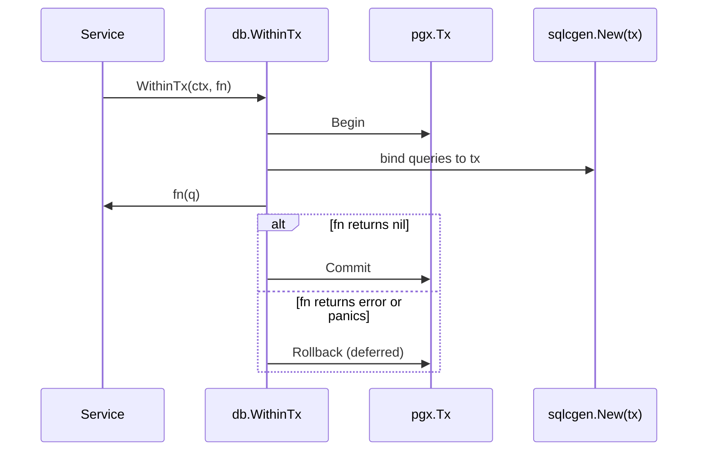
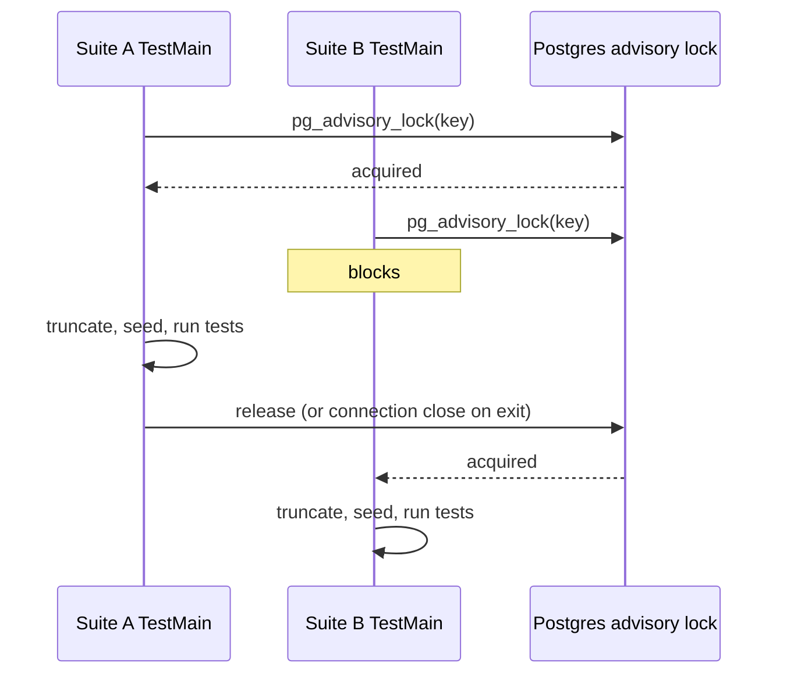

# Repositories and transactions

## `db.DB` — pool plus queries

```go
// internal/db/db.go
type DB struct {
    Pool    *pgxpool.Pool
    Queries *sqlcgen.Queries
}
```

`Open` creates the pool and **pings before returning**, closing the pool if the ping fails
(`db.go:31-42`). A misconfigured `DATABASE_URL` therefore fails at `buildPlatform`, not at
the first request.



## The repository pattern here

There is no `Repository` base type. A service declares the interface it needs, and the
generated `*sqlcgen.Queries` satisfies it structurally:

```go
// internal/jobsources/ports.go
type Repository interface {
    GetJobSourceByKey(ctx context.Context, key string) (sqlcgen.JobSource, error)
    ListJobSources(ctx context.Context) ([]sqlcgen.JobSource, error)
    SetJobSourceEnabled(ctx context.Context, arg sqlcgen.SetJobSourceEnabledParams) error
    // ...
}
```

Composition passes `p.DB.Queries` wherever a port is expected — see every `compose*`
function. Packages that need richer mapping add a `repository.go` (for example
`internal/matching/repository.go`) that wraps the queries and returns domain types.



## Transactions

`WithinTx` binds a `*sqlcgen.Queries` to a single transaction, commits on success and
rolls back on error **or panic** (`db.go:48-71`):

```go
func (d *DB) WithinTx(ctx context.Context, fn func(*sqlcgen.Queries) error) error {
    tx, err := d.Pool.Begin(ctx)
    if err != nil { return fmt.Errorf("db: begin tx: %w", err) }
    defer func() { _ = tx.Rollback(ctx) }()   // no-op after commit
    if err := fn(sqlcgen.New(tx)); err != nil { return err }
    if err := tx.Commit(ctx); err != nil { return fmt.Errorf("db: commit tx: %w", err) }
    return nil
}
```



The doc comment names the motivating case: an application status update and its
`ApplicationOutcome` event insert must not diverge.

:::note Why the signature takes `*sqlcgen.Queries`
Deliberate, and documented at `db.go:53-56`: a domain port here would force `db` to import
the use-case packages. Instead each package declares its own structural interface over the
generated type, keeping the dependency arrow pointing the right way.
:::

## Test isolation

`internal/dbtest` is compiled **only** under the `integration` build tag and never links
into the production binary (`internal/dbtest/database.go:26`, `112-116`).

Its central problem and solution: `go test ./...` runs packages in parallel, several
integration suites `TRUNCATE` the same tables, and one suite's cleanup would wipe
another's fixtures mid-test. `LockSharedDB` takes a session-level Postgres advisory lock
(`0x104BF1DE`) so the suites take turns.



A suite that ends via `os.Exit` can ignore the release function — Postgres drops session
advisory locks when the connection closes.

## Practical guidance

| Need | Do |
| --- | --- |
| One straightforward write | call the generated query directly through your port |
| Two writes that must agree | `WithinTx` |
| Dynamic filters (job list) | build SQL over `db.Pool`, keep it in one place |
| Vector similarity | `db.Pool` — pgvector operators are not expressible as a static sqlc query here |
| A DB-backed test | `//go:build integration`, `dbtest.New(t)` for a clone of the migrated template, run via `make test-integration` |

## Truncation helper

`make truncate-db` clears the ten core tables with `RESTART IDENTITY CASCADE`:
`Application`, `GeneratedDocument`, `Job`, `JobSource`, `MatchResult`, `Profile`,
`SalaryCache`, `SavedSearch`, `SourceRun`, `Subscription`. Useful for resetting a
development database without dropping the schema.
