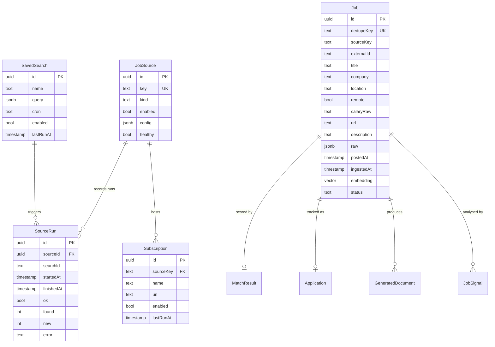
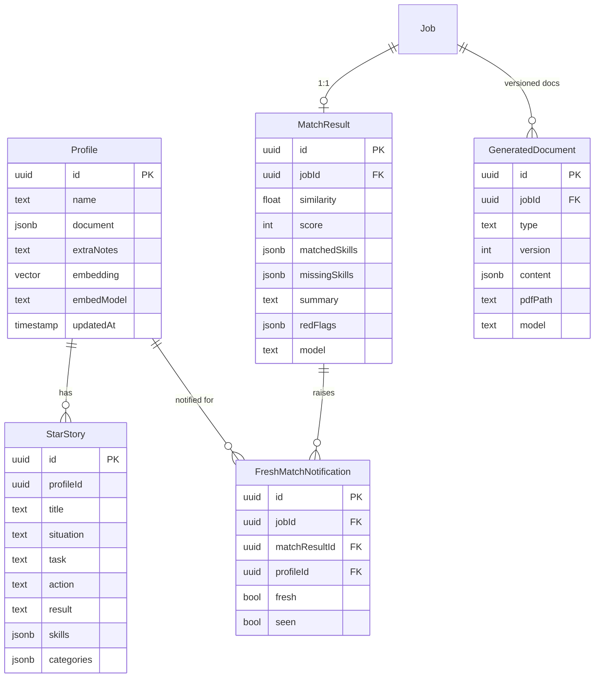
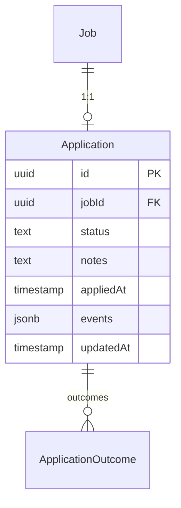
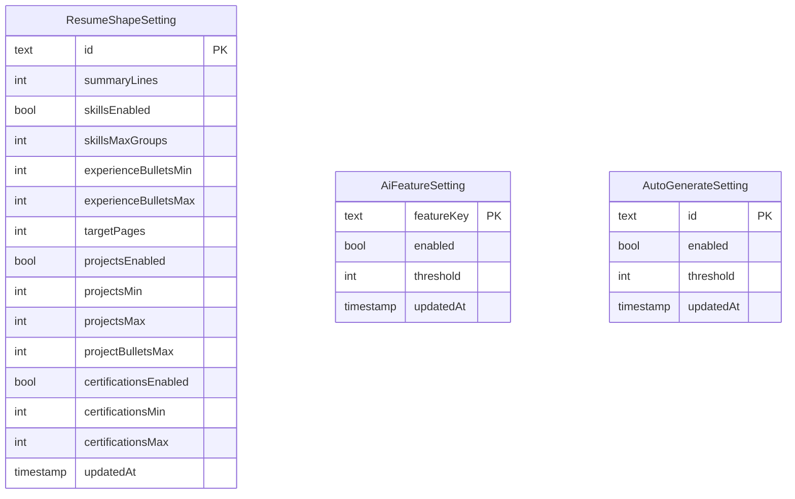
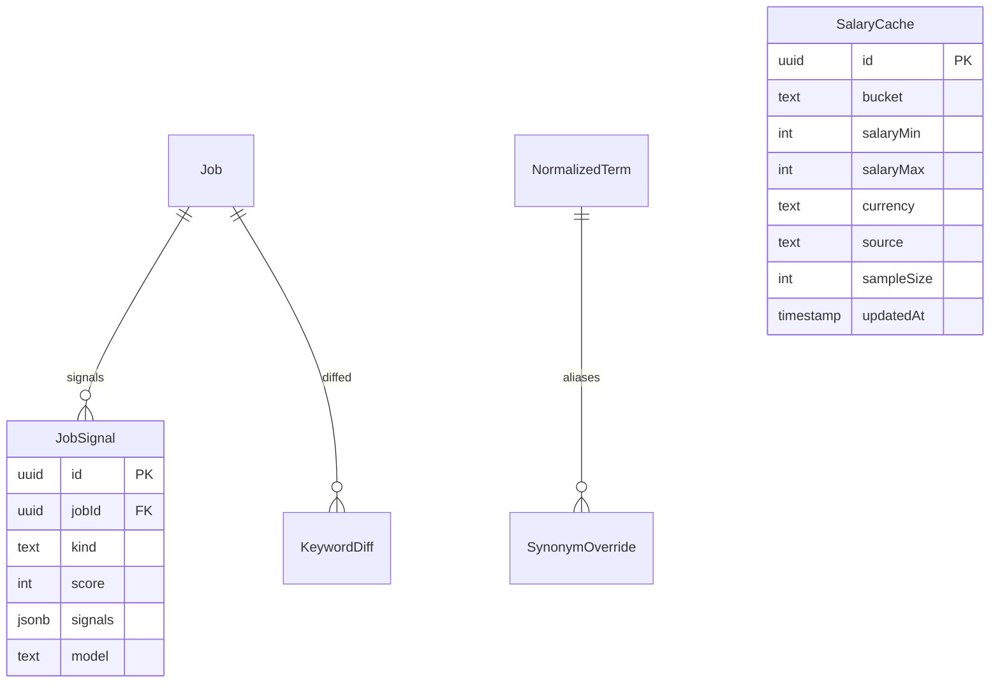
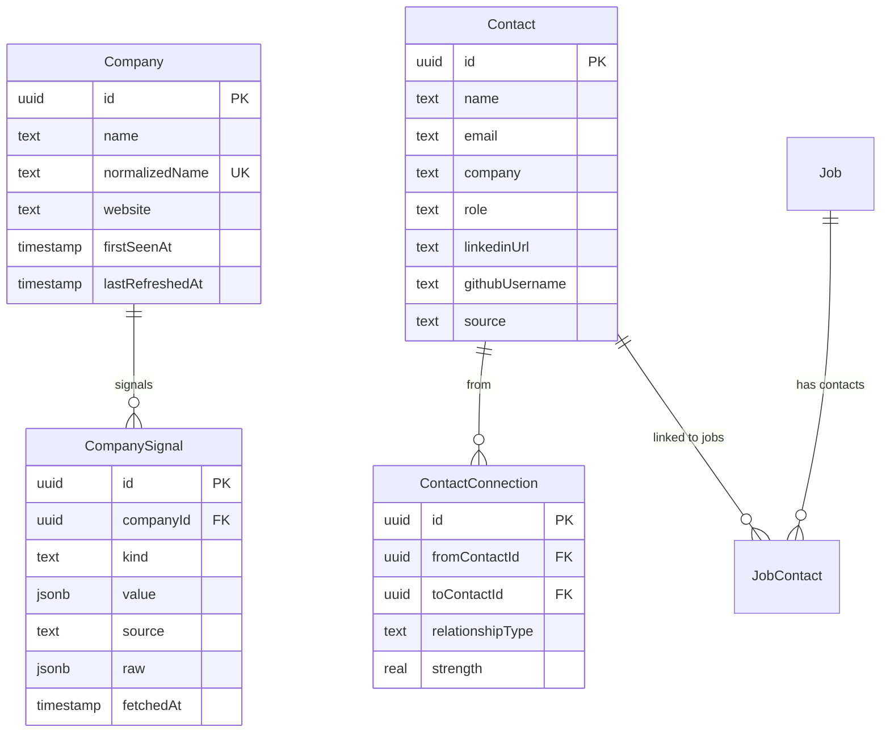
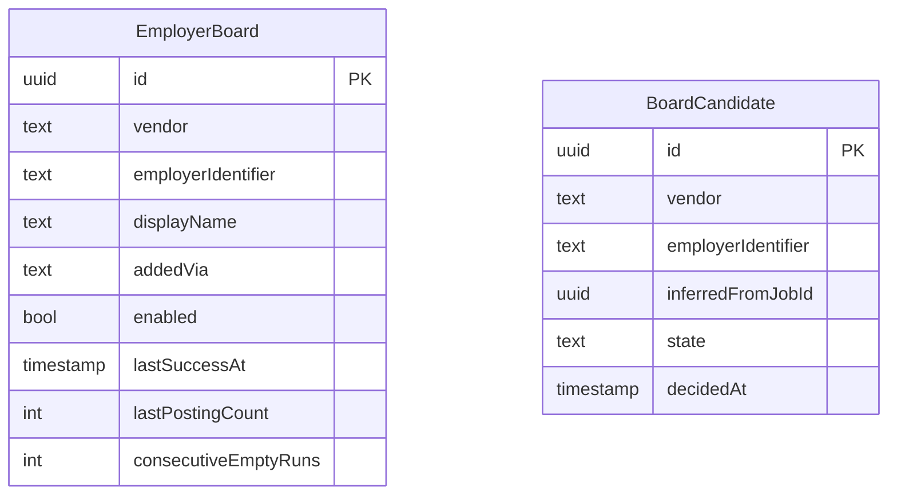
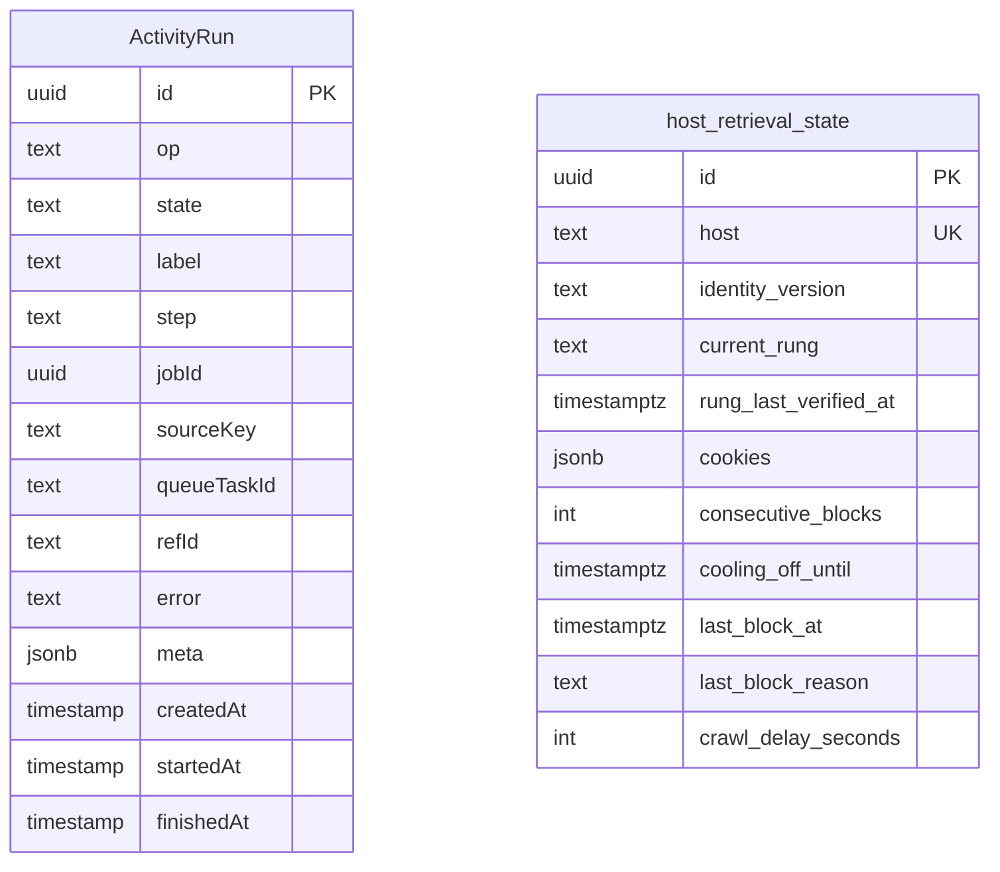

# Schema

All identifiers except `host_retrieval_state` are quoted PascalCase/camelCase, inherited
from the initial Drizzle-generated migration (`00001_init.sql:1-5`).

## Jobs and sources

| Column | Notes |
| --- | --- |
| `Job.dedupeKey` | `UNIQUE`; identity of a posting |
| `Job.raw` | `jsonb NOT NULL`, the untouched provider payload |
| `Job.embedding` | `vector(768)`, sized to `EMBED_DIMS` |
| `Job.status` | defaults to `'found'` |
| `JobSource.kind` | plain `text`, no CHECK; `api`, `scrape`, `sidecar` or `manual` in practice |
| `SavedSearch.cron` | defaults to `'0 */6 * * *'` |
| `Subscription.sourceKey` | FK to `JobSource.key`, cascade delete |

Indexes: `Job(ingestedAt)`, `Job(status)`, `MatchResult(score)`, `SourceRun(startedAt)`
(`00001_init.sql:108-111`).

## Matching, documents, profile

`GeneratedDocument` is unique on `(jobId, type, version)` — regeneration adds a version
rather than overwriting. `MatchResult` is unique on `jobId` — one current score per job.

## Application tracking

`Application.events` is an append-only jsonb array defaulting to `'[]'` — the history of
status changes travels with the row rather than in a side table.

## AI and settings

| Table | Constraint of note |
| --- | --- |
| `ResumeShapeSetting` | singleton: `CHECK (id = 'default')`. Every numeric column carries its own range `CHECK`, so an out-of-range shape cannot be stored even if application validation is bypassed. |
| `AiFeatureSetting` | keyed by feature, `threshold` defaults to 90 |
| `AutoGenerateSetting` | singleton: `CHECK (id = 'default')` |

`ResumeShapeSetting`'s defaults reproduce the shape the pipeline hardcoded before the
table existed (`00034_resume_shape_setting.sql`), so a fresh install and an upgraded
install generate identical documents. `0` means *unlimited* for the `max`/`min` columns.

**`LlmTaskSetting` no longer exists.** It held per-task `{provider, model}` until
`00033_drop_llm_task_setting.sql` dropped it; routing moved into `gateway/config.yaml`.

## Signals, analysis, salary

`JobSignal` is unique on `(jobId, kind)`, so the ghost detector's verdict for a job
replaces itself rather than accumulating. `SalaryCache` is unique on
`(bucket, currency, source)` with a `sampleSize` counter.

## Company and contacts

`ContactConnection` carries `CHECK (fromContactId <> toContactId)` — the graph cannot
contain a self-edge. `strength` is a `real` in `[0,1]`, defaulting to `0.5`, used to rank
referral paths.

## ATS board roster

Both are unique on `(vendor, employerIdentifier)`. `BoardCandidate.state` starts at
`'proposed'` and is moved by `/api/roster/candidates/{id}/accept` or `/reject`;
`consecutiveEmptyRuns` on `EmployerBoard` is how a dead board is spotted.

## Operations

| Column | Meaning |
| --- | --- |
| `ActivityRun.op` | operation name, e.g. the task type |
| `ActivityRun.state` | `queued` by default, then `running`, `succeeded`, `failed`, `cancelled` |
| `ActivityRun.queueTaskId` | asynq task id, used by cancel/retry and the sweeper |
| `ActivityRun.meta` | free-form jsonb, defaults to `'{}'` |
| `host_retrieval_state.cookies` | encrypted with `CONFIG_ENCRYPTION_KEY` |
| `host_retrieval_state.current_rung` | `direct`, `browser`, or `flaresolverr` |
| `host_retrieval_state.crawl_delay_seconds` | learned from the host's `robots.txt` |

:::note Vestigial budget columns
`budget_period_start`, `budget_used` and `budget_limit` remain on
`host_retrieval_state` from the original design. Migration `00029_drop_host_budget.sql`
removed the per-host daily budget behaviour in favour of crawl-delay-aware pacing.
:::
