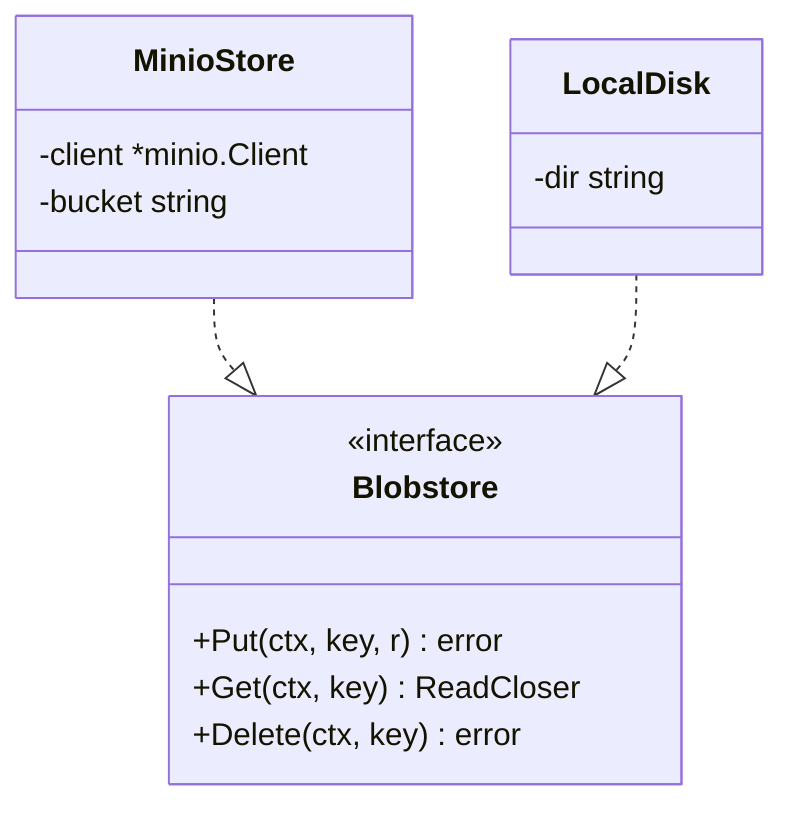
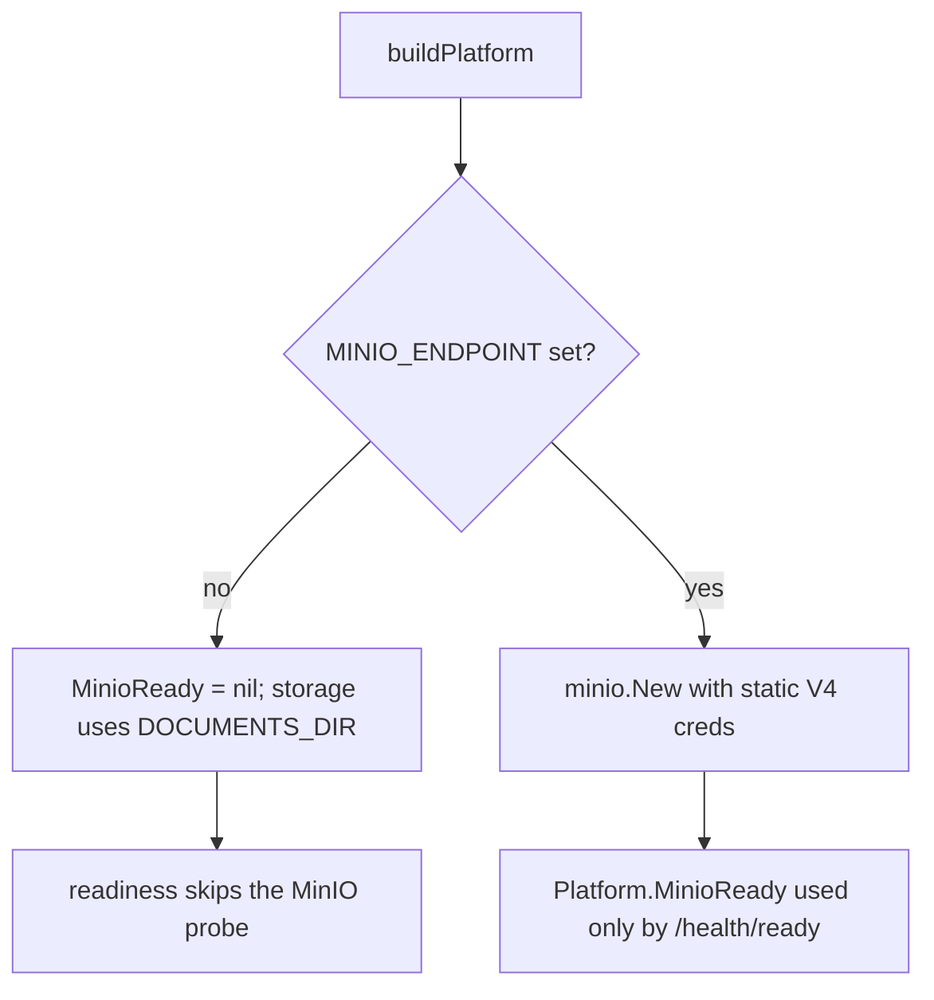
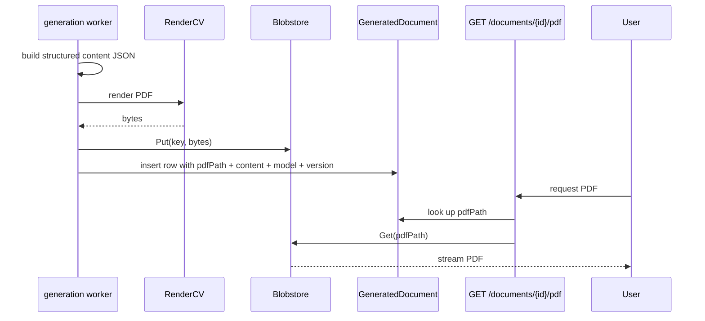

# Document storage

Generated PDFs do not belong in Postgres. `internal/storage` abstracts where they go.

## The port and its adapters



The adapter proves conformance at compile time in its own test file
(`internal/storage/minio_test.go:9`):

```go
var _ Blobstore = (*MinioStore)(nil)
```

That one line is a pattern worth copying: adapter/port mismatches become build failures.

## Configuration

```go
// internal/storage/minio.go
type Config struct {
    Endpoint  string // host:port, e.g. "minio:9000" (no scheme)
    AccessKey string
    SecretKey string
    Bucket    string
    UseSSL    bool
}
```

| Variable | Effect |
| --- | --- |
| `MINIO_ENDPOINT` | empty → MinIO disabled, documents go to disk |
| `MINIO_ACCESS_KEY` / `MINIO_SECRET_KEY` | static V4 credentials |
| `MINIO_BUCKET` | defaults to `documents` when blank |
| `MINIO_USE_SSL` | `Secure` flag on the client |
| `DOCUMENTS_DIR` | local path, defaults to `./data/documents` |

`NewMinioStore` **ensures the bucket exists** on construction (`minio.go:28-40`) — first
run needs no manual setup.

## Selection at startup



`Platform.MinioReady` is explicitly a *probe* client, not the storage adapter
(`cmd/server/platform.go:38-44`) — the readiness endpoint uses it to report connectivity,
while the generation service holds its own `Blobstore`.

## Document lifecycle



The database stores the **structured content** as `jsonb` plus a `pdfPath`; the blob store
holds the rendered artefact. Re-rendering from stored content is therefore possible
without re-running the LLM.

## Versioning and retention

`GeneratedDocument` is unique on `(jobId, type, version)` (`00001_init.sql:19-28`). A
regeneration writes a new version and a new blob; nothing is overwritten. There is no
automatic pruning — old versions and their blobs persist until deleted with their job
(rows cascade; blobs do not).

:::warning Deleting a job leaves its blobs
`DELETE FROM "Job"` cascades to `GeneratedDocument`, but the blob store has no foreign
keys. `DELETE /api/jobs` clears rows; orphaned PDFs remain in `DOCUMENTS_DIR` or the
bucket.
:::

## Failure behaviour

| Failure | Effect |
| --- | --- |
| MinIO unreachable at startup | `NewMinioStore` returns a connection error rather than hanging — asserted by `TestNewMinioStore_UnreachableEndpoint` with a 3-second context |
| Blank bucket name | defaults to `documents`, no panic |
| MinIO down at request time | the PDF endpoint fails; the `GeneratedDocument` row and its content JSON remain intact |
| `DOCUMENTS_DIR` not writable | generation fails; the task is retried by asynq |

## Backups

Two things to back up: the Postgres database (rows, content JSON, paths) and the blob
location (`DOCUMENTS_DIR` or the MinIO bucket). Losing only the blobs is recoverable by
re-rendering from stored content; losing the database is not.
