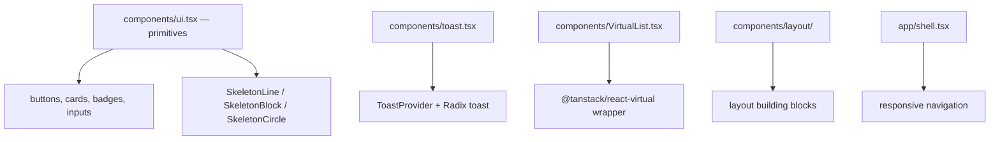
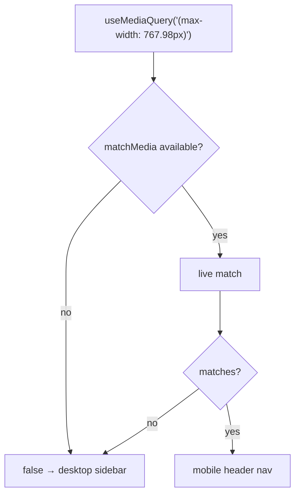
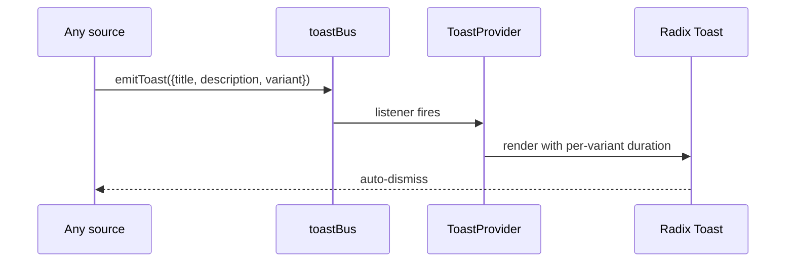
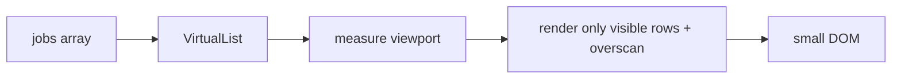

# Component system

## What is shared



Both `ui.tsx` and `toast.tsx` have colocated tests (`ui.test.tsx`, `toast.test.tsx`) —
shared primitives are the components most worth testing, because every page depends on
them.

## Styling

Tailwind 4 through `@tailwindcss/vite`, with semantic class names layered on top:
`text-fg`, `bg-surface`, `border-border`, `bg-bg/70`. Those are design tokens defined in
`src/index.css` rather than raw palette values, so theming is one file.

Two helpers:

| Helper | Purpose |
| --- | --- |
| `cn()` (`lib/utils.ts`) | `clsx` + `tailwind-merge` — conditional classes with conflict resolution |
| `class-variance-authority` | typed component variants |

`tailwind-merge` matters: `cn('px-2', condition && 'px-4')` yields `px-4`, not both.

## Radix primitives

| Primitive | Used for |
| --- | --- |
| `react-dialog` | modals |
| `react-select` | selects |
| `react-switch` | toggles (settings) |
| `react-tabs` | tabbed panels |
| `react-toast` | the toast surface |
| `react-tooltip` | hints |
| `react-slot` | polymorphic `asChild` composition |

Radix ships behaviour and accessibility unstyled; Tailwind supplies the look. That
division is why there is no bespoke focus-trap or roving-tabindex code in this repo.

## Accessibility conventions

### One accessible element per control

`shell.tsx` renders the mobile header **or** the desktop sidebar, never both:

```tsx
const isMobile = useMediaQuery('(max-width: 767.98px)');
```

with the reason in the comment: *"Render a single navigation at a time so each nav link has
exactly one accessible element in the DOM."* CSS-hidden duplicates confuse screen readers
and make `getByRole` ambiguous in tests.

### Landmarks and labels

- `<nav aria-label="Primary">` on both navigation variants.
- `<aside>` for the sidebar, `<main>` for content, `<header>` for the mobile bar.
- Icons come from lucide-react alongside a text label, not instead of one.

### SSR and test fallback

`useMediaQuery` falls back to the desktop layout when `matchMedia` is unavailable, so
jsdom tests get a deterministic tree.



### Sanitised HTML

`dompurify` wraps any model-generated HTML before it reaches the DOM.

## Toasts



```ts
export type ToastVariant = 'error' | 'success' | 'info';
export interface ToastRecord extends ToastInput {
  id: string;
  variant: ToastVariant;
}
```

Ids are generated as `toast-<counter>-<timestamp>`, so two toasts raised in the same
millisecond still get distinct React keys.

## Virtualisation

`VirtualList.tsx` wraps `@tanstack/react-virtual` for the feed. The feed can hold thousands
of jobs after a few ingestion runs; rendering them all would make filtering unusable.



## Drag and drop

dnd-kit powers the tracker kanban — `@dnd-kit/core`, `/sortable`, `/utilities`. Chosen over
alternatives for keyboard-accessible sensors, which matters for a board that is the primary
interaction on that page.

## Conventions for new components

| Rule | Rationale |
| --- | --- |
| Panel-sized components live in their feature directory | only the feed needs the feed's card |
| Promote to `components/` when a second feature needs it | avoids premature abstraction |
| Reach for a Radix primitive before writing behaviour | accessibility is the hard part |
| Compose classes with `cn()` | conflict resolution |
| Give every loading state a skeleton | see [state and data](/frontend/state-and-data) |
| Colocate the test | `Panel.tsx` and `Panel.test.tsx` |
