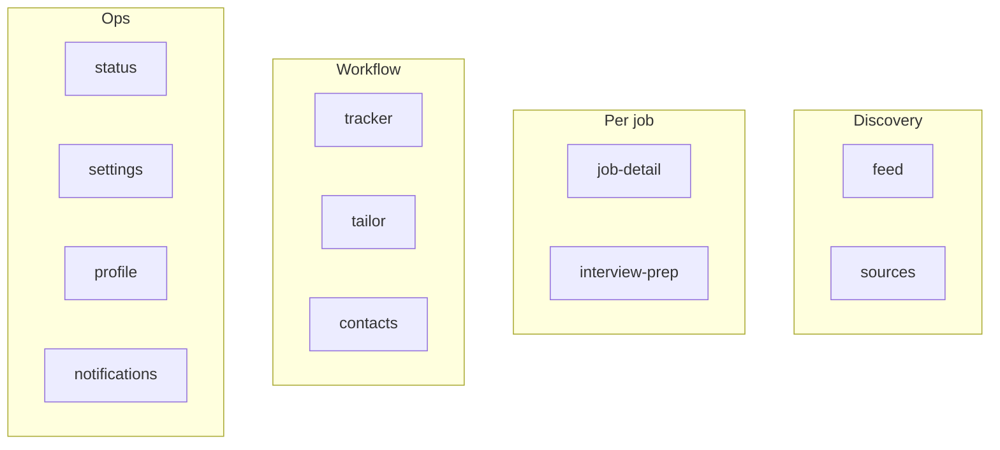
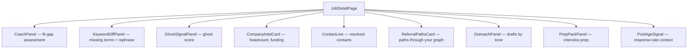
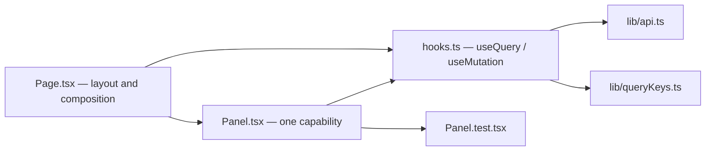

# Feature modules

Each directory under `src/features` owns a product area: its page, its panels, and a local
`hooks.ts` holding the queries and mutations that area needs.

## `feed`

`FeedPage.tsx`, `hooks.ts`, `FeedPage.test.tsx`.

The ranked job list — filters, virtualised rows, shortlist and hide actions.

| Action | Endpoint |
| --- | --- |
| list | `GET /api/jobs` |
| shortlist | `POST /api/jobs/{id}/shortlist` |
| hide | `POST /api/jobs/{id}/hide` |

Uses `components/VirtualList.tsx` (`@tanstack/react-virtual`) — the feed can hold
thousands of rows.

## `job-detail`

The largest slice: `JobDetailPage.tsx` plus nine panels, each with its own test.

| Panel | Endpoint |
| --- | --- |
| `CoachPanel` | `POST /api/jobs/{id}/coach/assess`, `GET .../coach/assessment` |
| `KeywordDiffPanel` | `GET /api/jobs/{id}/keyword-diff` |
| `GhostSignalPanel` | `POST /api/jobs/{id}/ghost-score` |
| `CompanyIntelCard` | `GET /api/companies/{jobId}/intel`, `POST .../refresh` |
| `ContactLine` | `GET /api/jobs/{id}/contacts`, `POST .../refresh` |
| `ReferralPathsCard` | `GET /api/jobs/{id}/referral-paths` |
| `OutreachPanel` | `GET /api/jobs/{id}/outreach/tones`, `POST .../generate` |
| `PrepPackPanel` | `GET /api/jobs/{id}/interview-prep` |
| `PostAgeSignal` | `GET /api/postage-response-rate` |
| page | `GET /api/jobs/{id}`, `GET .../documents`, `POST .../generate` |

One panel per backend capability, each independently loadable — a slow company-intel fetch
never blocks the keyword diff.

## `interview-prep`

`companyNews.ts` and its test — a pure module, no page of its own; `PrepPackPanel` in
`job-detail` renders it.

## `tracker`

`TrackerPage.tsx`, `hooks.ts`. The kanban board over `APPLICATION_STATUSES`, using dnd-kit.

| Action | Endpoint |
| --- | --- |
| load | `GET /api/applications` |
| move a card | `PATCH /api/applications/{id}` |
| stats | `GET /api/stats` |

## `tailor`

`TailorPage.tsx`, `hooks.ts`. Ad-hoc documents from pasted vacancy text.

| Action | Endpoint |
| --- | --- |
| generate | `POST /api/documents/tailor` |
| list | `GET /api/documents/ad-hoc` |
| read / edit | `GET`, `PUT /api/documents/{id}` |
| download | `GET /api/documents/{id}/pdf` |

## `contacts`

`ContactsPage.tsx`, `hooks.ts`. The referral graph.

| Action | Endpoint |
| --- | --- |
| list | `GET /api/contacts` |
| CSV import | `POST /api/contacts/import` (multipart) |
| GitHub sync | `POST /api/contacts/{id}/github-sync` |

## `sources`

`SourcesPage.tsx` (which also exports `HostRetrievalPanel`), `hooks.ts`,
`djinniSearchSummary.ts`, `SubscriptionRow.tsx`, plus a `roster/` subdirectory.

| Concern | Endpoint |
| --- | --- |
| list and toggle sources | `GET /api/sources`, `PUT /api/sources/{key}` |
| test, run, enrich | `POST /api/sources/{key}/test`, `/run`, `/enrich` |
| saved searches | `/api/searches*` |
| subscriptions | `/api/subscriptions*` |
| host retrieval state | `/api/hosts/{host}/*` |
| ATS roster | `/api/roster*` |

`HostRetrievalPanel` is the operator's window into the [fetch
ladder](/ingestion/retrieval-and-fetching): current rung, cooling-off, and the buttons that
clear a rung preference or cookies. `djinniSearchSummary.ts` renders Djinni's preset search
parameters as readable text.

## `status`

`StatusPage.tsx`, `hooks.ts`. Activity runs and queue backlogs.

| Action | Endpoint |
| --- | --- |
| runs | `GET /api/activity` (polled) |
| queues | `GET /api/activity/queues` |
| retry / cancel | `POST /api/activity/retry`, `/{id}/cancel`, `/cancel-all` |

## `settings`

`SettingsPage.tsx`, `AiFeatureSettingsCard.tsx`, `ResumeShapeCard.tsx`, `hooks.ts`.

| Card | Endpoint |
| --- | --- |
| `AiFeatureSettingsCard` | `GET /api/settings/ai-features`, `PUT .../{feature}` |
| `ResumeShapeCard` | `GET`/`PUT /api/settings/resume-shape` |

`ResumeShapeCard` submits the **whole** config on save — the endpoint replaces rather than
patches — and offers a one-action reset to defaults. Validation is all-or-nothing, so a
single out-of-range field rejects the entire update.

There is no LLM settings card. Provider and model selection was removed from the dashboard
by feature 030; routing lives in `gateway/config.yaml`.

## `profile`

`ProfilePage.tsx`, `components/`, `hooks.ts`. Master profile and editable resume
(spec 009).

| Action | Endpoint |
| --- | --- |
| list / CRUD | `/api/profiles*` |
| upload config | `POST /api/profiles/config` (multipart) |
| config status | `GET /api/profiles/config/status` |
| resume read/write | `GET`/`PUT /api/profiles/{id}/resume` |

`GET /api/profiles/config/status` is what `RequireProfileConfig` consults before letting
you into the Feed.

## `notifications`

`NotificationBell.tsx`, `hooks.ts`. Rendered by the shell, not by a route.

| Action | Endpoint |
| --- | --- |
| unseen count | `GET /api/notifications/unseen-count` (polled) |
| list | `GET /api/notifications` |
| mark seen | `POST /api/notifications/{id}/seen` |

## Slice anatomy

The rule: pages compose, hooks fetch, `api.ts` talks HTTP. A component that calls `fetch`
directly is a bug.
