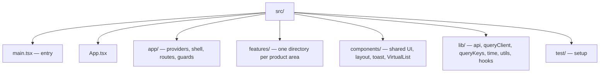
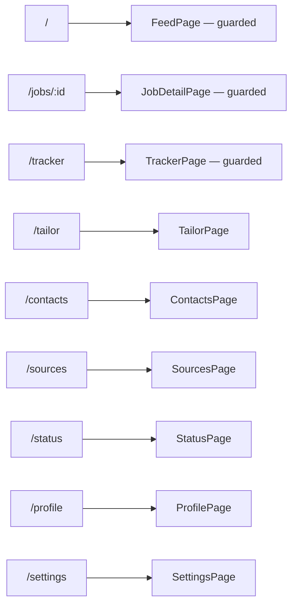
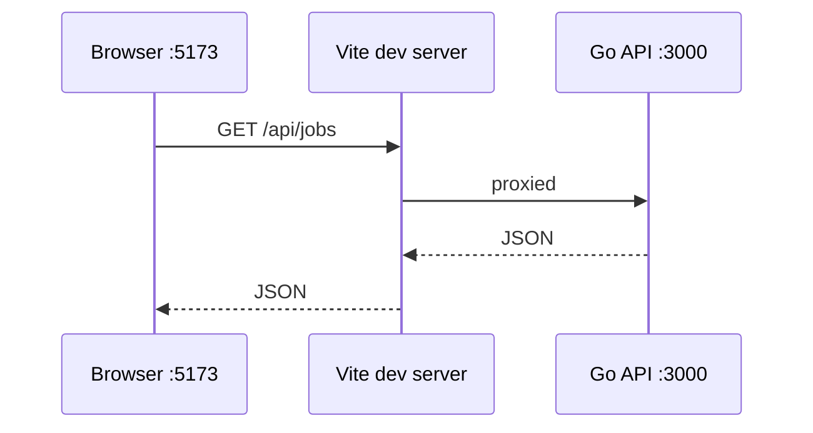

# Frontend overview

## Stack

| Concern | Choice |
| --- | --- |
| Framework | React 19 |
| Build | Vite 6, `@vitejs/plugin-react` |
| Routing | react-router-dom 7 |
| Server state | TanStack Query 5 |
| Styling | Tailwind 4 via `@tailwindcss/vite` |
| Primitives | Radix UI — dialog, select, switch, tabs, toast, tooltip |
| Icons | lucide-react |
| Drag and drop | dnd-kit (tracker kanban) |
| Virtualisation | `@tanstack/react-virtual` |
| Sanitisation | dompurify |
| Types | `@job-finder/shared` (workspace package) |
| Tests | Vitest + Testing Library, Playwright for e2e |

## Directory layout



| Path | Contents |
| --- | --- |
| `src/app/providers.tsx` | QueryClientProvider → BrowserRouter → ToastProvider |
| `src/app/shell.tsx` | responsive nav shell |
| `src/app/routes.tsx` | route table |
| `src/app/RequireProfileConfig.tsx` | guard for routes needing a configured profile |
| `src/features/<area>` | pages, panels and a local `hooks.ts` |
| `src/lib/api.ts` | the entire HTTP surface, typed |
| `src/lib/queryKeys.ts` | centralised cache keys |
| `src/lib/queryClient.ts` | global error handling and defaults |

## Routes



Three routes are wrapped in `RequireProfileConfig` — Feed, Job detail and Tracker — because
without a profile there is nothing to match against. Profile, Settings and Sources stay
reachable so you can fix that.

## Navigation

`shell.tsx` defines the nav once and renders **one** navigation at a time:

```tsx
const isMobile = useMediaQuery('(max-width: 767.98px)');
```

The comment explains why this is a conditional render rather than CSS visibility: *"Render
a single navigation at a time so each nav link has exactly one accessible element in the
DOM."* Two hidden copies would give screen readers and tests duplicate matches. It falls
back to the desktop sidebar when `matchMedia` is unavailable (jsdom tests).

## Principles

### Types come from the backend contract

Every type in `api.ts` is imported from `@job-finder/shared` — 40+ DTO types, no local
redeclaration. See [Shared types](/frontend/shared-types).

### One API module

All server access goes through `src/lib/api.ts`. Components never call `fetch`. The module
wraps failures in a typed error:

```ts
export class ApiError extends Error {
  status: number;
}
```

### Query keys are centralised

`src/lib/queryKeys.ts` is a nested const object — `queryKeys.jobs.detail(id)`,
`queryKeys.coach.assessment(jobId)`. Invalidation targets a key factory, not a
string literal typed twice.

### Errors surface automatically, opt out deliberately

The `QueryClient` attaches global `onError` handlers that raise a toast, with two
documented escapes ([state and data](/frontend/state-and-data)).

### Feature isolation

A feature owns its page, its panels and its `hooks.ts`. Cross-feature imports are rare and
deliberate — the shell importing `NotificationBell` is one.

### Server-side truth

Ranking, scoring, eligibility and status transitions are computed by the API. The dashboard
renders and dispatches; it does not re-implement rules.

## Dev server

```ts
server: {
  port: 5173,
  proxy: { '/api': 'http://localhost:3000' },
}
```

`api.ts` fetches relative `/api/...` paths, so the same code works behind the dev proxy and
in production behind one origin. There is no API base-URL environment variable to
misconfigure.



## Path alias

`@` resolves to `./src` (`vite.config.ts`), though most code uses relative imports.
