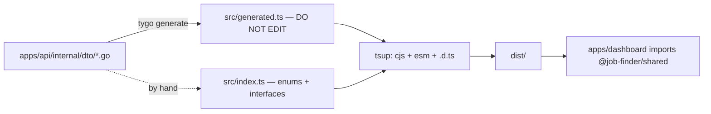
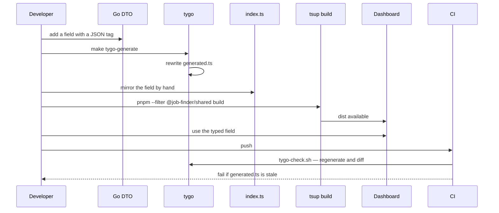
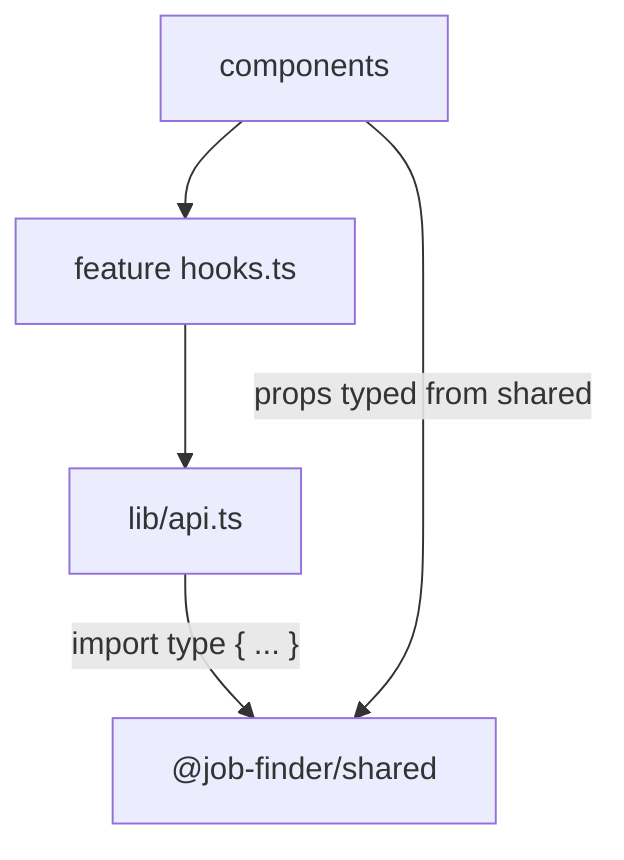

# Shared types

`packages/shared` is the contract between the Go backend and the React dashboard.

## Two files, two origins



| File | Origin | Editable | Contains |
| --- | --- | --- | --- |
| `src/generated.ts` | tygo, from Go DTOs | **no** | one interface per Go DTO struct |
| `src/index.ts` | hand-written | yes | const-tuple enums and interfaces TypeScript needs that Go cannot express |

`generated.ts` opens with the standard banner:

```ts
// Code generated by tygo. DO NOT EDIT.

//////////
// source: activity.go

export interface ActivityRunDto {
  id: string;
  op: string;
  state: string;
  label: string;
  step?: string;
  // ...
  createdAt: string;
  elapsedMs?: number /* int64 */;
}
```

Note the shape: nullable Go pointers become optional TypeScript properties, `time.Time`
becomes `string` (a tygo `type_mappings` entry), and the original Go integer width survives
as a comment.

## Why `index.ts` is hand-maintained

Some contract elements have no Go equivalent tygo can emit — const tuples used both as
runtime values and as union types:

```ts
export const APPLICATION_STATUSES = [
  'found', 'shortlisted', 'docs_generated', 'applied',
  'interview', 'offer', 'rejected',
] as const;
export type ApplicationStatus = (typeof APPLICATION_STATUSES)[number];

export const DOCUMENT_TYPES = ['resume', 'cover_letter'] as const;
export const SOURCE_KINDS = ['api', 'scrape', 'sidecar'] as const;
```

The tracker iterates `APPLICATION_STATUSES` to render its columns *and* uses
`ApplicationStatus` as a type. A generated interface cannot do both.

:::warning `index.ts` does not re-export `generated.ts`
`AGENTS.md` states the rule: Go DTO field names and JSON tags must match `index.ts`
field-for-field, because `index.ts` is hand-maintained. **Update both when you add a DTO
field.**
:::

## Build

```json
"scripts": {
  "build": "tsup src/index.ts --format cjs,esm --dts",
  "dev":   "tsup src/index.ts --format cjs,esm --dts --watch"
}
```

```json
"main": "./dist/index.js",
"module": "./dist/index.mjs",
"types": "./dist/index.d.ts"
```

The dashboard imports the **built** package, not the source. So:

```bash
pnpm --filter @job-finder/shared build
```

is required after any change — and it is why CI runs that command before both
`frontend-test` and `frontend-typecheck`.



## Failure modes

| Symptom | Cause | Fix |
| --- | --- | --- |
| `Property 'x' does not exist on type` | `dist/` is stale | rebuild the shared package |
| Field is `undefined` at runtime but typed | added to `generated.ts`, forgotten in `index.ts` (or vice versa) | mirror it |
| CI `tygo-drift` fails | edited a DTO without regenerating | `make tygo-generate` and commit |
| Type exists but the API never sends it | DTO struct field has no JSON tag, or the handler never maps it | fix the handler |
| Dashboard compiles, API returns a different shape | `index.ts` drifted from the Go DTO — nothing checks this | manual review |

That last row is the sharp edge. `tygo-check` guards `generated.ts`; nothing guards
`index.ts`.

## What the dashboard imports

`src/lib/api.ts` imports 40+ types from `@job-finder/shared` in a single statement —
`ActivityListResponse`, `ApplicationDto`, `JobDto`, `JobListResponse`, `MatchResult`-bearing
responses, `LlmSettingsResponseDto`, `ProfileDto`, `QueueBacklogResponse`, `ResumeDto`,
`SubscriptionDto`, and the rest. No dashboard file declares its own server type.



## Adding a field — the checklist

1. Add the field to the Go DTO struct with its JSON tag.
2. Map it in the handler.
3. `make tygo-generate`.
4. Mirror it in `packages/shared/src/index.ts` if the type lives there.
5. `pnpm --filter @job-finder/shared build`.
6. Use it in the dashboard.
7. Commit the regenerated `generated.ts` with the source change.
