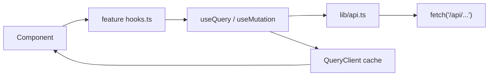
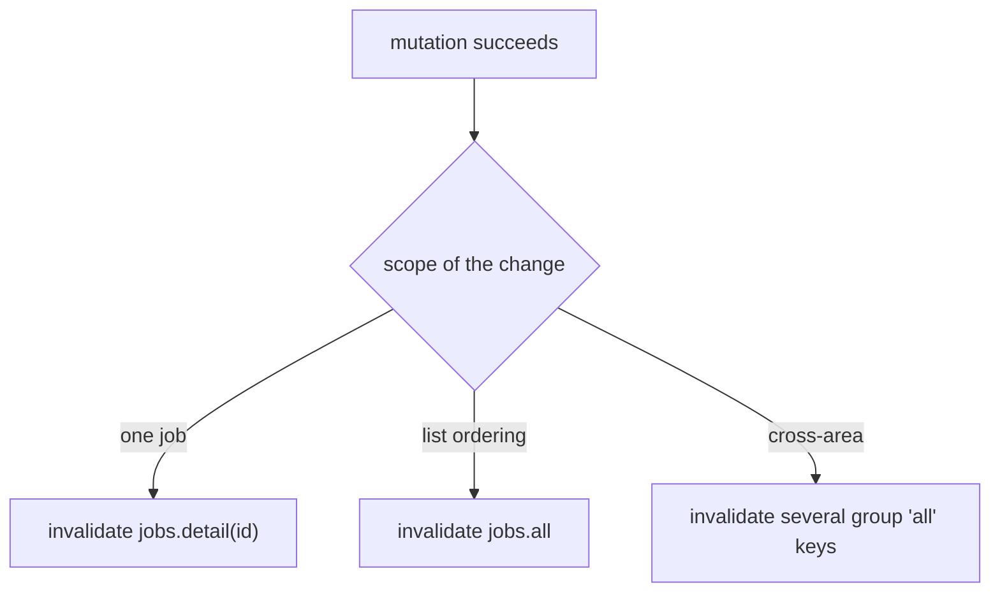
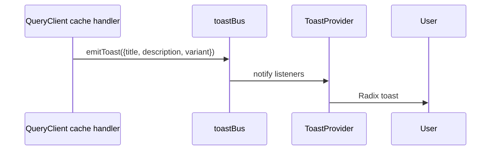
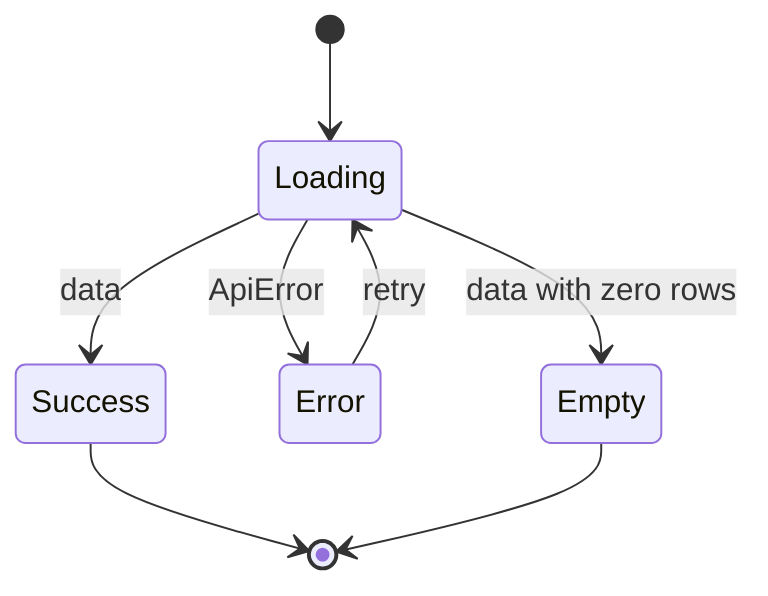

# State and data fetching

## Server state only

There is no Redux, Zustand or context-based store for domain data. Everything the user
sees comes from the API, and TanStack Query owns it. Local state is component state.



## The API module

`src/lib/api.ts` is the only place `fetch` appears. One private helper does the work:

```ts
async function request<T>(path: string, init?: RequestInit): Promise<T> {
  const res = await fetch(`/api${path}`, {
    headers: init?.body instanceof FormData ? undefined : { 'Content-Type': 'application/json' },
    ...init,
  });
  if (!res.ok) {
    const body = await res.text().catch(() => '');
    throw new ApiError(res.status, res.statusText, body);
  }
  // ...
}
```

Three details:

- **Relative `/api` paths.** The dev proxy and production both work with no base-URL
  configuration.
- **FormData sets its own boundary.** Passing `Content-Type` for a multipart body would
  break it, so the header is omitted for `FormData` — that is how profile config upload and
  contact CSV import work.
- **Failures become `ApiError`** carrying `status`, so callers branch on a number rather
  than parse a message.

```ts
export class ApiError extends Error {
  status: number;
}
```

## Query keys

`src/lib/queryKeys.ts` is a nested const object of key factories:

```ts
export const queryKeys = {
  jobs: {
    all: ['jobs'] as const,
    list: (filters: JobFilters) => ['jobs', 'list', filters] as const,
    detail: (id: string | undefined) => ['jobs', 'detail', id] as const,
    keywordDiff: (id: string | undefined) => ['jobs', 'keyword-diff', id] as const,
  },
  coach: { assessment: (jobId: string | undefined) => ['coach', 'assessment', jobId] as const },
  // ...
};
```

Two conventions make invalidation reliable:

1. **Each group has an `all` key**, so a mutation can invalidate a whole area with
   `queryClient.invalidateQueries({ queryKey: queryKeys.jobs.all })`.
2. **Id parameters accept `undefined`**, so a component can build its key before the route
   param resolves and pair it with `enabled: !!id`.



## Global error handling

`createDashboardQueryClient` (`src/lib/queryClient.ts`) attaches cache-level handlers so no
component has to remember to report a failure.

```ts
queryCache: new QueryCache({
  onError: (error, query) => {
    if (query.meta?.silentOn404 && error instanceof ApiError && error.status === 404) return;
    emitToast({ title: 'Something went wrong', description: toErrorMessage(error), variant: 'error' });
  },
}),
mutationCache: new MutationCache({
  onError: (error, _vars, _ctx, mutation) => {
    if (mutation.options.onError) return;
    emitToast({ title: 'Action failed', description: toErrorMessage(error), variant: 'error' });
  },
}),
```

Two deliberate escape hatches, both documented in the file:

| Escape | Meaning |
| --- | --- |
| `meta.silentOn404` | a 404 here means *"not configured yet"*, an expected empty state — not a failure |
| a mutation defining its own `onError` | it reports the failure itself; the global handler stands down to avoid double-reporting |

`silentOn404` is registered as a typed query meta via module augmentation, so it is
autocompleted and typo-proof:

```ts
declare module '@tanstack/react-query' {
  interface Register {
    queryMeta: { silentOn404?: boolean };
  }
}
```

## Defaults

```ts
defaultOptions: {
  queries: { retry: 1, refetchOnWindowFocus: false },
  mutations: { retry: false },
}
```

| Default | Why |
| --- | --- |
| `retry: 1` for queries | one retry absorbs a blip; more would delay a real error |
| `refetchOnWindowFocus: false` | many queries trigger scraping or model work — refetching on tab focus would be expensive |
| `retry: false` for mutations | a retried POST could double-enqueue a task |

That third row matters: mutations here enqueue work with side effects.

## The toast bus

`src/lib/toastBus.ts` is a tiny listener registry decoupling "something failed" from "a
React component renders a toast":

```ts
export type ToastVariant = 'error' | 'success' | 'info';
export interface ToastInput { title: string; description?: string; variant?: ToastVariant; duration?: number; }
```



The bus exists because the `QueryClient` is created outside the React tree
(`providers.tsx` builds it in `useState`), so it cannot call a hook to raise a toast.

## Polling

Two areas poll: the Status page (`/api/activity`, `/api/activity/queues`) and the
notification bell (`/api/notifications/unseen-count`). Both are cheap Postgres reads.
Nothing polls an endpoint that spends model calls.

## Loading states — skeletons, not spinners

Spec 006 introduced skeleton loading. `src/components/ui.tsx` exports the primitives:

```tsx
export function SkeletonLine({ width, className }: { width?: string; className?: string })
export function SkeletonBlock({ className }: { className?: string })
export function SkeletonCircle({ size = 'md', className }: { size?: 'sm' | 'md' | 'lg'; className?: string })
```



| State | Rendering |
| --- | --- |
| Loading | skeletons shaped like the eventual content |
| Success | the content |
| Empty | an explicit empty state, not a blank panel |
| Error | a toast from the global handler, plus in-place messaging where it matters |

The reason skeletons beat spinners here: panels load independently, so a page with nine
panels would otherwise show nine spinners and jump as each resolves.

## Sanitisation

`dompurify` is a direct dependency — model-generated HTML (cover letters, intel summaries)
is sanitised before rendering. Never pass model output to `dangerouslySetInnerHTML`
unsanitised.
