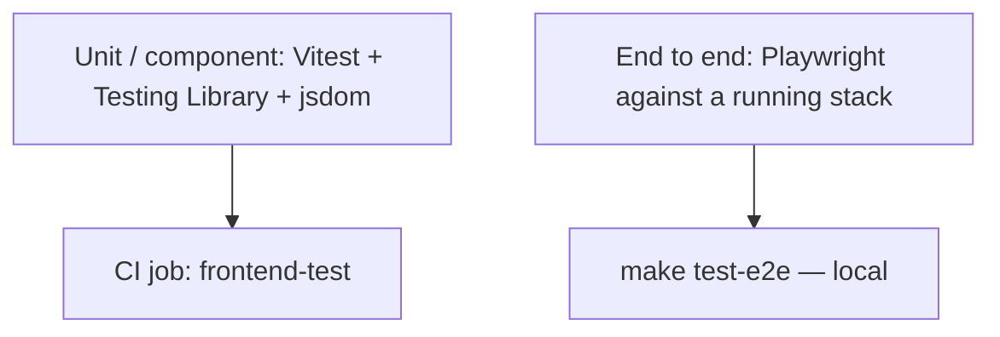
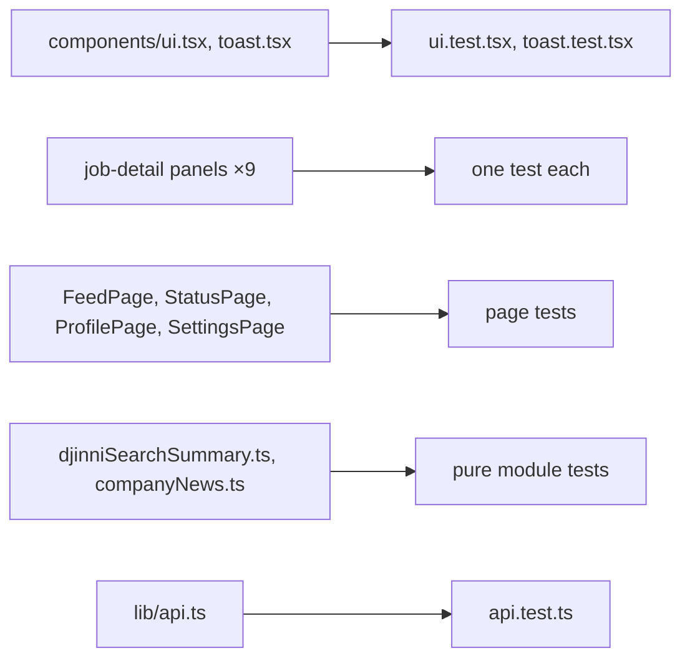
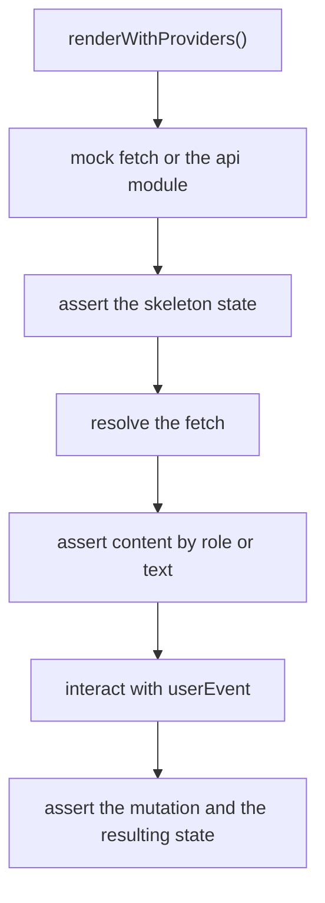

# Frontend testing

## Two layers



| Layer | Location | Environment | Command |
| --- | --- | --- | --- |
| Unit / component | `src/**/*.test.ts(x)` | jsdom | `make test-react`, `pnpm --filter @job-finder/dashboard test` |
| E2E | `tests/e2e/*.spec.ts` | real browser, full stack | `make test-e2e` |

## Vitest configuration

```ts
// vitest.config.ts
export default defineConfig({
  plugins: [react()],
  test: {
    environment: 'jsdom',
    setupFiles: ['./src/test/setup.ts'],
    globals: true,
    css: false,
    exclude: ['tests/e2e/**', 'node_modules/**'],
  },
});
```

Two choices worth noting:

- **`css: false`** — Tailwind classes are strings in the DOM; processing CSS would slow the
  suite for no assertion value.
- **`exclude: ['tests/e2e/**']`** — Playwright specs must never be picked up by Vitest;
  they use a different runner and a different `test` global.

## Test helpers

`src/test/` holds three files:

| File | Purpose |
| --- | --- |
| `setup.ts` | global setup, `@testing-library/jest-dom` matchers |
| `test-utils.tsx` | `renderWithProviders` |
| `factories.ts` | DTO fixture builders |

### `renderWithProviders`

```tsx
function createTestQueryClient() {
  return new QueryClient({
    defaultOptions: {
      queries: { retry: false, gcTime: 0 },
      mutations: { retry: false },
    },
  });
}

export function renderWithProviders(ui: ReactElement, options?: RenderOptions) {
  const queryClient = createTestQueryClient();
  const Wrapper = ({ children }: { children: React.ReactNode }) => (
    <QueryClientProvider client={queryClient}>
      <BrowserRouter>{children}</BrowserRouter>
    </QueryClientProvider>
  );
  // ...
}
```

Three differences from the production client, each removing a source of flakiness:

| Setting | Reason |
| --- | --- |
| `retry: false` | a test asserting an error state should not wait for a retry |
| `gcTime: 0` | no cache leaks between tests |
| a **fresh client per render** | tests cannot see each other's cached data |

Note it wraps `QueryClientProvider` and `BrowserRouter` but not `ToastProvider` — a test
that asserts toast behaviour opts in explicitly.

### Factories

`factories.ts` builds DTO fixtures typed from `@job-finder/shared`, so a backend contract
change breaks the fixtures at compile time rather than producing tests that pass against a
shape the API no longer sends.

## What is tested



The distribution is deliberate:

- **Shared primitives** — every page depends on them.
- **Panels** — each maps to one backend capability with real loading, empty and error
  states.
- **Pure modules** — cheap, fast, high value (`djinniSearchSummary`, `companyNews`).
- **The API module** — request shaping, `ApiError` construction, FormData handling.

## Writing a component test



Conventions:

- Query by role and accessible name (`getByRole('button', { name: /generate/i })`), which
  is also why the shell renders one navigation at a time.
- Use `@testing-library/user-event`, not `fireEvent`.
- Assert the skeleton state too — loading is a state spec 006 made explicit.

## E2E

Three Playwright specs in `tests/e2e`:

| Spec | Covers |
| --- | --- |
| `navigation.spec.ts` | the shell and route transitions |
| `feed.spec.ts` | the job feed |
| `sources.spec.ts` | source configuration |

`make test-e2e` brings up compose, recreates the test database, waits, then runs
Playwright against the live stack. These are the tests that would catch a broken dev proxy
or a route that renders nothing — things jsdom cannot see.

## Commands

```bash
make test-react                                  # vitest run
pnpm --filter @job-finder/dashboard test:watch   # watch mode
pnpm --filter @job-finder/dashboard test:coverage
make test-e2e                                    # Playwright, needs the stack
pnpm typecheck                                   # tsc across the workspace
```

:::warning Build the shared package first
`@job-finder/dashboard` imports `@job-finder/shared` from `dist/`. Run
`pnpm --filter @job-finder/shared build` after changing shared types, or tests will compile
against stale declarations — which is exactly why both CI frontend jobs do it before
running.
:::

## CI

`frontend-test` and `frontend-typecheck` (`.github/workflows/api-ci.yml`) run on Node 22
with pnpm 11, both preceded by the shared build. E2E is not in CI — it needs the full stack
up.
