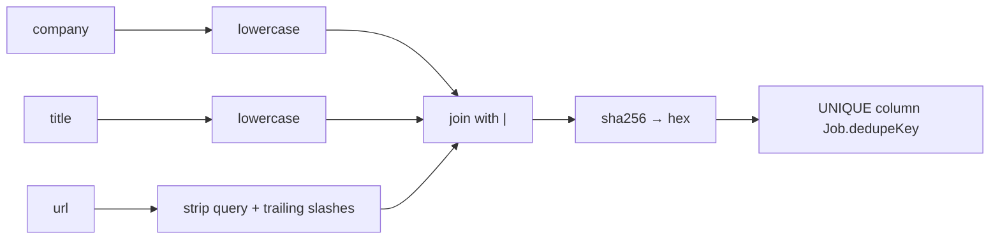
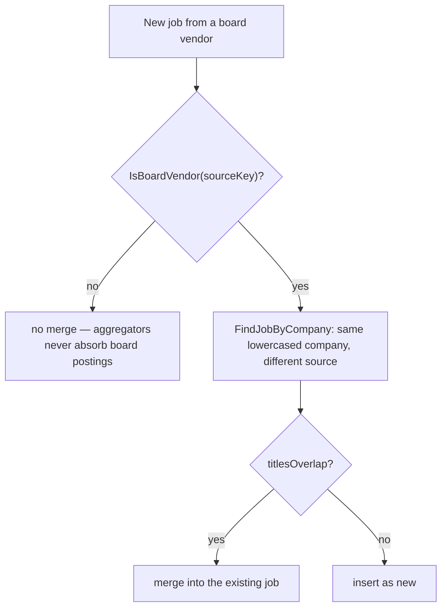
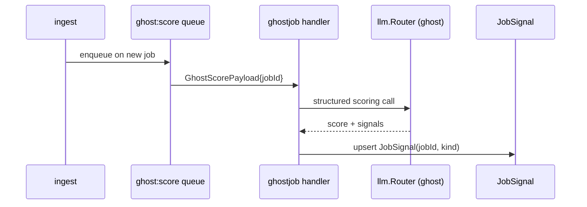
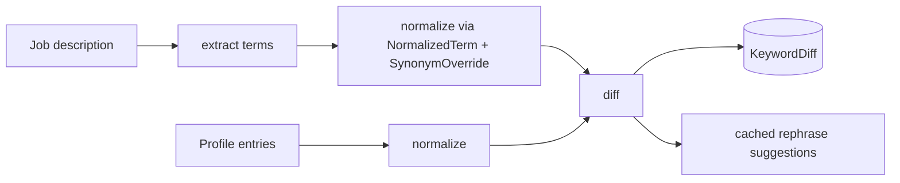

# Deduplication and quality

## The dedupe key

```go
// internal/ingestion/dedupe.go
// DedupeKey computes sha256(lower(company)|lower(title)|canonicalUrl)
func DedupeKey(company, title, rawURL string) string {
    canonical := CanonicalURL(rawURL)
    sum := sha256.Sum256([]byte(strings.ToLower(company) + "|" + strings.ToLower(title) + "|" + canonical))
    return hex.EncodeToString(sum[:])
}

// CanonicalURL strips the query string and trailing slashes.
func CanonicalURL(rawURL string) string {
    return strings.TrimRight(strings.SplitN(rawURL, "?", 2)[0], "/")
}
```

:::warning This function is byte-compatible on purpose
The comment is blunt: it *"must match ingestion.processor.ts:74 byte-for-byte or duplicate
jobs flood in."* Changing the hash input invalidates every stored key and re-ingests the
world. If you must change it, plan a migration that recomputes keys.
:::



## Cross-source merging

The same role appears on an aggregator and on the employer's own ATS board. Exact dedupe
misses this — the URLs differ. `FindMergeCandidate` handles it, but only in one direction.



Board vendors are `greenhouse`, `lever`, `ashby`, `workable`, `smartrecruiters`
(`dedupe.go:18-22`). The direction is deliberate: the ATS posting is the authoritative
one, so it merges into the aggregator record rather than duplicating it.

### Title overlap

`titlesOverlap` (`dedupe.go:45-73`) accepts a match when any of these hold:

1. the titles are equal ignoring case and surrounding whitespace;
2. one lowercased title contains the other;
3. after dropping stop words and punctuation, they share **two or more** significant
   words — or one, when the shorter title has only one significant word.

The stop-word list is small and hand-written (`dedupe.go:24-30`): `a`, `an`, `the`, `and`,
`or`, `of`, `in`, `to`, `for`, `is`, `at`, `on`, `with`, `by`, `as`, `be`, `it`, `its`,
`not`, `no`, `are`, `was`, `we`, `you`, `our`, `your`, `all`, `will`, `from`.

| Pair | Overlaps? | Why |
| --- | --- | --- |
| "Senior Go Engineer" / "Senior Go Engineer" | yes | exact |
| "Go Engineer" / "Senior Go Engineer" | yes | substring |
| "Backend Engineer (Go)" / "Go Backend Engineer" | yes | shares `backend`, `engineer`, `go` |
| "Data Analyst" / "Data Scientist" | no | only `data` overlaps |

:::note Embedding similarity is deferred
The comment on `FindMergeCandidate` explains why merging is lexical: jobs typically have
no embedding at ingestion time, so vector comparison waits for the match stage.
:::

## Seen counts

Migration `00016_job_seen_count.sql` and `InsertJob`'s `ARRAY[$2]` for `seenOnSources`
track which sources have surfaced a posting. A job seen on four boards is a stronger
signal than one seen once — and it is also how a re-run avoids counting the same posting
as new.

## Ghost-job detection

`internal/ghostjob` scores postings that look like they are not real openings — perpetual
listings, pipeline-building ads, reposts. It writes `JobSignal` rows, unique on
`(jobId, kind)` so a re-score replaces rather than accumulates.



Triggering is deliberately restricted (`internal/queue/queue.go:76-79`): ingestion and the
manual `POST /api/jobs/{id}/ghost-score` endpoint only — **never on a schedule** (FR-014).
That keeps a background loop from re-scoring the whole corpus against a paid provider.

## Keyword extraction

`internal/keyword` produces the JD keyword diff — which terms a posting demands that your
profile does not evidence — backed by `KeywordDiff`, `NormalizedTerm` and
`SynonymOverride`. Rephrase suggestions go through `ProviderRephraseModel` behind a
`CachedRephraser` with a TTL from `KEYWORD_REPHRASE_CACHE_TTL_SEC`
(`compose.go`, `composeKeyword`).



## Salary inference

`internal/salary` combines the raw salary text, an optional levels.fyi CSV
(`LEVELS_FYI_CSV`) and LLM inference, caching results in `SalaryCache` keyed by
`(bucket, currency, source)` with a `sampleSize` counter. With the CSV unset the loader
logs a warning and that source is simply absent
(`compose.go`, `composeSalary`). `SALARY_FLOOR_USD` filters below a threshold; `0`
disables it.

## Quality signals summary

| Signal | Table | Produced by |
| --- | --- | --- |
| Duplicate suppression | `Job.dedupeKey` | `ingestion/dedupe.go` |
| Cross-source merge | `Job` | `FindMergeCandidate` |
| Multi-source corroboration | `Job.seenOnSources` | `InsertJob` |
| Ghost likelihood | `JobSignal` | `internal/ghostjob` |
| Keyword gap | `KeywordDiff` | `internal/keyword` |
| Salary estimate | `SalaryCache`, `Job.salary*` | `internal/salary` |
| Fit score | `MatchResult` | `internal/matching` |
