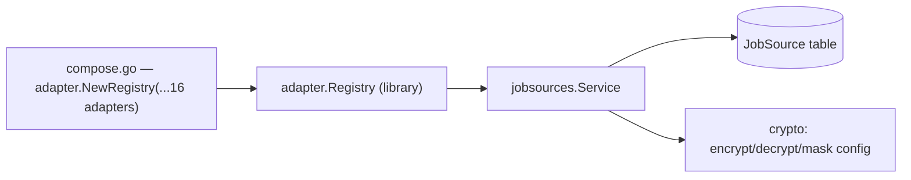
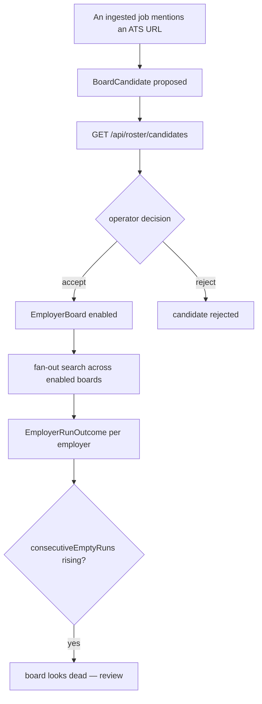
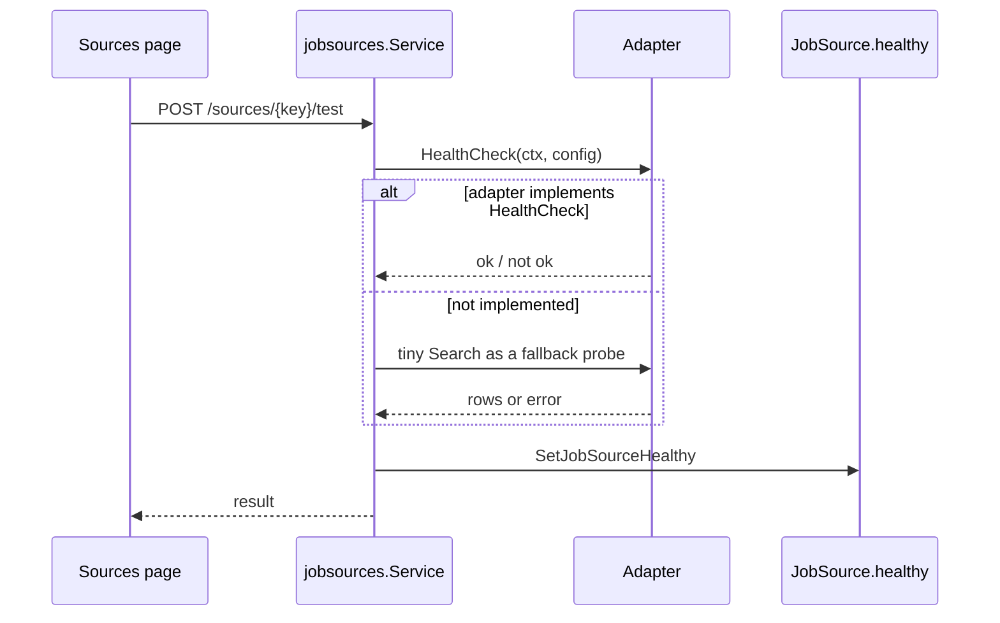
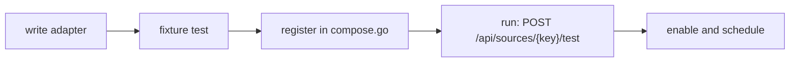

# Job sources

## The contract

The contract lives in the job-scraper library, not in this repo — `ports/source.go`:

```go
// ports.JobSource — the core port. Every adapter in adapters/ implements it,
// every decorator in adapter/middleware wraps it.
type JobSource interface {
    Key() string
    Kind() model.SourceKind
    // Search receives the decrypted JobSource.config merged over env defaults.
    Search(ctx context.Context, query model.SearchQuery, config map[string]any) ([]model.NormalizedJob, error)
    // HealthCheck must be cheap enough to run on a schedule.
    HealthCheck(ctx context.Context, config map[string]any) (bool, error)
}
```

Optional capabilities, also in `ports/source.go`:

| Interface | Method | Effect when implemented |
| --- | --- | --- |
| `DetailNeeder` | `NeedsDetail() bool` | `Search` rows are list-only; an `enrich` pass fetches the full posting before matching or ghost-scoring |
| `Credentialed` | `UsesUserAccount() bool` | the retrieval ladder never escalates past `direct` for this source |
| `PostingReader` | `ReadPosting(...)` | the source can read one posting page into a complete `NormalizedJob`; without it, manual add degrades to the fill-in path |
| `Closer` | `Close() error` | the source holds a browser, pooled client or login session; `Registry.Close` releases it |

:::note Ask through `adapter.As`, not a type assertion
A registered source is usually a bare source behind decorators. Asserting
`src.(ports.PostingReader)` on the outermost wrapper answers "no" even when the source
underneath implements it. `adapter.As[T](src)` walks the `Unwrap` chain instead
(`adapter/capabilities.go`).
:::

## Registry and lazy source rows



Two behaviours from `internal/jobsources/application/service.go`:

- **Identity lives in the registry, not the database.** `GetByKey` asks the registry
  first and only then the table; a `JobSource` row is created *lazily*, on first real use
  of a key, not seeded upfront (`service.go:109-135`).
- **Config is encrypted at rest** with `CONFIG_ENCRYPTION_KEY`. With no key set, the
  service falls back to plaintext for development (`encryptConfig`, `service.go:33-42`).

Secret-looking keys are masked on read using `secretKeyRe`
(`service.go:21`), which matches `cookie|key|secret|token|password` case-insensitively, so
`GET /api/sources` never returns credentials to the browser.

## Provider inventory

Adapter packages live in the job-scraper library under `adapters/<key>/`. "Registered"
means the adapter is passed to `adapter.NewRegistry(...)` in `composeJobSources`
(`cmd/server/compose.go:186-201`) and can therefore be listed, enabled, health-checked and
run. Sources marked ❌ are constructed only inside `composeEnrichment`
(`compose.go:461-466`): they can fetch a posting's detail page, but an ingest run for
their key fails with `NotRegisteredError`.

| Key | Adapter file | Transport | Registered | Needs credentials | Notes |
| --- | --- | --- | --- | --- | --- |
| `adzuna` | `adzuna.go` | API | ✅ | `ADZUNA_APP_ID`, `ADZUNA_APP_KEY` | `ADZUNA_COUNTRY` selects the market |
| `remotive` | `remotive.go` | API | ✅ | no | remote-only board |
| `arbeitnow` | `arbeitnow.go` | API | ✅ | no | |
| `jooble` | `jooble.go` | API | ✅ | `JOOBLE_API_KEY` | |
| `jobspy` | `jobspy.go` | sidecar | ✅ | no | delegates to an external JobSpy service at `JOBSPY_URL` |
| `djinni` | `djinni.go`, `djinni_searchmode.go`, `djinni_detail.go` | scrape | ✅ | no | preset and basic search modes (specs 015, 016); `DJINNI_DETAIL_DELAY_MS`, optional `DJINNI_RATE_OVERRIDE_RPS` |
| `dou` | `dou.go`, `dou_detail.go` | scrape | ✅ | no | |
| `workua` | `workua.go` | scrape | ✅ | no | `WORKUA_DETAIL_DELAY_MS` |
| `robota` | `robota.go` | scrape | ✅ | no | |
| `manual` | `manual.go` | manual | ✅ | no | hand-entered vacancies; `Search` fails permanently by design (spec 041) |
| `indeed` | `indeed.go` | scrape | ❌ enrich only | no | spec 002 |
| `remoteok` | `remoteok.go` | scrape | ❌ enrich only | no | spec 003 |
| `glassdoor` | `glassdoor.go` | scrape | ❌ enrich only | no | spec 004 |
| `jobleads` | `jobleads.go` | scrape | ❌ enrich only | `JOBLEADS_EMAIL`, `JOBLEADS_PASSWORD` | login-gated via the library's `session/` package; `Credentialed` |
| `wellfound` | `wellfound.go` | scrape | ❌ enrich only | no | spec 010 |
| `jobgether` | `jobgether.go` | scrape | ❌ enrich only | no | spec 012 |
| `himalayas` | `himalayas.go` | scrape | ❌ unwired | no | spec 011; present in the library, referenced by neither compose path |
| `greenhouse` | `greenhouse.go` | ATS API | ✅ | no | roster-driven (spec 013) |
| `lever` | `lever.go` | ATS API | ✅ | no | roster-driven |
| `ashby` | `ashby.go` | ATS API | ✅ | no | roster-driven |
| `workable` | `workable.go` | ATS API | ✅ | no | roster-driven |
| `smartrecruiters` | `smartrecruiters.go` | ATS API | ✅ | no | roster-driven |

:::warning Six sources cannot be run
This is live drift, tracked in `specs/domains/job-sources.md`, not a documentation gap —
see the ❌ rows above.
:::

:::note The `sidecar` source kind
`jobspy` is the only adapter with kind `sidecar` (`internal/dto/scraper_aliases.go:21-28`):
it delegates to a JobSpy service over HTTP rather than talking to a board itself. The
Python sidecar that used to ship here as `apps/jobspy-sidecar/` was removed in commit
`b433986`; point `JOBSPY_URL` at a separately deployed instance, or override it per source
with the `url` config key. With neither set the adapter's requests have no host and fail.
:::

## ATS boards and the roster

The five ATS vendors share one `atsboard` implementation in the job-scraper library and are
constructed one call each — `greenhouse.New(roster)`, `lever.New(roster)`, and so on. Each
vendor package also exposes a `HealthChecker()`, and `composeJobSources` collects those five
into the checkers map the roster service takes (`cmd/server/compose.go`).



Per-employer outcomes are a closed vocabulary (`ports/source.go:94-99`):

| Outcome | Meaning |
| --- | --- |
| `read` | postings fetched |
| `not_found` | employer identifier does not resolve |
| `unreadable` | fetched but unparseable |
| `refused` | blocked or forbidden |
| `no_postings` | resolved and empty |

Discovery is manual-first: `POST /api/roster/discover` proposes, a human accepts.

## Health checks



## Adding a source

The adapter itself belongs in the job-scraper library, not in this repo:

1. Create `adapters/<name>/<name>.go` in the library, implementing `ports.JobSource`.
2. Implement `NeedsDetail()` if `Search` returns list-only rows.
3. Implement `UsesUserAccount()` if it needs a login session.
4. Fetch **only** through the injected scraping/retrieval ports — never `http.Get`.
5. Add a fixture-based `<name>_test.go` plus fixtures in `adapters/<name>/testdata/`.
6. Expose it through `adapters/<name>/provider.go`, then register it in
   `adapter.NewRegistry(...)` in `composeJobSources` (`cmd/server/compose.go`) on the app
   side. Skipping this step is what leaves a source enrich-only.
7. Add any credentials as `config` fields and to `.env.example`.


