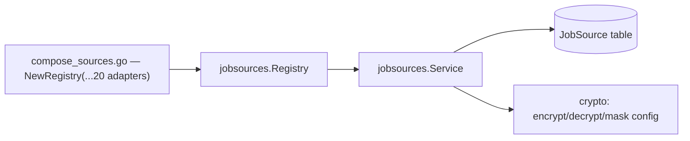
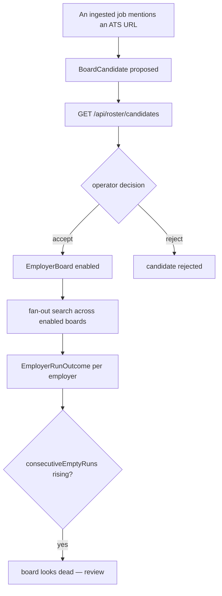
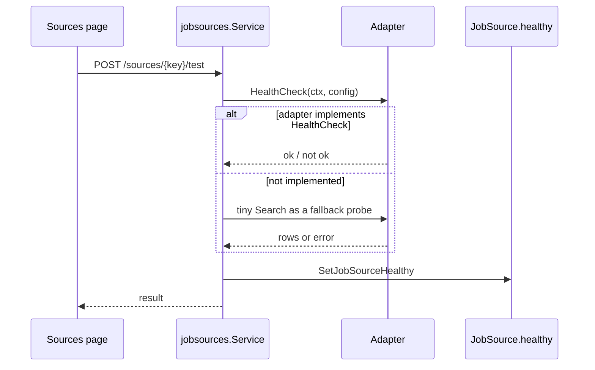
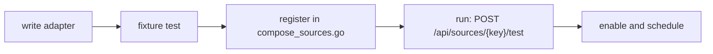

# Job sources

## The contract

```go
// internal/jobsources/adapter.go
type Adapter interface {
    Key() string
    Kind() dto.SourceKind
    // Search receives the decrypted JobSource.config merged over env defaults.
    Search(ctx context.Context, query dto.SearchQuery, config map[string]any) ([]dto.NormalizedJob, error)
    // HealthCheck is optional; nil means the registry falls back to a tiny search.
    HealthCheck(ctx context.Context, config map[string]any) (bool, error)
}
```

Optional capabilities:

| Interface | Method | Effect when implemented |
| --- | --- | --- |
| `DetailNeeder` | `NeedsDetail() bool` | `Search` rows are list-only; an `enrich` pass fetches the full posting before matching or ghost-scoring |
| `Credentialed` | `UsesUserAccount() bool` | the retrieval ladder never escalates past `direct` for this source |

## Registry and lazy source rows



Two behaviours from `jobsources/service.go:19-32`:

- **Identity lives in the registry, not the database.** A `JobSource` row is created
  *lazily*, on first real use of a key — not seeded upfront.
- **Config is encrypted at rest** with `CONFIG_ENCRYPTION_KEY`. With no key set, the
  service falls back to plaintext for development (`encryptConfig`, `service.go:33-42`).

Secret-looking keys are masked on read using `secretKeyRe`
(`service.go:18`), which matches `cookie|key|secret|token|password` case-insensitively, so
`GET /api/sources` never returns credentials to the browser.

## Provider inventory

Registered in `cmd/server/compose_sources.go:26-44`.

| Key | Adapter file | Transport | Needs credentials | Notes |
| --- | --- | --- | --- | --- |
| `adzuna` | `adzuna.go` | API | `ADZUNA_APP_ID`, `ADZUNA_APP_KEY` | `ADZUNA_COUNTRY` selects the market |
| `remotive` | `remotive.go` | API | no | remote-only board |
| `arbeitnow` | `arbeitnow.go` | API | no | |
| `jooble` | `jooble.go` | API | `JOOBLE_API_KEY` | |
| `djinni` | `djinni.go`, `djinni_searchmode.go` | scrape | no | preset and basic search modes (specs 015, 016); `DJINNI_DETAIL_DELAY_MS`, optional `DJINNI_RATE_OVERRIDE_RPS` |
| `dou` | `dou.go` | scrape | no | |
| `workua` | `workua.go` | scrape | no | `WORKUA_DETAIL_DELAY_MS` |
| `robota` | `robota.go` | scrape | no | |
| `indeed` | `indeed.go` | scrape | no | spec 002 |
| `remoteok` | `remoteok.go` | scrape | no | spec 003 |
| `glassdoor` | `glassdoor.go` | scrape | no | spec 004 |
| `jobleads` | `jobleads.go`, `jobleads_session.go` | scrape | `JOBLEADS_EMAIL`, `JOBLEADS_PASSWORD` | login-gated; `Credentialed` |
| `wellfound` | `wellfound.go` | scrape | no | spec 010 |
| `himalayas` | `himalayas.go` | scrape | no | spec 011 |
| `jobgether` | `jobgether.go` | scrape | no | spec 012 |
| `greenhouse` | `greenhouse.go` | ATS API | no | roster-driven (spec 013) |
| `lever` | `lever.go` | ATS API | no | roster-driven |
| `ashby` | `ashby.go` | ATS API | no | roster-driven |
| `workable` | `workable.go` | ATS API | no | roster-driven |
| `smartrecruiters` | `smartrecruiters.go` | ATS API | no | roster-driven |

:::note The `sidecar` source kind
`dto.SourceKind` still includes `sidecar` (`internal/dto/dto.go:8`), but the JobSpy
adapter and its Python sidecar were removed (commit `b433986`). `apps/jobspy-sidecar/`
retains only a stale virtualenv and test directory. No registered adapter uses the
`sidecar` kind today.
:::

## ATS boards and the roster

The five ATS vendors share one `atsboard` implementation in the jobscraper library and are
constructed one call each — `greenhouse.New(roster)`, `lever.New(roster)`, and so on. Each
vendor package also exposes a `HealthChecker()`, and `composeJobSources` collects those five
into the checkers map the roster service takes (`cmd/server/compose.go`).



Per-employer outcomes are a closed vocabulary (`adapter.go:60-70`):

| Outcome | Meaning |
| --- | --- |
| `read` | postings fetched |
| `not_found` | employer identifier does not resolve |
| `unreadable` | fetched but unparseable |
| `refused` | blocked or forbidden |
| `no_postings` | resolved and empty |

Discovery is manual-first: `POST /api/roster/discover` proposes, a human accepts.

## Health checks



## Adding a source

1. Create `internal/jobsources/adapters/<name>.go` implementing `Adapter`.
2. Implement `NeedsDetail()` if `Search` returns list-only rows.
3. Implement `UsesUserAccount()` if it needs a login session.
4. Fetch **only** through the injected `Scraping` service — never `http.Get`.
5. Add a fixture-based `<name>_test.go` plus fixtures in `adapters/testdata/`.
6. Register the adapter in `jobsources.NewRegistry(...)` in `compose_sources.go`.
7. Add any credentials as `config` fields and to `.env.example`.


