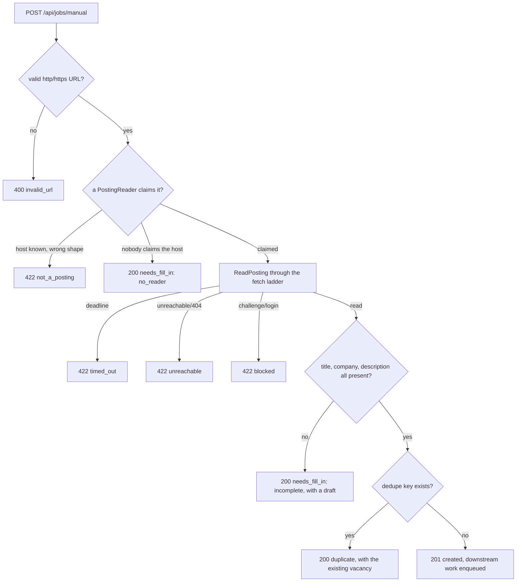

# Manual vacancy add

## Rule: a hand-added vacancy is an ordinary vacancy

An operator pastes a posting URL and gets a vacancy back. Not a queued task, not a
special record — the same row a crawl would have written, with the same dedupe key,
the same `subscriptionId` attribution, and the same downstream work enqueued. Matching,
tailoring and the tracker cannot tell the two apart, because there is nothing to tell
apart: both go through `jobsources/application/ingest`.

Two things make it distinguishable *on purpose*, and only two:

- The vacancy hangs off a `Subscription` whose `kind` is `manual`, so the feed can filter
  on it and the sources view can count it.
- Its `SourceRun` carries `trigger = 'manual'`, so a failed paste never counts toward a
  source's health.

## The flow



Every terminal state past resolution writes exactly one `SourceRun`. Every failure state
leaves no vacancy behind — persistence runs inside a transaction, so a timeout mid-write
rolls back and the same URL can be resubmitted immediately.

## Rule: one deadline covers everything the operator waits for

The handler wraps the request context in a 30-second timeout that spans resolution,
per-host pacing, fetch, parse and persist. There is no separate budget per stage, because
the operator cares about one number.

Pacing is **not** bypassed to fit inside it. If a crawl of the same host is in flight, the
add waits its turn and reports `timed_out` if it cannot fit. Getting throttled off a source
to save five seconds is a bad trade.

Post-ingest work — match, ghost-score, enrich — is enqueued after the vacancy is committed,
on a background context, and is explicitly outside the deadline. Matching is an LLM call
that can take minutes; the vacancy is useful before it finishes.

## The `PostingReader` port

A source supports manual add by implementing one optional interface from the job-scraper
library, `ports/source.go:76-89`:

```go
type PostingReader interface {
    MatchesPostingURL(rawURL string) bool
    ReadPosting(ctx context.Context, rawURL string, config map[string]any) (dto.NormalizedJob, error)
}
```

`FetchDetail` cannot serve this. Nine adapters have it, but every one returns a *patch* —
description, salary, location, remote, `postedAt` — applied to a job whose title and
company already came from a search card. A manual add starts from a bare URL, so title and
company have to come from the posting page itself.

### Contract for implementors

1. **`MatchesPostingURL` does no I/O and never panics.** It is called for every registered
   adapter on every add, in registry order; the first claim wins.
2. **It returns false for search URLs on its own host.** A Djinni preset-search URL is a
   Djinni URL that is not a posting. Combined with an optional `ClaimsHost(host) bool`, this
   is what separates `not_a_posting` (recovery: create a subscription) from `no_reader`
   (recovery: the fill-in form).
3. **`ReadPosting` returns partial results rather than erroring** when the page loads but
   some fields are absent. That partial result is what pre-fills the fill-in draft. It
   errors only when the page could not be read at all.
4. **It honours the context deadline**, returning `context.DeadlineExceeded` shallowly
   enough for `errors.Is` to see it.
5. **It sets `SourceKey` to its own `Key()`** and resolves `URL` to an absolute, canonical
   form — query dropped — so the dedupe key matches what a crawl would produce.
6. **It uses the same retrieval path as the adapter's other methods**, so pacing and ladder
   escalation apply unchanged.

Adding a source is two pieces of work: implement the port, and add a fixture test. Nothing
in the service, the endpoint or the dashboard changes. That is the point of the port.

Adapters without the port are untouched, and their hosts degrade to the fill-in form.

## `POST /api/jobs/manual`

Request: `{ "url": "https://djinni.co/jobs/123456-senior-go-engineer/" }`

Every non-5xx response is a `ManualAddResultDto` discriminated by `outcome`. Clients switch
on `kind`, never on prose.

| `outcome` | `kind` | HTTP | Carries | Recovery offered |
|---|---|---|---|---|
| `created` | — | 201 | the new `JobDto` | — |
| `duplicate` | — | 200 | the *existing* `JobDto` | navigate to it |
| `failed` | `invalid_url` | 400 | reason | fix the URL |
| `failed` | `not_a_posting` | 422 | reason | create a subscription instead |
| `failed` | `unreachable` | 422 | reason | retry, or fill in |
| `failed` | `blocked` | 422 | reason | fill in |
| `failed` | `timed_out` | 422 | reason | retry |
| `needs_fill_in` | `no_reader` | 200 | a draft holding the URL | the fill-in form |
| `needs_fill_in` | `incomplete` | 200 | a draft holding what was read | the fill-in form |

A duplicate is not an error: `ok = true`, `found = 1`, `new = 0` on its run. Two
simultaneous submissions of the same URL yield one vacancy — the loser of the race hits the
`Job_dedupeKey_unique` constraint, re-reads, and reports `duplicate`.

## `POST /api/jobs/manual/fill-in`

Saves a hand-completed vacancy. Nothing is fetched.

`title`, `company` and `description` are required and a rejection names **every** missing
field, not the first. `sourceKey` defaults to `manual` — a registered no-op adapter that
exists so vacancies on unreadable hosts have a valid source row to reference; its `Search`
fails permanently, so nothing can ever crawl it.

`postedAt` is stored exactly as given, including not at all. It is **never** defaulted to
the add time: an unknown-age vacancy that looks fresh corrupts ghost-job scoring and every
other age-sensitive read.

## Feed effects

`GET /api/jobs` gains an `onlyManual` filter, which spans every source — the existing
`subscriptionId` filter cannot, since there is one manual subscription per source.

Under the default `sort=score`, vacancies added by hand in the last 24 hours sort first.
This is a leading `ORDER BY` term, not stored state, so it expires by itself with no cleanup
job. Under the explicitly chosen `sort=date` the term is absent — an operator who asked for
recency gets recency.

## Subscription write guards

The manual subscription is created implicitly on the first add for a source and is never
writable the way a saved search is:

| Endpoint | Behaviour on a manual row |
|---|---|
| `POST /subscriptions` with `kind: "manual"` | 400 — created implicitly only |
| `PUT /subscriptions/{id}` changing `url` or `cron` | 400 — immutable; there is nothing to crawl and nothing to schedule |
| `DELETE /subscriptions/{id}` with vacancies attached | 409 — would orphan hand-entered work |
| `POST /subscriptions/{id}/run` | 400 — not runnable |
| `POST /subscriptions/run-all` | skipped silently |

The scheduler never sees a manual row at all: its due-subscription query filters on
`kind = 'crawl'`. Manual rows are excluded by kind rather than by being disabled, because
"disabled" means "paused by the operator" and has to keep meaning that.
