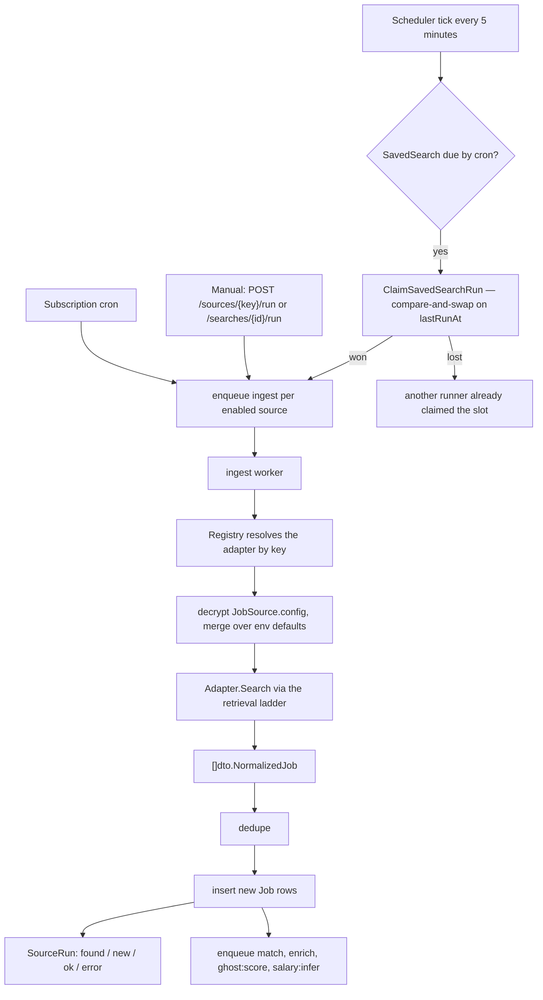
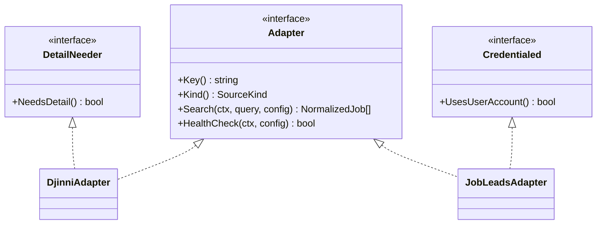
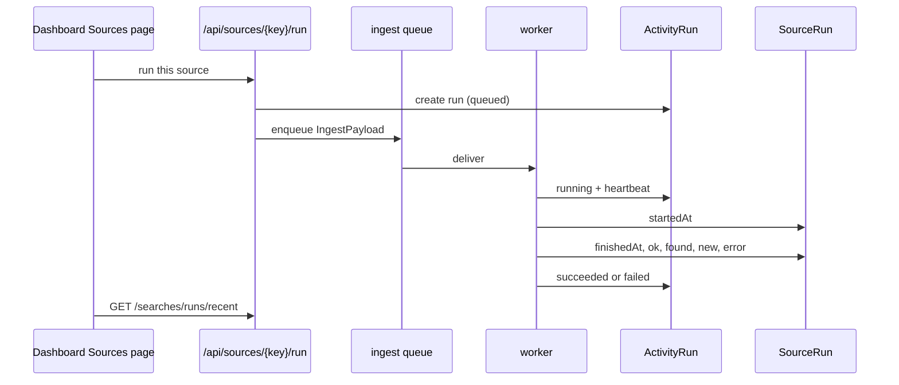

# Ingestion overview

Ingestion is the path from "a job exists on some board" to "a `Job` row exists here,
scored and ready to read".

## The pipeline

## Principles

### One retrieval path for every adapter

`internal/retrieval` is the single shared HTTP retrieval interface. The package comment is
explicit (`retrieval.go:1-5`): *"Every scraped adapter fetches through this package so no
source implements its own request strategy or challenge handling (FR-020)."*

An adapter therefore cannot accidentally bypass pacing, identity, cookies, or challenge
handling — those are properties of the transport, not of adapter discipline.

### Adding a source is one file plus one registry line

From `jobsources/adapter.go:1-5`: *"Adding a job site = one adapter implementing Adapter +
one entry in the registry's constructor list."* The registry list lives in
`cmd/server/compose_sources.go:26-44`.

### Capabilities are optional interfaces, not flags

An adapter whose `Search` already returns complete rows implements nothing extra;
`jobsources.NeedsDetail(a)` and `IsCredentialed(a)` type-assert and default to `false`
(`adapter.go:44-58`). New capabilities are added without touching twenty adapters.

### One source's failure is not the run's failure

Each source is its own `ingest` task with its own `SourceRun` row. A 503 from one board
marks that run `ok=false` with an `error`, and the others complete normally.

### Retries are for transient failures only

`IngestMaxRetry = 2` — three deliveries. Errors a retry cannot fix are wrapped in
`asynq.SkipRetry` by the handler (`internal/queue/queue.go:39-49`). The comment records
why the value changed from zero: scraping is the least reliable step and runs are hours
apart, so one transient failure used to cost a source its entire cron window.

### Credentialed sources never escalate

`MaxRungForAccount(usesUserAccount)` caps a logged-in source at the `direct` rung
(`retrieval/ladder.go:43-48`). The browser and FlareSolverr rungs cannot carry the session
cookie and would land on a login page — and driving a challenge solver through someone's
account is not something to do quietly.

### Normalize at the boundary, keep the original

Adapters return `dto.NormalizedJob`. The provider payload is stored in `Job.raw` so a
parser fix can be replayed without re-scraping.

## Where things live

| Concern | Package |
| --- | --- |
| Adapter contract, registry, ~20 adapters | `internal/jobsources` |
| Scheduling, runs, dedupe, reconciliation | `internal/ingestion` |
| Fetch ladder, identity, per-host state | `internal/retrieval` |
| Headless browsing | `internal/scraping` |
| Per-host pacing | `internal/ratelimit` |
| Ghost-posting detection | `internal/ghostjob` |
| ATS board roster | `internal/jobsources/roster` |

## Observing a run

